 

The LDaCA Steering Committee guides project issues, advocates for the project, and ensures clear communication with stakeholders. 

It oversees project outcomes, approves major changes, and facilitates access to subject matter experts when needed. 

Members bring expertise in governance, leadership, partnerships, data, technology, research, global skills, and community engagement, ensuring effective project oversight. 
 
 

View the **<a href="LDaCA-SC_Terms of Reference_2024-2028.pdf">Terms of Reference →</a>**
 
 

 

## Committee Communiques
**<a href="2024-09-30 Communique SCMeeting_InPerson.pdf">September 2024 →</a>** 
**<a href="2024-09-30 Communique SCMeeting_InPerson.pdf">March 2025 →</a>** 

 

## Committee Members
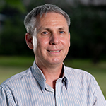

<b>Prof Michael Haugh, The University of Queensland—Chief Investigator (LDaCA)</b> 
<i>Chairperson</i>

Michael Haugh is Professor of Linguistics and Applied Linguistics, and a Fellow of the Australian Academy of the Humanities. He is currently leading the Language Data Commons of Australia (LDaCA).
 
 

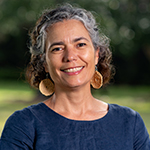

<b>Dr Rose Barrowcliffe, The University of Queensland—Chief Investigator (LDaCA)</b> 
<i>Member</i>

Dr. Rose Barrowcliffe’s (Butchulla) work and research examines the representation and rights of Indigenous peoples in collecting institutions, and supports embedding Indigenous knowledge authority in archival records and data.
 
 

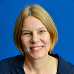

<b>Prof Monika Bednarek, The University of Sydney—Chief Investigator</b> 
<i>Member</i>

Monika Bednarek is Professor in Linguistics and Director of the Sydney Corpus Lab at the University of Sydney, Australia. Her research combines corpus linguistics, sociolinguistics and discourse analysis, and she has published widely in these areas.
 
 

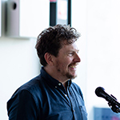

<b>Mr Adam Bell, AARNET—Chief Investigator</b> 
<i>Member</i>

Adam Bell leads AARNet’s engagement with Australian cultural organisations and digital preservation initiatives. He is deputy chair of GLAM Peak and member of the Digital Preservation Coalition’s Australasian Stakeholder Group.
 
 

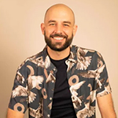

<b>Prof Clint Bracknell, University of Western Australia—Chief Investigator</b> 
<i>Member</i>

Clint Bracknell is a Noongar song-maker, composer, and Professor of Music at the University of Western Australia. He investigates connections between song, language, and landscapes, often working on projects to improve Indigenous community access to intangible cultural heritage.
 
 

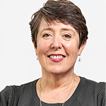

<b>Ms Jenny Fewster, Australian Research Data Commons—Director, HASS & Indigenous RDC</b> 
<i>Member</i>

With over 20 years’ experience in collecting, managing and disseminating research and cultural heritage data and resources, Jenny is passionate about delivering quality research infrastructure and data to meet the diverse needs of HASS and Indigenous researchers.
 
 

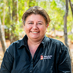

<b>A/Prof Kathryn Gilbey, Batchelor Institute—Chief Investigator</b> 
<i>Member</i>

Professor Kathryn Gilbey is an Alyawarr scholar and the Executive Dean at Batchelor Institute of Indigenous Tertiary Education. The former Director of the Batchelor Graduate School she specialises in First Nations knowledges, inclusive education and critical race theories. Kathryn has worked in the field of Education for many years in the Northern Territory.
 
 

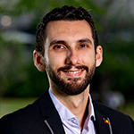

<b>Robert McLellan, The University of Queensland—Project Manager (LDaCA)/ Industry Fellow</b> 
<i>Member</i>

Robert, a Gureng Gureng descendant from the Wide Bay region, is a community researcher, director and governance practitioner. He is an Industry Fellow at the University of QLD and Senior Program Manager for Language Data Commons of Australia (LDaCA).
 
 

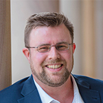

<b>Dr Martin Schweinberger, The University of Queensland—Chief Investigator</b> 
<i>Member</i>

Martin Schweinberger is a Lecturer in Applied Linguistics at UQ and co-director of LADAL. A quantitative corpus linguist, he specializes in computational analyses of text and speech. Martin is a Chief Investigator of LDaCA and Vice-President Profession of ISLE. His research spans language variation, discourse markers, L1/L2 acquisition, computational modeling, and text analytics. He also serves as a board member of ICAME.
 
 

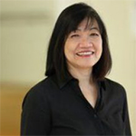

<b>Dr Marissa Takahashi, Queensland University of Technology (Digital Observatory)—Chief Investigator</b> 
<i>Member</i>

Marissa Takahashi is the Manager of the QUT Digital Observatory under the QUT Research Infrastructure. Marissa holds a PhD in Business Information Systems, MBA from The University of Queensland Business School and MSc in Information Engineering from Kyushu Institute of Technology in Japan.
 
 

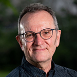

<b>A/Prof Nick Thieberger, The University of Melbourne—Chief Investigator</b> 
<i>Member</i>

Nick Thieberger is an Associate Professor in the School of Languages and Linguistics, University of Melbourne. He worked at the Vanuatu Cultural Centre in the mid-1990s and then wrote a grammar of Nafsan. His focus is finding, digitising, and providing access to language records, primarily through the Pacific and Regional Archive for Digital Sources in Endangered Cultures (PARADISEC) of which he is Director. He also leads Nyingarn, a platform for manuscript sources on Australian languages.
 
 

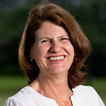

<b>Prof Catherine Travis, Australian National University—Chief Investigator</b> 
<i>Member</i>

Catherine Travis is Professor of Modern European Languages in the School of Literature, Languages and Linguistics at the Australian National University, and a Fellow of the Australian Academy of the Humanities. As a variationist sociolinguist, Catherine works with corpora of spontaneous speech to explore how languages change over time; how changes spread across society; and how social characteristics impact speech. She is particularly interested in socially diverse societies, including monolingual and bilingual settings.
 
 

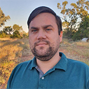

<b>Beau Williams, First Languages Australia—Chief Investigator</b> 
<i>Member</i>

Beau is a Murrawarri man with extensive experience in accounting, project management, procurement and contracting. Beau has worked in Indigenous affairs with the NSW state government, Australian Public Service and across the not for profit sector. Beau is the Chief Executive Officer of First Languages Australia. 
 
 

 

## Committee Advisors

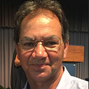

<b>Mr Desmond Crump, The University of Queensland—Industry Fellow (Indigenous Languages)</b> 
<i>Advisor</i>

Desmond Crump’s family and cultural links are from South-West Queensland, which is the top end of the Gamilaroi Nation - he has an extensive background in education and community language revival. Currently Desmond is employed as the Industry Fellow (Indigenous Languages) for the University of Queensland to support activities under the UQ Indigenous Languages Strategy. Desmond is also a member of the Office of the Arts National Directions Group for the International Decade of Indigenous Languages and the AIATSIS Languages Advisory Committee.
 
 

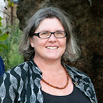

<b>Dr Amanda Harris, PARADISEC</b> 
<i>Advisor</i>

Amanda Harris is an ARC Future Fellow at Sydney Conservatorium of Music, University of Sydney and Director of the Sydney Unit of digital archive PARADISEC (Pacific and Regional Archive for Digital Sources in Endangered Cultures). Amanda is a musicologist and cultural historian focused on histories of musical encounter in Australia’s Oceanic location and colonial history, with an emphasis on collaborative research.
 
 

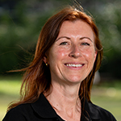

<b>Ms Lauren Reed, AIATSIS</b> 
<i>Advisor</i>

Lauren Reed is the Director of the Centre for Australian Languages at the Australian Institute of Aboriginal and Torres Strait Islander Studies (AIATSIS). As part of her work at AIATSIS, Lauren leads the AIATSIS Dictionaries Program, the National Indigenous Languages Surveys, the Austlang platform and the Paper & Talk workshop series. Lauren is a linguist who also works with Indigenous sign languages of Australia and the Asia-Pacific.
 
 

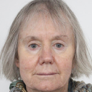

<b>Prof Jane Simpson, Australian National University</b> 
<i>Advisor</i>

Jane Simpson is Emeritus Professor in linguistics at the Australian National University. She has carried out fieldwork since 1979 with Warumungu and Warlpiri people in Central Australia. She has assisted on language revitalisation projects. Her interest in archiving began with the National Lexicography Project at the Australian Institute of Aboriginal and Torres Strait Islander Studies, and continued with work with the PARADISEC archive.
 
 

 

## Standing Guests
- **Moises Sacal Bonequi**, The University of Queensland— Research Technology (LDaCA)
- **Dr Ben Foley**, The University of Queensland—Data and Collections (LDaCA)
- **Dr Sam Hames**, The University of Queensland —Research Analytics (LDaCA)
- **Dr Simon Musgrave**, The University of Queensland Research Support and Training (LDaCA)
- **Siobhann McCafferty or Jennifer Corbett**, Australian Research Data Commons, HASS & Indigenous RDC
- **Chenoa Pettrup**,  The University of Queensland—Industry Engagement and Communication (LDaCA)
- **Sue Plunkett-Cole**, The University of Queensland—Project Coordinator (LDaCA)
- **Dr Peter Sefton**, The University of Queensland—Research Technology (LDaCA)
 
 

 