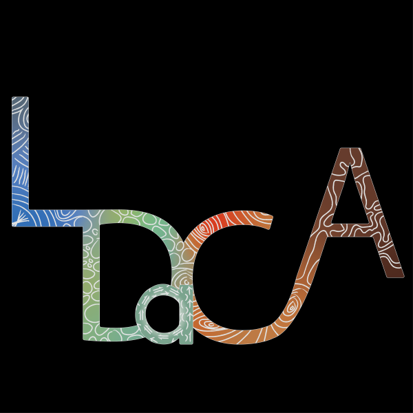
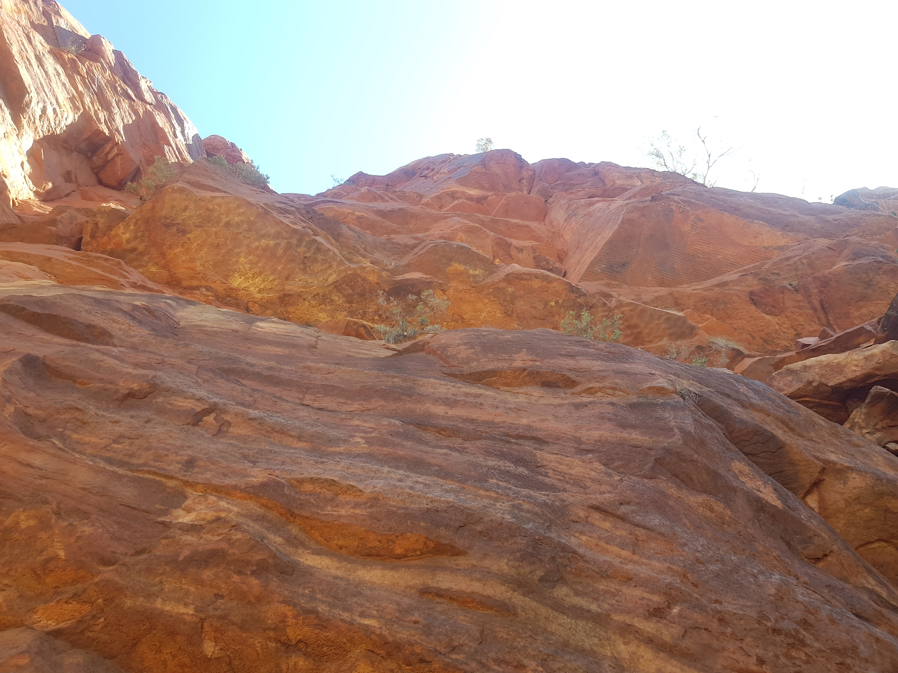

**Bio**
My name is Otis Carmichael and I am a proud Waanyi man living in Meanjin. My designs reflect my appreciation of the past and my hope for the future.

The design of the LDaCA logo came from my own experience researching the Waanyi language, the language of [my mob](https://en.wikipedia.org/wiki/Waanyi). The design flows from the beginning to the end, where it flows back into itself at the beginning, representing the cyclical nature of life and the Land. The strands of language interweave with themselves, influenced by everything that touches them until they become something entirely their own. The complexity of these languages is a thing of beauty and their preservation, study and proliferation lays claim to this unceded land. 

**The inspiration of the design is as follows:**

**L** (Language) - Language is shown as a flow of words that can be merged, split and rearranged to create different meanings, just as these lines can be.

**D** (Data) - Data is depicted by these specks of raw information, undecipherable before processing but heavy with power.

**a** - This data is not just numbers and words but aspects of cultures and knowledge with connections to the land. 

**C** (Commons) - Whilst research often appears niche in these commons, there is no limit to the range of it’s influence, the ripples of which disrupt everything it touches.

**A** (Australia) - The language data of this common has been collected from many individual nations that make up ‘Australia’, often with a foundation on extraction based research techniques. This project aims to make up for the mistakes of the past by celebrating and giving back to these nations, which are so incredibly distinct whilst sharing beautiful connections with each other.

The colours utilised in this design draw from those that are seen in my peoples land of Boodjamulla, in the Gulf of Carpentaria (see below). They reflect the connections between the Sky, the People and the Land in the hope that these connections continue to strengthen indefinitely.



    

        
    

    

        
    

    

        
    



