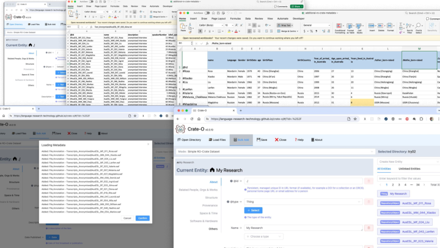

<a href="2024-OR-Crate-O.pdf">PDF version</a> | <a href="2024-OR-Crate-O.pptx">Powerpoint Version</a>

<section  typeof='http://purl.org/ontology/bibo/Slide' style="border:1px solid black;     margin-bottom: 100px; padding: 50px">

# Developer Track Session 2

Time: 05 June 2024, 09:00 - 10:30 · Location: Drottningporten 2

Crate-O - A drop-in linked data metadata editor for RO-Crate (and other) linked data in repositories and beyond

Peter Sefton, Alvin Sebastian, Moises Sacal Bonequi, Rosanna Smith

University of Queensland, Australia

Research Object Crate is a metadata packaging standard which has been widely adopted over the last few years in research contexts and which debuted at Open Repositories with a workshop in 2019.

</section>

<section  typeof='http://purl.org/ontology/bibo/Slide' style="border:1px solid black;     margin-bottom: 100px; padding: 50px">

Crate-O is an editor for the RO-Crate Metadata Specification.

RO-Crate has been presented here at Open Repositories for the last few years, and is now starting to be incorporated into many research repository solutions (though they are not always called repositories).

</section>

<section  typeof='http://purl.org/ontology/bibo/Slide' style="border:1px solid black;     margin-bottom: 100px; padding: 50px">

I am presenting in the next session on why RO-Crate is important for repositories.

# Five ways RO-Crate data packages are important for repositories

Time: 05 June 2024, 11:00 - 12:30 · Location: Drottningporten 1

Peter Sefton\*, Stian Soiland-Reyes\*\*

\*University of Queensland, Australia; \*\*The University of Manchester, UK

Research Object Crate is a linked data metadata packaging standard which has been widely adopted in research contexts. In this presentation, we will briefly explain what RO-Crate is, how it is being adopted worldwide, then go on to list ways that RO-Crate is growing in importance in the repository world:

- Uploading of complex multi-file objects means RO-Crate is compatible with any general-purpose repository that can accept a zip file (with some coding, repository services can do more with RO-Crates)

- Download for well-described data objects complete with metadata from a repository rather than just a zip or file with no metadata

- Using RO-Crate metadata reduces the amount of customisation that is required in repository software, as ALL the metadata is described using the same simple, self-documenting linked-data structures, so generic display templates

- Sufficiently well-described RO-Crates can be used to make data FAIR compliant, aiding in Findability, Accessibility, Interoperability and Reusability thanks to standardised metadata and mature tooling

- And if you’re looking for a sustainable repository solution, there are tools which can run a repository from a set of static files on a storage service, in line with the ideas put forward by Suleman in the closing keynote for OR2023.

</section>

<section  typeof='http://purl.org/ontology/bibo/Slide' style="border:1px solid black;     margin-bottom: 100px; padding: 50px">

The Language Data Commons of Australia Data Partnerships (LDaCA-DP), Language Data Commons of Australia Research Data Commons (LDaCA-RDC), and Australian Text Analytics Platform (ATAP) projects received investment (https://doi.org/10.47486/DP768, https://doi.org/10.47486/HIR001, & https://doi.org/10.47486/PL074)
from the Australian Research Data Commons (ARDC).

The ARDC is funded by the National Collaborative Research Infrastructure Strategy (NCRIS).

</section>

<section  typeof='http://purl.org/ontology/bibo/Slide' style="border:1px solid black;     margin-bottom: 100px; padding: 50px">

A version of the Crate-O component is available as a playground for Chrome browsers only. This allows you to describe your local folders in your computer and generate an RO-Crate.

</section>

<section  typeof='http://purl.org/ontology/bibo/Slide' style="border:1px solid black;     margin-bottom: 100px; padding: 50px">

https://github.com/Language-Research-Technology/ro-crate-modes/blob/main/docs/soss-profiles.md

A Schema.org style Schema (SOSS) specifies a metadata vocabulary of Classes and Properties, based on the RO-Crate specification's use of Schema.org classes.
An RO-Crate Profile has (at least) a document that explains how metadata entities from the Schema are used for a particular purpose.
An RO-Crate Mode is a set of lightweight syntactic rules for combining SOSS Classes, Properties and DefinedTerms, expressed in a JSON file.

</section>

<section  typeof='http://purl.org/ontology/bibo/Slide' style="border:1px solid black;     margin-bottom: 100px; padding: 50px">

Crate-O RO-Crate Editor Mode Files are editor configurations that implement RO-Crate Metadata Profiles.

The configuration files are intended to form the basis of an approach for describing RO-Crate editor behaviour and can be used for RO-Crate validation.

Initial versions of this work were based on the Describo Profiles (which vary between versions of Describo) used to configure the Describo family of RO-Crate editing tools, currently maintained by Marco La Rosa.

</section>

<section  typeof='http://purl.org/ontology/bibo/Slide' style="border:1px solid black;     margin-bottom: 100px; padding: 50px">

Crate-O is a single-page front-end web app developed using the Vue Javascript framework. Vue app is built by composing and nesting modular structures called components.

The main part Crate-O is then bundled in the CrateEditor component (highlighted in red) that allows a user to view, add, edit and delete properties of an entity, add and delete entities, and navigate and browse all entities in the crate.

The CrateEditor component is exported as EMAScript Module and can be imported into any Vue web app by adding Crate-O as dependency.

The default main app (for showcasing) only runs in Chrome-based browsers because it requires the `showDirectoryPicker` method from File System API to access (read/write) a directory on a local machine. The feature is still experimental and only available in Chrome-based browsers. However, the CrateEditor component itself does not require that feature.

</section>

<section  typeof='http://purl.org/ontology/bibo/Slide' style="border:1px solid black;     margin-bottom: 100px; padding: 50px">

This slide illustrates the very basic example of embedding Crate-O CrateEditor in any Vue app.

The example shows a Vue Single-File Component (SFC) (\*.vue)

- Inside the &lt; import the CrateEditor component from the Crate-O package

- Initialise all required variables

- Add the &lt;crate-editor> tag inside the &lt;template> and pass in the data via the attributes:

- crate: a plain js object in json-ld format, usually is the result of JSON.parse() of the string content of ro-crate-metadata.json file

- mode: a plain js object conforming to the ro-crate-mode syntax

</section>

<section  typeof='http://purl.org/ontology/bibo/Slide' style="border:1px solid black;     margin-bottom: 100px; padding: 50px">

Data can be imported into Crate-O using spreadsheets - this is an efficient way to create metadata for collections of objects. Spreadsheet skills are common and many projects have already been described using spreadsheets to describe and manage files, we work with data custodians to standardize their approach to this so that they can create rich linked-data metadata.

</section>

<section  typeof='http://purl.org/ontology/bibo/Slide' style="border:1px solid black;     margin-bottom: 100px; padding: 50px">

Crate-O can be found here https://github.com/Language-Research-Technology/crate-o

</section>
