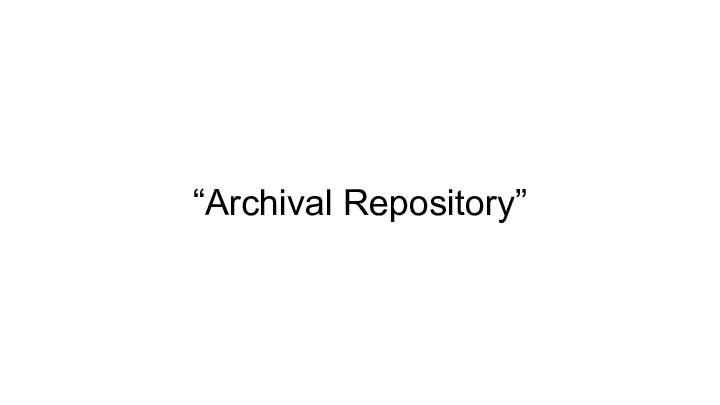
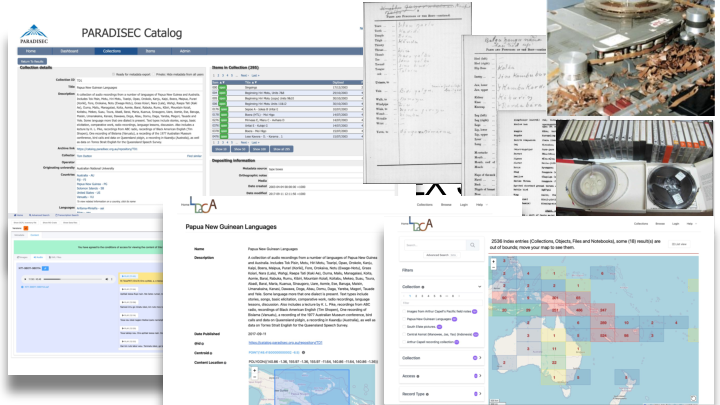
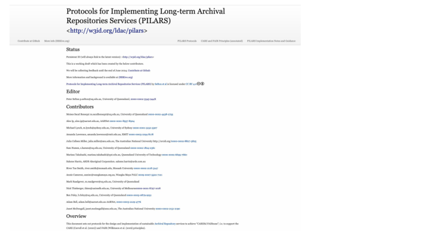
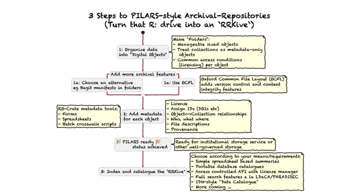

<a href="2024-OR-PILARS.pdf">PDF version</a> | <a href="2024-OR-PILARS.pptx">Powerpoint Version</a>

<section  typeof='http://purl.org/ontology/bibo/Slide' style="border:1px solid black;     margin-bottom: 100px; padding: 50px">

# From “R-Drive to [RRKive](RRKive.org)” – a comprehensive, open and sustainable set of principles and tools for low (and high) resource archival-repositories

Presented at: The 19th International Conference on Open Repositories, June 3-6th 2024, Göteborg, Sweden

Session: Presentations: Open and Sustainable Infrastructure

Time: 04/June/2024: 13:30 - 15:00 · Location: Drottningporten 1

Peter Sefton*, Robert McLellan*, Michael Lynch**, Moises Sacal Bonequi*, Nick Thieberger***

\*University of Queensland; **University of Sydney; \***University of Melbourne

We present a toolkit for sustainable Archival Repositories, with metadata and storage standards as well as APIs and data portals, that can be assembled by communities with various levels of resourcing into repository solutions at a variety of scales, with fallback to offline operation. Tools are designed to work in low-resource environments, allowing communities to have agency and control over their materials. We prioritise sustainability, simplicity, standardisation, linked-data description and clear licensing over user interface features, in line with Suleman’s keynote presentation at OR2023, while still being able to drive rich, full-featured services when resources allow and fall back to a sustainable core if needed.

Much of the data we work with is subject to Indigenous Cultural Intellectual Property (ICIP) rights, controlled by First Nations peoples guided by Indigenous data sovereignty principles; we must ensure it is handled in a conscionable and culturally responsible manner.

Making data Accessible does not always mean Open Access – under both research ethics and the CARE and FAIR principles, data by and about humans needs access control and licensing. Our framework deals with these issues and is built from the ground up to be “as open as possible, as closed as needed”.

NOTE: Since the abstract was submitted we have adopted the name “Protocols” for the use in work we are doing on tools for FAIR and CARE adoption.

</section>

<section  typeof='http://purl.org/ontology/bibo/Slide' style="border:1px solid black;     margin-bottom: 100px; padding: 50px">

This slide summarises the aims of the Language Data Commons of Australia project.

</section>

<section  typeof='http://purl.org/ontology/bibo/Slide' style="border:1px solid black;     margin-bottom: 100px; padding: 50px">

The area of the strategy we’re focusing on for this presentation is highlighted – tools, standards and technical infrastructure.

The activities we are undertaking are:

> - Develop shared tools, standards and technical infrastructure to help data stewards care for data for the long term
> - Build data portals with useful search functions and lightweight technical structures.

Towards the following outcomes:

> - Standards and tools are available and being applied by data stewards
> - Good governance and standardised, distributed storage of data helps
>   preserve data
> - Discovering and locating language data is easy via linked portals.

</section>

<section  typeof='http://purl.org/ontology/bibo/Slide' style="border:1px solid black;     margin-bottom: 100px; padding: 50px">

We don’t need to define the term “Repository” at the Open Repositories conference, but we do need to define a term that we use at LDaCA when we talk about Repositories – we use the inclusive term “Archival Repository” to refer to systems designed to keep data for the long term. We do this to avoid drawing boundaries around what is a “repository” vs an “archive” or a Digital Preservation system and to include as many practitioners as possible in the conversation.

</section>

<section  typeof='http://purl.org/ontology/bibo/Slide' style="border:1px solid black;     margin-bottom: 100px; padding: 50px">

The first implementation of this stream of work was the [UTS Research Data Portal] – this has not been updated for a while due to staffing changes at the university and a lack of ongoing governance that made the data repository dependent on individual people (three of whom are authors of this paper and no longer work for UTS), but as of mid-2024 it is being renovated and revitalised.

[UTS Research Data Portal]: https://data.research.uts.edu.au/

</section>

<section  typeof='http://purl.org/ontology/bibo/Slide' style="border:1px solid black;     margin-bottom: 100px; padding: 50px">

This screenshot shows what an LDaCA site looks like; a typical data-discovery portal. Underneath is not a typical (by Open Repositories standards) repository solution like Dspace, Innvenio or EPrints, all of which are more or less monolithic architectures. Following the implementation protocols we will discuss below, data is very much considered separately from the application used to provide views of the Archival Repository.

</section>

<section  typeof='http://purl.org/ontology/bibo/Slide' style="border:1px solid black;     margin-bottom: 100px; padding: 50px">

This slide shows a collage of images from the [PARADISEC]( https://www.paradisec.org.au/) catalogue and some images of the materials that have been digitised. Objects in the collection range from manuscript images to dynamic media, predominantly audio from analog tapes which are now at risk of loss due to old age.

PARADISEC’s separation of data-at-rest from portal application was one of the main inspirations for our implementation protocols, introduced below.

</section>

<section  typeof='http://purl.org/ontology/bibo/Slide' style="border:1px solid black;     margin-bottom: 100px; padding: 50px">

Opening Australia’s Multilingual Archive is a collection of linked documents, authors and places which was created in Heurist, a legacy digital humanities web app - we used it as a proof-of-concept for getting the objects and their relationships crosswalked from Heurist’s native XML format to an RO-Crate, giving us a file-based archive of the collection. We then extended the LDaCA data discovery portal to include maps and timelines. This gives the sort of rich, immersive data exploration typical of custom websites.

</section>

<section  typeof='http://purl.org/ontology/bibo/Slide' style="border:1px solid black;     margin-bottom: 100px; padding: 50px">

The work we are presenting here builds on “Arkisto”, an initiative started in 2019 and funded by an ARDC precursor, the Australian National Data Service. Arkisto was an _informal_ collaboration between the University of Technology Sydney and PARADISEC with contributions from AARNet and the State Library of NSW, and resulted in a website that articulated some principles and use cases for designing sustainable repositories. The initial work was presented at OR 2021.
The Arkisto approach is summarised on the home page:
Data on an Arkisto deployment is always available on disc (or object storage) with a complete description independently of any services such as websites or APIs. Once the data is safe and well described, Arkisto has a flexible model for how data can be accessed using a variety of services.
The approach, and the standards it mentioned, the Oxford Common File Layout (OCFL) (Hankinson et al., 2019) and Research Object RO-Crate (RO-Crate) (Soiland-Reyes et al., 2022), were included in the successful proposal for the Language Data Commons of Australia project, and that project with continued collaboration with PARADISEC and the University of Sydney, has advanced the work.

</section>

<section  typeof='http://purl.org/ontology/bibo/Slide' style="border:1px solid black;     margin-bottom: 100px; padding: 50px">

The Arkisto work was helpful in that it aided in securing funding and was the starting point for principled development of Archival Repository solutions. However, it had a few issues.

The core idea of Arkisto was indeed a set of principles, but:

We also presented it as a “Platform” (whatever that is) and tied implementation of the platform to two particular Specifications (which we still use at LDaCA).
The informality of the collaboration became a problem when there were disagreements; the site did not have clear ownership or governance so there was no mechanism for resolving issues or making major changes to the site.
We decided to revisit the Arkisto approach, separating out principles (CARE and FAIR), implementation protocols, and then implementation details such as which specifications are followed and software tools to implement them.

</section>

<section  typeof='http://purl.org/ontology/bibo/Slide' style="border:1px solid black;     margin-bottom: 100px; padding: 50px">

Here we introduce the PILARS protocols, which the lead of the LDaCA project, Professor Michael Haugh, described as a guide to implementing “CAREul FAIRness”, referring to the CARE and FAIR principles.
This is a snapshot of the current draft. The Protocols have a persistent identifier: <http://w3id.org/ldac/pilars>

</section>

<section  typeof='http://purl.org/ontology/bibo/Slide' style="border:1px solid black;     margin-bottom: 100px; padding: 50px">

The [CARE] principles frame the [FAIR] principles with an emphasis on the rights of Indigenous Peoples, and (we think on the LDaCA project) have relevance to any data.

> The current movement toward open data and open science does not fully engage with Indigenous Peoples' rights and interests. Existing principles within the open data movement (e.g. FAIR: findable, accessible, interoperable, reusable) primarily focus on characteristics of data that will facilitate increased data sharing among entities while ignoring power differentials and historical contexts. The emphasis on greater data sharing alone creates a tension for Indigenous Peoples who are also asserting greater control over the application and use of Indigenous data and Indigenous Knowledge for collective benefit.

[FAIR]: https://www.nature.com/articles/sdata201618
[CARE]: https://www.gida-global.org/care

</section>

<section  typeof='http://purl.org/ontology/bibo/Slide' style="border:1px solid black;     margin-bottom: 100px; padding: 50px">

PILARS is being managed on GitHub in a public repository, which means anyone can contribute via issues or pull requests.

</section>

<section  typeof='http://purl.org/ontology/bibo/Slide' style="border:1px solid black;     margin-bottom: 100px; padding: 50px">

Setting up the governance is still in progress, but we will be formalising this drawing on the expertise of Robert McLellan - one of the authors of this presentation. The current plan is to use a variant of GitHub’s [Minimum Viable Governance model](https://github.com/github/MVG) which explains how to create a consensus-based governance system with a management committee.

</section>

<section  typeof='http://purl.org/ontology/bibo/Slide' style="border:1px solid black;     margin-bottom: 100px; padding: 50px">

We will now introduce the three main PILARS protocols one by one.

1 Data is Portable: assets are not locked in to a particular mode of storage, interface or service.

1.1 Keep data in one or more general-purpose commodity IT storage systems.

1.1.1 The storage system has a method to store and retrieve file-like datastreams using hierarchical file-paths.

1.1.2 The storage system has a method to list all the file-paths in the storage system.

1.2 Divide up data files into [Storage Objects] that form meaningful units, of the smallest practical size.

1.2.1 Each Storage Object is a directory (or storage object equivalent) containing the files, including metadata and administrative files such as checksums that make up an Object.

1.2.2 Storage Objects can be located by inspecting the contents of the storage hierarchy by listing the paths (1.1.2), for example by the presence of a file with a defined name in the hierarchy.

1.3 Document and implement an ID resolution mapping system to map IDs to storage locations FAIR-F1.

1.4. Store documentation about the conventions and standards such as (1.3) used in a data store within the root of the storage service itself.

1.5 Data storage of well-described data objects is considered separately from the current uses to which the data is put.

1.6 Data files use open or standard formats where possible, independent of particular software FAIR-I.

1.7 If data resides in systems, such as content management systems or database applications which do not inherently support all of the protocols 1 & 2 then put processes in place to export data to a system that does.

</section>

<section  typeof='http://purl.org/ontology/bibo/Slide' style="border:1px solid black;     margin-bottom: 100px; padding: 50px">

2 Data is Annotated: contents, structure, provenance and access and reuse permissions are comprehensively described with metadata and licenses.

2.1 For each Storage Object, store metadata that describes (annotates) the object and (optionally) the files that make up the object. The metadata should be stored in a file or files with the data files.

2.2 For Protocol 2.1 use interoperable general-purpose linked-data metadata stored in a file format which has an Open Specification. This may be extended with domain-specific or ad hoc metadata (which may be in non-linked-data formats) and may be stored in additional files (FAIR-F1 FAIR-F2).

2.3 For each Storage Object, include at least one license document linked from the metadata using the appropriate property for a ‘license’ from the core vocabulary (e.g. http://schema.org/license), setting out in plain language how data may be used and/or redistributed and by whom ([CARE] & [FAIR-R1.1]).

2.3.1 Do not expose data, for example via a portal without access controls or disseminate confidential license or other governance information. Licensing may change, be withdrawn and new licenses added over time, note, however once data has been distributed under an Open Access license it may not be withdrawn from those who have downloaded it.

2.3.2 Documentation about licenses for deposit and archive-wide accession policies may also be stored with an object.

2.4 Store checksum-metadata in a documented standard format alongside data files to help ensure data integrity.

2.5 Represent Repository Collections such as archival series or other organising entities as Storage Objects; either self-contained with their member data within the Storage Object or as metadata-only Storage Objects referencing or referenced by other Storage Objects.

</section>

<section  typeof='http://purl.org/ontology/bibo/Slide' style="border:1px solid black;     margin-bottom: 100px; padding: 50px">

3 Governance

3.1 The purpose of the Archival Repository holding the data is articulated.

3.2 Management systems are in place to sustain the Archival Repository.

3.3 Deposit agreements are in place and documented setting out the rights needed for the Archival Repository as an organisation to manage data.

3.3 Processes are in place to ensure data persistence for the defined periods that meet the repository purpose (including indefinitely).

3.4 Processes are in place for disposal/deaccessioning if appropriate to the purpose.

The first two Protocols are about data storage and description and are the core of the PILARS approach to implementation - the third is a recognition that they need to be followed in a governance context. Archival Repositories are not just software packages or application deployments; they need to be seen as social institutions that have the means to persist, and have management and contingency planning in place.

</section>

<section  typeof='http://purl.org/ontology/bibo/Slide' style="border:1px solid black;     margin-bottom: 100px; padding: 50px">

The initial work on establishing Archival Repository infrastructure for the Language Data Commons of Australia focussed on re-housing existing data sets which were in a variety of legacy web applications, with data and metadata locked up in the likes of WordPress and Zope websites. The best of these applications from a migration perspective was the data from Alveo (Burnham et al., 2014); this was available in a Fedora-based repository which was only intermittently available due to support issues and more usefully, a copy of the data stored on disk with linked-data metadata files (N-Triples) allowed us to migrate those collections to the Arkisto standards-stack by cross walking files directly.

The experience with the Alveo collections, including the largest collection, Austalk (Estival et al., 2014), which had data from around 1000 speakers, totalled 60GB (for metadata and audio) with circa 8 million files, was that having data available on disk with adjacent metadata, free from an API was extremely valuable. We had to develop tooling to migrate data but this was much more straightforward because of the use of standards with available software implementations both in source and target, and the ability to have direct access to the data and metadata from storage.

Subsequently, the team has been working with other legacy and contemporary research data, most of which has never been archived and does not have standardised metadata. Typically researchers manage this kind of data by keeping it on disk, often with an ad-hoc spreadsheet for metadata. This approach is common to many disciplines; we have dubbed this the “R-Drive” approach, where researchers use local storage, or an institutional research data store (hence the “R”). The following is a simplified workflow infographic developed to assist in communicating the basic principles.

</section>

<section  typeof='http://purl.org/ontology/bibo/Slide' style="border:1px solid black;     margin-bottom: 100px; padding: 50px">

The above diagram shows the current state of known PILARS implementation as of the middle of 2024.

There are three main open-source toolkits at the moment.

- [Oni](https://github.com/Language-Research-Technology/oni-ui) is an open-source portal application for building data portals from RO-Crate data – (we showed screenshots above; most of them look like shopping websites for data) – but Oni sites are extremely flexible in how they are presented.

  - The Language Data Commons of Australia (LDaCA)’ s main deployment is the [LDaCA data portal](https://data.ldaca.edu.au)

  - The University of Technology Sydney uses an earlier version of Oni, and is currently being updated to use the LDaCA version.

- [Nyingarn](https://nyingarn.net/) makes manuscript sources of Australian Indigenous languages available as searchable and reusable text documents to support language revitalisation

We showed screenshots for the [OMAA](https://omaa-arts.sydney.edu.au/) above.

</section>

<section  typeof='http://purl.org/ontology/bibo/Slide' style="border:1px solid black;     margin-bottom: 100px; padding: 50px">

The [RRKive](https://rrkive.org)  website is the project site that will contain additional information about PILARS – how to implement the protocols, open source software, presentations etc. to supplement PILARS.

</section>

<section  typeof='http://purl.org/ontology/bibo/Slide' style="border:1px solid black;     margin-bottom: 100px; padding: 50px">

Note – pronounce the “RR” pirate-fashion.

</section>

<section  typeof='http://purl.org/ontology/bibo/Slide' style="border:1px solid black;     margin-bottom: 100px; padding: 50px">

This slide shows a conceptual architecture for [PARADISEC] with some statistics about its large and important collection.

</section>

<section  typeof='http://purl.org/ontology/bibo/Slide' style="border:1px solid black;     margin-bottom: 100px; padding: 50px">

As we are dealing with resources created by people, with inherent rights in what they say and perform, the RRKive approach has a baked-in expectation that _access control_ will be needed, in order to respect ICIP, moral rights and legal and ethical constraints imposed by research institutions and “the law of the land” (although within the so-called Australian context, lands were never ceded by the original long-term custodians, and still today, no legitimate legal instrument, or agreement exists to suggest otherwise) we need to provide mechanisms for authorised data access which is why we engage the above mentioned Indigenous Data Sovereignty principles. And it cannot be emphasised enough that implementing a license-based access system is the easy part of this, it is the engagement with rights-holders which can take a lot of time and effort.

LDaCA has implemented a distributed access control system – we have presented on this before, so will not include that here, see this [previous presentation](../fair-care-eresearch-2022/).

Both PARADISEC and Nyingarn at this stage use ‘traditional’ access control lists which are local to the applications themselves, but there is some scope to discuss the adoption of a more decentralised approach if needed.

</section>

<section  typeof='http://purl.org/ontology/bibo/Slide' style="border:1px solid black;     margin-bottom: 100px; padding: 50px">

The Language Data Commons of Australia (LDaCA) has extensive materials for partners bringing data to the project about how to work our data licensing issues, obtain a DOI, prepare data for ingest and source long-term storage, remembering that LDaCA is a project and cannot provide perennity for data.

</section>

<section  typeof='http://purl.org/ontology/bibo/Slide' style="border:1px solid black;     margin-bottom: 100px; padding: 50px">
, <https://doi.org/10.47486/HIR001>, & <https://doi.org/10.47486/PL074>)
from the Australian Research Data Commons (ARDC).  The ARDC is funded by the National Collaborative Research Infrastructure Strategy (NCRIS).' title='Slide: 24' border='1'  width='85%%'/>

The Language Data Commons of Australia Data Partnerships (LDaCA-DP), Language Data Commons of Australia Research Data Commons (LDaCA-RDC), and Australian Text Analytics Platform (ATAP) projects received investment.
(https://doi.org/10.47486/DP768, https://doi.org/10.47486/HIR001, & https://doi.org/10.47486/PL074)
from the Australian Research Data Commons (ARDC).

The ARDC is funded by the National Collaborative Research Infrastructure Strategy (NCRIS).

</section>

# References

Burnham, D., Estival, D., Cassidy, S., Sefton, P., & Verspoor, K. (2014). Two platforms for research in Human Communication Science: The AusTalk corpus and the Alveo Virtual Laboratory. 17th Oriental Chapter of the International Committee for the Co-Ordination and Standardization of Speech Databases and Assessment Techniques (COCOSDA), 1–6. https://doi.org/10.1109/ICSDA.2014.7051412

Estival, D., Cassidy, S., Cox, F., & Burnham, D. (2014). AusTalk: An audio-visual corpus of Australian English. https://drive.google.com/file/d/1E6D0tDCwz-Y4FmHGDKs45CYCdKwrZMor/view

Hankinson, A., Brower, D., Jefferies, N., Metz, R., Morley, J., Warner, S., & Woods, A. (2019). The Oxford Common File Layout: A Common Approach to Digital Preservation. Publications, 7(2), Article 2. https://doi.org/10.3390/publications7020039
Sefton, P., Sacal Bonequi, M., Sebastian, A., & Raadgever, M. (2023, June 13). Introducing the Oni Repository Stack. https://doi.org/10.5281/zenodo.8091519

Soiland-Reyes, S., Sefton, P., Crosas, M., Castro, L. J., Coppens, F., Fernández, J. M., Garijo, D., Grüning, B., La Rosa, M., Leo, S., Ó Carragáin, E., Portier, M., Trisovic, A., RO-Crate Community, Groth, P., & Goble, C. (2022). Packaging research artefacts with RO-Crate. Data Science, 5(2), 97–138. https://doi.org/10.3233/DS-210053

Thieberger, N. 2023. Doing it for Ourselves: The New Archive Built by and Responsive to the Researcher. Digital Humanities Quarterly (DHQ) Volume 17 Number 1. https://digitalhumanities.org/dhq/vol/17/1/000667/000667.html

---
