<a href="LDaCA Technical Architecture update 2025.pdf">PDF version</a> 

    

<section typeof='http://purl.org/ontology/bibo/Slide'>
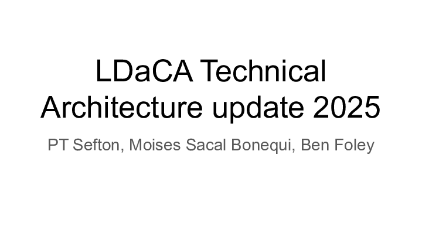

This presentation is an update on the LDaCA technical architecture for the LDaCA Steering Committee meeting 22 August 2025.

The architecture for LDaCA has not changed significantly for the last couple of years. We are still basing our design on the [PILARS](http://w3id.org/ldac/pilars) protocols.

</section>

<section typeof='http://purl.org/ontology/bibo/Slide'>
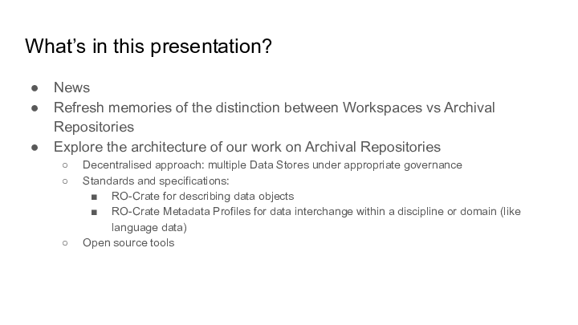

This presentation will report on some recent developments, mostly in behind-the-scenes improvements to our software stack. It will give a brief refresh of the principles behind the LDaCA approach, and talk about our decentralised approach to data management and how it fits with the metadata standards we have been developing for the last few years. We will also show how the open source tools used across LDaCA’s network of collaborators are starting to be harmonised and shared between services, reducing development and maintenance costs and improving sustainability.

</section>

<section typeof='http://purl.org/ontology/bibo/Slide'>
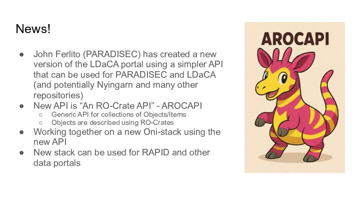

This new RO-Crate API will extend portals and act as a baseline for other infrastructure that uses RO-Crates. For example, AROCAPI has basic routes (use cases) and specific configurations will be implemented (coded/programmed) for different portals.

A concrete example is that PARADISEC will implement different authentication routes (using the existing “Nabu” catalog) than the LDaCA data portal which uses [CADRE](https://cadre.ada.edu.au/login) ([REMS])(https://www.elixir-finland.org/en/aai-rems-2/).

We are evaluating the API throughout its development, rather than waiting until John finishes his work on it. 

</section>

<section typeof='http://purl.org/ontology/bibo/Slide'>
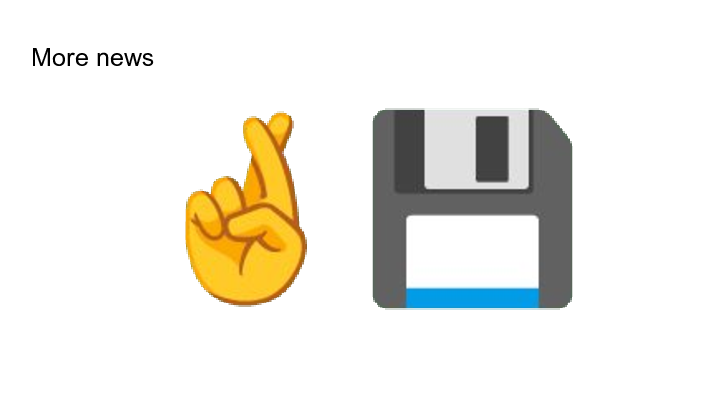

Promising discussions are taking place with one of our partners about taking on LDaCA data long-term (instead of having to distribute the collections across partner institutions). This would give a consolidated basis for a Language Data repository and a broader Humanities data service.

</section>

<section typeof='http://purl.org/ontology/bibo/Slide'>

This slide shows the LDaCA execution strategy. All of the strands (Collect & organise, Conserve, Find, Access, Analyse, Guide) are relevant to the technical architecture.

</section>

<section typeof='http://purl.org/ontology/bibo/Slide'>

From the very beginning of the project, the LDaCA architecture has been designed around the principle that to build a “Research Data Commons” we need to look after data above all else. We took an approach that considered long-term data management separately from current uses of the data.

This resulted in some design choices which are markedly different from those commonly seen in software development for research.

Effort was put into:

- Organising and describing data using open specifications BEFORE building features into applications;
- Designing an access-control system with long-term adaptability in mind (read [the story about that](https://www.ldaca.edu.au/news/posts/fair-care-eresearch-2022/) as presented at eResearch Australasia 2022);
- Batch-conversion of existing data to the new approach; and
- Developing a metadata framework and tools to implement it.

With this foundation, and the new interoperability we gain from our collaboration on the AROCAPI API, we are well placed to collect and conserve more data and make use of data in workspace environments including:

- The new LDaCA analytics forum will drive analytical workspaces
- Work by the LDaCA technical team will continue to improve data preparation workspaces, possibly by collaborating to adapt the Nyingarn Workspace for general purpose use.

</section>

<section typeof='http://purl.org/ontology/bibo/Slide'>
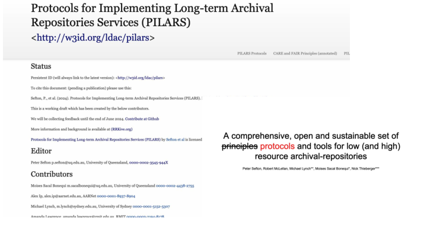

In 2024, we released the Protocols for Implementing Long Term Archival Repositories (PILARS), described in this [2024 presentation at Open Repositories](https://www.ldaca.edu.au/news/posts/open-repositories-2024-pilars/).

</section>

<section typeof='http://purl.org/ontology/bibo/Slide'>

For the rest of this presentation, we will focus on recent developments in the “Green zone” – the Archival Repository functions of the LDaCA architecture. We will not be talking about the analysis stream as that will be discussed in detail in the newly established Analytics Forum.

</section>

<section typeof='http://purl.org/ontology/bibo/Slide'>
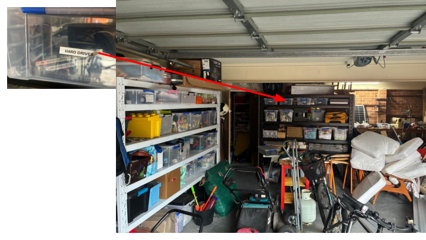

I wanted to throw in a personal story here. This is an unstaged picture of my (PT Sefton’s) garage this morning. The box of hard drives contains some old backups of mine just in case, and also my late father Ian Sefton’s physics education research data, stuff like student feedback from lab programs in the 80s trialling different approaches to teaching core physics concepts and extensive literature reviews. These HAVE been handed on to his younger colleagues but could easily have ended up only available here in this garage. I wanted to remind us all that this project is a once in a career opportunity to develop processes for organising data and putting it somewhere alongside other data in a Data Commons where (a) your descendants are not made responsible for it and put it in a box in the shed or chuck it in a skip; and (b) others can find it, use it (subject to the clear “data will” license permissions you left with the data to describe who should be allowed to do what with it), and build on your legacy.

Remember:

- Storage is not data management (particularly if the storage is a shopping bag full of mistreated hard drives)
- Passing boxes of storage devices hand to hand is NOT a good strategy to conserve data
- Hard drives are not archives

</section>

<section typeof='http://purl.org/ontology/bibo/Slide'>
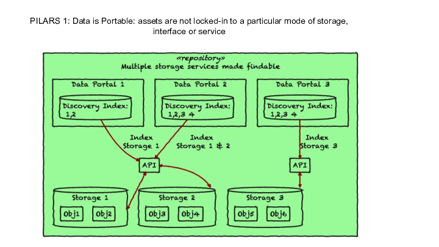

The first principle of PILARS is that data should be portable, not locked-in to a particular mode of storage, interface or service. Following the lead of PARADISEC two decades ago, the protocols call for storing data in commodity storage services such as file systems or (cloud) object storage services. This means that data is available independently of any specific software. This diagram is a sketch of how this approach allows for a wide range of architectures – data stored according to the protocols can be indexed and served over an API (with appropriate access controls). Over the next few slides, we will show some of the architectures that have emerged over the last couple of years at LDaCA.

</section>

<section typeof='http://purl.org/ontology/bibo/Slide'>
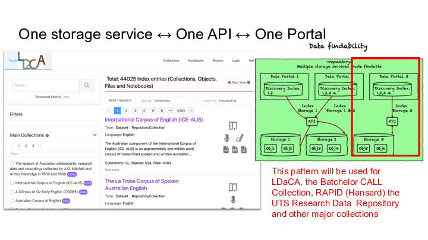

The first example is the LDaCA data portal, which is a central access-controlled gateway to the data that we have been collecting.

NOTE: during the project it has been unclear how we would look after data at the conclusion of the project. No single organisation had put up its hand up to host data for the medium to long term, but as noted in the News section we have had some positive talks with one of our partner institutions indicating that they may have an appetite for hosting data that otherwise does not have a home, and/or providing some redundancy for at-risk collections where data custodians are comfortable with a copy residing at the university (we won’t say which one until negotiations are more advanced).

</section>

<section typeof='http://purl.org/ontology/bibo/Slide'>
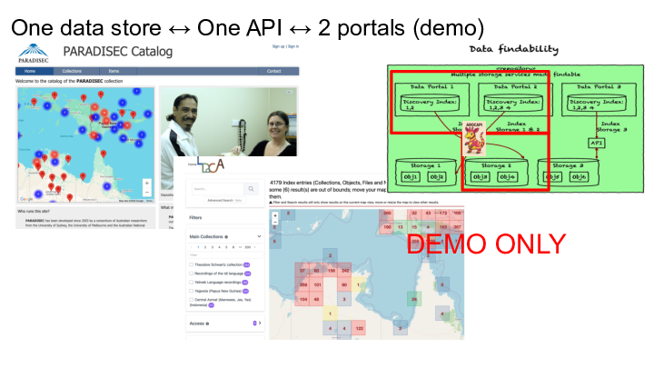

As part of the LDaCA / PARADISEC collaboration noted above, we have been working on the definition

</section>

<section typeof='http://purl.org/ontology/bibo/Slide'>

We have also explored other ways of sharing data assets, including local distribution via portable computers such as Raspberry PI with a local wireless network. There have also been discussions about establishing regional cooperative networks where communities reduce risk by holding data for each other.

</section>

<section typeof='http://purl.org/ontology/bibo/Slide'>
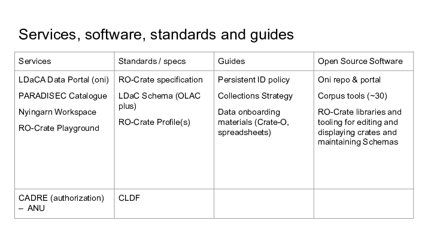

This slide summarizes the resources that have been developed by LDaCA and partners (the top row) with other resources listed  in the bottom row.
-  Oni 👹 portal software for mid-to-large deployments
  - V1 is working 
  - V2 under development with PARADISEC – a new shared API and code base that can be used across LDaCA and beyond
-  REMS - manage access control with identified users we use this via [CADRE]
-  “Corpus tools” (~30) for migrating data from existing formats to LDaCA ready RO-Crate are [available on github](https://github.com/Language-Research-Technology?q=corpus-tool)
    - Reduce cost of developing new migration tools by adapting existing corpus tools
    - Reproducible migration processes
    - Basis for quality assurance checks
-  Software libraries for managing data in RO-Crate, maintaining schemas available on at our [github organization](https://github.com/Language-Research-Technology)
-  RO-Crate prep tools
[Crate-O](https://language-research-technology.github.io/crate-o/#/) (now included in Nyingarn)
     -  Crate-O-compatible spreadsheet templates for DIY data import and supporting familiar Excel-based workflows - [documented](https://www.ldaca.edu.au/resources/user-guides/crate-o/convert-spreadsheet/) on the LDaCA website.
     - [LaMeta](https://sites.google.com/site/metadatatooldiscussion/home) – now has RO-Crate support
     - [RO-Crate playground](https://ro-crate.ldaca.edu.au/) to experiment with and validate metadata
-  Data preparation Workspaces
    - Niyingarn [https://nyingarn.net/](focussed on manuscripts only ATM)
TBD, next steps will be a Multi-modal workspace (audio & video transcription)

[CADRE]: https://cadre.ada.edu.au/

- We use the following metadata standards:
    - [OLAC - The OLAC Metadata Set and Controlled Vocabularies](https://aclanthology.org/W01-1506.pdf)
    - [CLDF - Cross-linguistic Data Formats](https://github.com/cldf/cldf)

</section>

<section typeof='http://purl.org/ontology/bibo/Slide'>
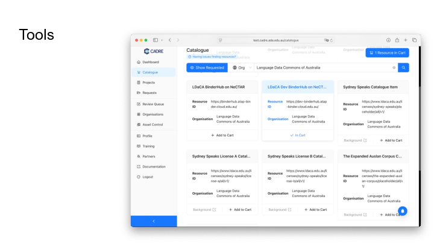

A service agreement between LDaCA and CADRE has been signed, to manage access control. 

REMS is still the backend of this tool, but CADRE built a wrapper so it looks more attractive.

CADRE version 2 is working on replacing the ADMIN component of REMS and is in testing phase now.

</section>

<section typeof='http://purl.org/ontology/bibo/Slide'>
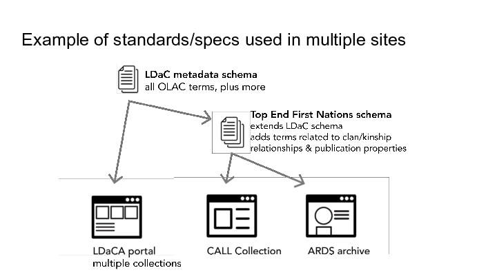

This slide show how the work we have done to define a metadata schema for language data based on existing work, are being extended to use in specific contexts. 

</section>

<section typeof='http://purl.org/ontology/bibo/Slide'>
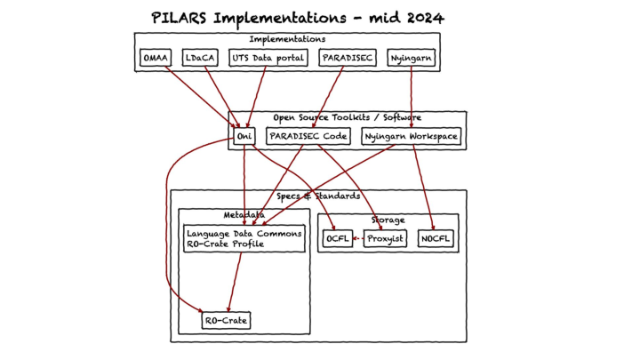

This diagram shows how the PILARS principles have been implemented by different organisations. Each example uses open source software, and accepted standards for metadata and storage, meaning that data is portable.  

</section>

<section typeof='http://purl.org/ontology/bibo/Slide'>
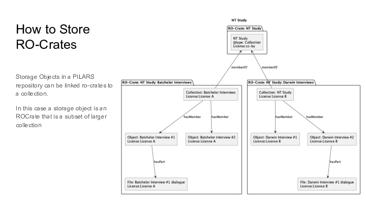

This slide shows one *potential* view of LDaCA’s architecture in 2026. There may be an opportunity to deepen the collaboration between the UQ LDaCA team and the PARADISEC team at Melbourne, sharing the development of more code.

For example, Nyingarn’s incomplete repository function could be done by a stand alone instance of the Oni portal, or as shown here, added to the LDaCA portal as a collection. 

Likewise the non-existent user-focussed data preparation functions of Nyigarn, where a user can describe an object and submit it could be generalized for use in LDaCA.

Changes shown in this diagram: 
- Remove the under-developed “[NOCFL]” storage service from Nyingarn and replace with either OCFL or an Object Store solution
- Upgrade Nyingarn workspace to be a generic data onboarding app for all kinds of data (rather than only manuscript transcription focus)

[NOCFL]: https://github.com/CoEDL/nocfl-js
[ARDC]: https://ardc.edu.au/ 

To conclude, we have an opportunity now to consider how the distributed LDaCA technical team can collaborate on key pieces of re-deployable infrastructure. This work is having an impact in other Australian Research Data Commons  ([ARDC]) co-investments.

</section>

