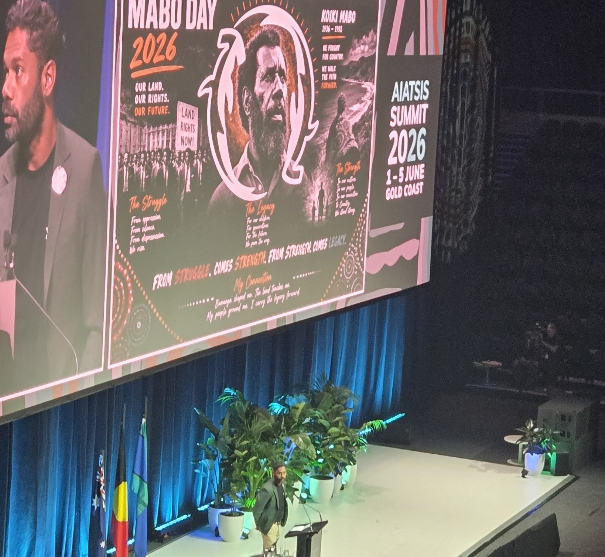
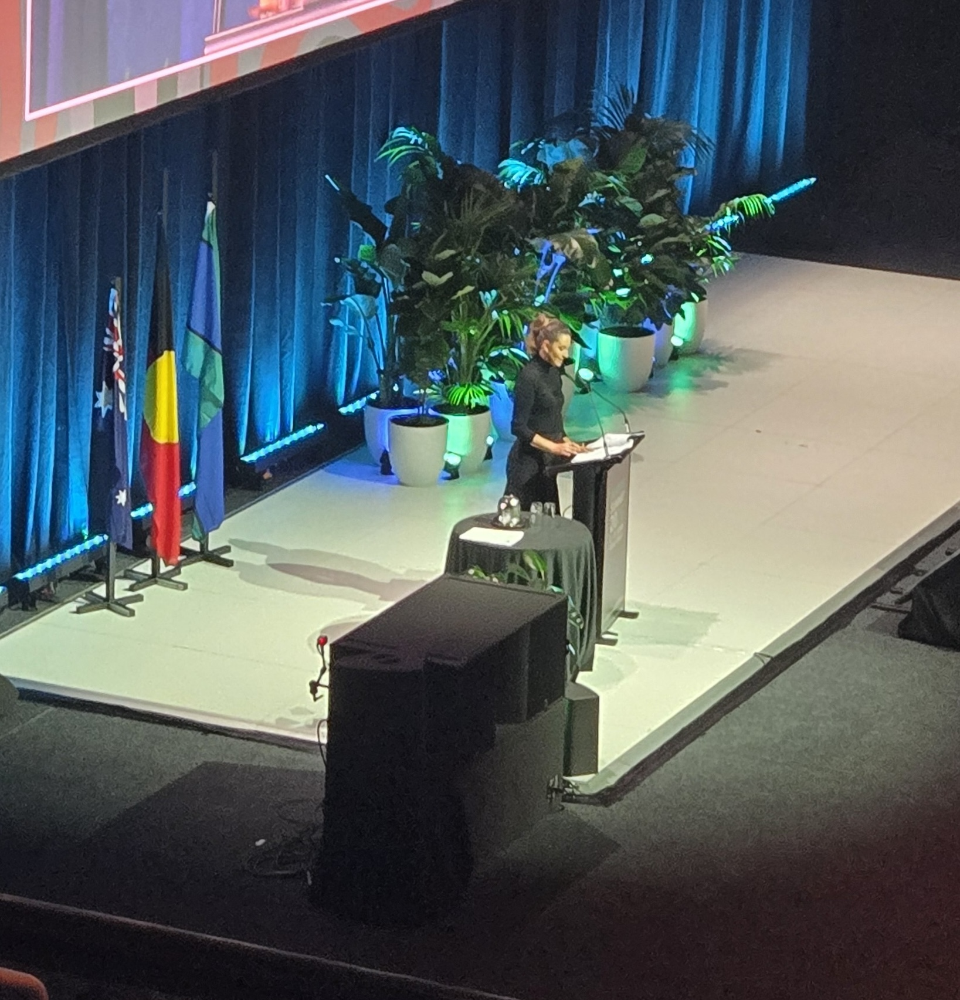
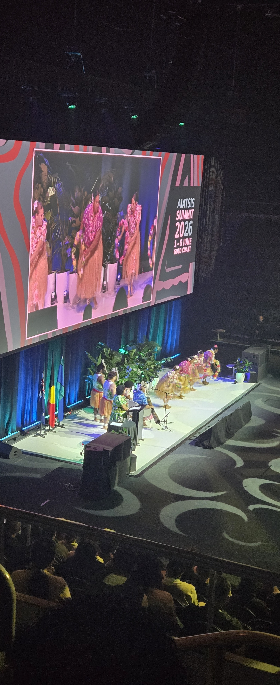

by 

The [AIATSIS Summit 2026](https://aiatsis.gov.au/whats-new/events/aiatsis-summit-2026) was held at the Gold Coast Convention and Exhibition Centre from 1–5 June 2026, co-hosted by the [Danggan Balun Aboriginal Corporation](https://fiverivers.net.au/) on the Country of the Kombumerri people of the Yugambeh language region. The Summit brought together Aboriginal and Torres Strait Islander Elders, leaders, and youth alongside academics, legal experts, the GLAM sector and government representatives to address issues of significance to First Nations peoples. This year's theme, Our Truth. Our Power. Our Future, acknowledged the lived experience, strength and resilience of Aboriginal and Torres Strait Islander peoples. Programming spanned research, cultural resurgence, rights and recognition, languages, governance and much more.

Among the attendees was Blanche Alexander, the newly appointed Data and Research Infrastructure Intern at ARDC with LDaCA. Here are her reflections on the event. 

 


 

I gained an enriched insight from the presentations delivered by Alex Hohoi and Moises Sacal Bonequi, who represented LDaCA at the conference. Their sessions uncovered themes such as the project's alignment to Closing the Gap Reform 4, which shapes progress in shared access to data and information. Target 16 was also highlighted, establishing strategy around Aboriginal and Torres Strait Islander cultures and languages remaining strong, supported and flourishing. Alex also explained the project's alignment with the [Global Indigenous Data Alliance](https://www.gida-global.org/) (GIDA). Further topics addressed inaccessibility as a key concern for uncatalogued data, with solutions proposed to improve findability.

Alex also discussed data governance in Milingimbi (a remote Yolŋu island community in Arnhem Land) including ideas about culturally informed place-based data enrichment processes.Their data enrichment program was championed by the community, which reflected local authority, and improved data integrity and data classification by strengthening digital assets with knowledge systems known to the area. In another example she shared from Arrernte, the capability to regain access to community data empowered a cultural resurgence and a return of sacred ceremonial practice. 
 
 



    

        
    

    

        
    

    

        
    



 
At the conference, I also had the pleasure of meeting PhD Candidate, Becki Cook, whose research spans data literacy within the health sector. Cook’s data literacy framework has cross-sector application, which is an exciting prospect for Indigenous Data Governance. [IndijiSeal](https://virtualsonglines.com/indiji) was another well-presented session that demonstrated a Virtual Songlines Digital Twin and spoke in depth about cryptographic controls that their team has developed to protect Indigenous artworks within the virtual ecosystem. The story of Bibi Barba, an Indigenous artist whose work was stolen under acts of infringement, detailed her experience and enforced the importance of preventing cultural harm on First Nations people’s data. 

In passing, I spoke to thought-leader, Terri Janke, and posed a question in relation to [Bulun Bulun v R & T Textiles Pty Ltd (1998)](https://www.austlii.edu.au/cgi-bin/viewdoc/au/journals/IndigLawB/1998/87.html), a landmark Australian Federal Court case concerning Indigenous Cultural and Intellectual Property (ICIP). I asked what impact the determination had on Indigenous Data Governance and Terri offered her insight into how the outcome has informed this area. After this discussion, I aim to continue further research community rights alignment to customary lore and responsibilities inherited by custodians of cultural assets. I want to understand considerations of ICIP and the legal relationship to fiduciary obligation.

Overall, my experience at AIATSIS has led to professional and personal growth, with my aims in Indigenous Data Sovereignty evolving with greater clarity.

 

### About the author



#### Blanche Alexander
[Blanche Alexander](https://www.linkedin.com/in/blanchealexander/) has worked in the community sector and the technology industry. Her professional interests are data analysis, cybersecurity and application development. Her personal hobbies are writing, music and digital art. She aims to ensure reciprocity and respect are upheld for First Nations people.

Blanche is the Data and Research Infrastructure Intern at [ARDC](https://ardc.edu.au/) working with LDaCA.

 
 

