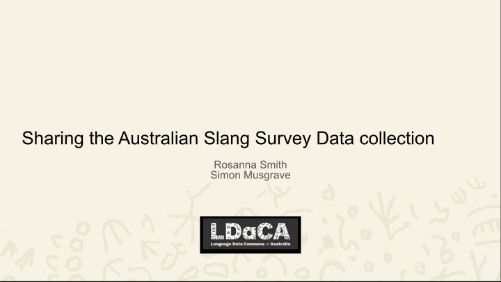
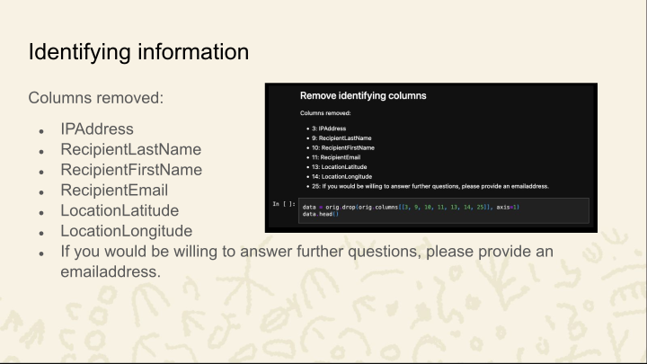
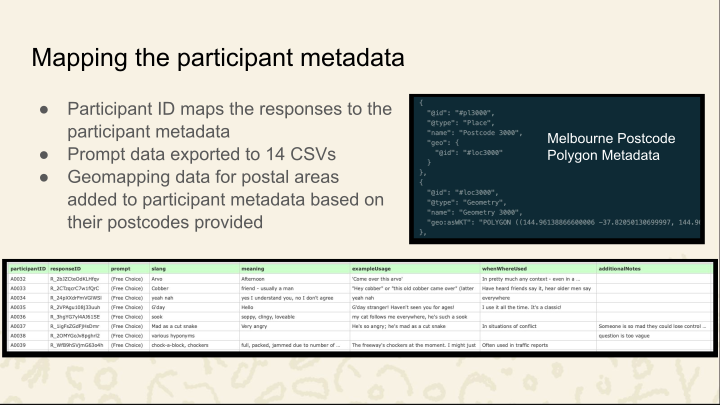
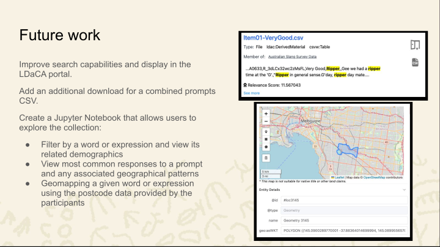

<a href="SlangSurvey.pdf">PDF version</a> | <a href="SlangSurvey.pptx">Powerpoint Version</a>

    

<section typeof='http://purl.org/ontology/bibo/Slide'>
 

This material was presented to the [8th Forum on Englishes](https://sites.google.com/view/auseng/home) in Australia, Melbourne 7/11/2025 by  and .

 

</section>

<section typeof='http://purl.org/ontology/bibo/Slide'>
 

The title of the project includes the phrase ‘Australian Vernacular’. For many people, this phrase makes sense intuitively but for our purposes we needed to unpack its meaning, particularly in relation to the idea of ‘Australian Slang’. Slang is a part of language use in any community, deployed to indicate membership of specific groups and to include people in, or exclude them from, some communication. This kind of slang is typically short-lived. As team members Dylan and Howard (Howie) have pointed out in [recent work](https://sites.google.com/view/auseng/programme-2025), the move from ‘cool’ to ‘cringe’ can happen very quickly. But there is also a repertoire of expressions which have lasted longer and which are taken by many people to be part of an Australian identity; this is a much more reified idea of ‘Australian Slang’, the kind of language which is the subject of humorous websites intended to help new chums (see what I did there?).

</section>

 

<section typeof='http://purl.org/ontology/bibo/Slide'>
 

As part of our project, we wanted to find out how people who use Australian English think about this version of ‘Australian Slang’. It seemed unlikely that collecting spontaneous language use data would address this question - and that would have been very expensive and time-consuming. (This is not to say that looking at records of language use is irrelevant - see the [post on this blog](../putting-data-to-work/) about Simon's work on slang as part of an Australian literary tradition, where corpus data inform the argument.) We decided that collecting data about metalinguistic knowledge of Australian Slang, what users of the language can reflectively say about Slang, would be a substantial resource for our research and we therefore designed and implemented a survey to collect such data.

Two members of our team (Kate and Howie) regularly appear on various ABC Radio stations and this meant that we were able to publicise the survey very widely. As a result, we were fortunate to acquire a very substantial body of data.

 

</section>

<section typeof='http://purl.org/ontology/bibo/Slide'>
 

We mentioned above that the information we were hoping to receive was metalinguistic and this is reflected in the structure of the survey questions. We did not ask participants about expressions which they did or might use - of course self-report data is notoriously unreliable. Instead, we asked about expressions which they thought of as typically Australian, and allowed them the opportunity to give information about the potential usage of an expression. Answering the question ‘When and where have you heard this expression used?’ allowed respondents to say that they used an expression, but many of the responses here were of the kind: “Not since the 80s.” (in relation to _grouse_). Many of the 'Further Comments' responses were along similar lines, for example, ‘It's not that common anymore. A working class or rural expression’ as a comment about _beauty_. These examples suggest that responses to the survey were of the kind we had hoped to receive: accounts of the consciously accessible knowledge people had about Australian Slang as a language register.

 

</section>

<section typeof='http://purl.org/ontology/bibo/Slide'>
 

The thirteen prompts mainly cover meanings with an affective component. Some of these prompts could be seen as referring to things or ideas which are seen as stereotypically Australian (e.g. the two alcohol-related items). This was a deliberate choice as we might expect that a strong association with Australianness would correlate with language which is also seen as distinctively Australian. As noted previously, prompt 13 and the final open question included an additional response category for the meaning of the expression. The responses for prompt 13 are of course much less cohesive than responses for the other prompts, but in the survey design process we were unable to decide on one specific body part which we thought would elicit characteristically Australian expressions (and we didn’t want to be indelicate!).

 

</section>

<section typeof='http://purl.org/ontology/bibo/Slide'>
 

The upper screen shot shows the first part of some rows on the response table. The initial columns are all Qualtrics-generated metadata; responses to questions we asked begin in the column headed ‘Is your age….’. The full question was “Is your age over 15?” and it was included because we wanted to allow at least some school age participants to contribute data but to make ethics clearance possible we had to specify a minimum age. If a participant answered ‘No’ to this question, the survey automatically closed. The lower screen shot shows some responses to one prompt (_something very good_). 

The screen shots show several problems which needed to be addressed before the data could usefully be shared:
- Potentially identifying information (precise location when survey was accessed, email provided if willing to answer follow-up questions)
- Blank responses
- Encoding issues (here partly due to the idiosyncrasies of Excel)

 

</section>

<section typeof='http://purl.org/ontology/bibo/Slide'>
 

Our aim was to make this dataset FAIR compliant. Findability is the last step in the process: when the data is tidied and formatted as an RO-Crate, it can be published in the LDaCA [data portal](https://data.ldaca.edu.au/search) where it is now discoverable and has a DOI. Our aim was to have a dataset which could be freely shared and this required the removal of the potentially identifying information mentioned on the previous slide. Contact emails were provided by some respondents in response to a question asking if they were willing to be contacted for follow-up questions. This information could only be shared beyond the project team if explicit permission was sought from each respondent and this is not practically possible. 

We improved the interoperability and reusabilty of the data in several ways. The download from Qualtrics has all responses from a participant as a single row with over 100 cells. We created a separate table for responses to each prompt to make the data more manageable. Within each of those tables, we removed blank responses, i.e. if a participant provided no responses to a particular prompt, that participant would not appear in the relevant table but might appear in other tables (unless they provided no responses at all). We also normalised encoding of e.g. quotation marks to improve interoperability. Spelling variations (e.g. _bonza/bonzer_) were left untouched as we believe that they may provide valuable information; for example, spelling variation may be regionally conditioned.

 

</section>

<section typeof='http://purl.org/ontology/bibo/Slide'>
 

As mentioned above, the original format of the data was unwieldy, with all the responses from a single participant in one row. We needed to convert the 100+ columns in the original data to separate rows per prompt, and from these generate 14 CSV files for each of those prompts. We also needed a de-identified version of the original data without any further transformation.

To do this, we used Jupyter Notebooks, which allow you to load the collection data and transform its contents in a repeatable way.This reproducibility also means others can run the same steps and identify areas where further data wrangling is needed, and I’ll take you through some of these now.

 

</section>

<section typeof='http://purl.org/ontology/bibo/Slide'>
 

For the de-identified version of the original survey, we removed 7 columns that contained personal identification data. This was then exported to a CSV with no further changes, preserving the original structure of the survey within the collection.

 

</section>

<section typeof='http://purl.org/ontology/bibo/Slide'>
 

We then needed to generate the CSVs for the 14 prompts. The first step here was to load the original data as a Pandas DataFrame and identify the columns related to each prompt. We also kept the Response ID to map those responses to the participant metadata. We then added a column with the prompt name, and this means we can recombine the data to run further processing, but it’s easy to split these out again for the separate CSVs.

 

</section>

<section typeof='http://purl.org/ontology/bibo/Slide'>
 

Unlike the rest of the prompts, those for Body Part and Free Choice had an additional column where participants could explain the meaning of the slang term, and this created a mismatch when we were trying to recombine the data. So for the 12 other prompts, we added a blank ‘meaning’ column to fix this and standardise the overall structure.

 

</section>

<section typeof='http://purl.org/ontology/bibo/Slide'>
 

Throughout the data, there were also sections where participants didn’t have responses to a particular prompt, and these weren’t useful to keep for this collection. Removing these would have caused a problem in the original format, but now that the data was divided according to prompt, we could remove these non-responses without deleting the whole row of a participant where they’d provided responses to other prompts.

 

</section>

<section typeof='http://purl.org/ontology/bibo/Slide'>
 

Another important part of the slang data processing was standardising some of the formatting and character encoding, to improve the searchability of the collection overall. This included removing leading and trailing spaces, fixing double spaces and minor errors in punctuation position. We also standardised quotation marks and removed some diacritic typos. The examples here show the highlighted items that were identified in the first box, and the reformatted version in the second.

 

</section>

<section typeof='http://purl.org/ontology/bibo/Slide'>
 

So with all these updates applied, we mapped the participant ID to the responses, and each prompt was exported to a separate CSV file, like the example shown here. With the participant ID, we could also map each response to the postcodes provided by the participants, and then use geomapping data from the Australian Bureau of Statistics to turn these postcodes into polygons in the collection metadata.

 

</section>

<section typeof='http://purl.org/ontology/bibo/Slide'>
 

The transformed collection is now stored in the LDaCA Portal as an [RO-Crate](https://www.researchobject.org/ro-crate/) or Research Object Crate. This is a way of packaging research data that stores the data together with its associated metadata and other component files, such as the data license.

The screenshot on the right shows the collection in the portal, listing some of its main details, access permissions and downloads.

The screenshot on the left is an example of one of the transformed CSV files within the collection, that can be viewed in the portal.

 

</section>

<section typeof='http://purl.org/ontology/bibo/Slide'>
 

Now that the data is available in the portal, we’re looking at next steps for the slang data. One of these is improving how results from searching the collection are displayed. As you can see from the top screenshot, a query currently returns the full line from the CSV file rather than just the cells where the search term occurs. Another is adding a download combining all the prompts in a single CSV, which in some cases is preferable to work with than the split CSVs.

We’ll also be developing a Jupyter Notebook linked from the portal, that allows users to explore the collection in more detail. This would include the ability to filter by word or expression, demographics including age range and gender, as well as viewing the most common responses for a given prompt. We can also map the postcodes provided by the participants using the geomapping data, and through this view any geographical patterns associated with the slang terms.

 

</section>

<section typeof='http://purl.org/ontology/bibo/Slide'>
 

Finally, if you’re interested in hearing more about this and other collections we’re working on at LDaCA, you can subscribe to our newsletter with the QR code.

 

</section>

