 

[Download as PDF](arkisto-stack-or-2023.pdf)

This presentation was delivered by Peter Sefton at the [Open Repositories 2023](https://or2023.openrepositories.org/) conference in South Africa on 2023-06-14 in the [Presentations: Discipline specific systems with  principles
](https://www.conftool.net/or2023/index.php?page=browseSessions&form_session=460&presentations=show) session.

This contains the slides and complete speaker notes, which have been edited after the conference.

<section typeof='http://purl.org/ontology/bibo/Slide'>

We will present a standards-based generalised architecture for large-scale data\* repositories for research and preservation illustrated with real-world examples drawn from a number of languages and cultural archive projects. This work is taking place in the context of the Australian Humanities and Social Sciences Research Data Commons, particularly the Language Data component thereof and the long-established  cultural archive. The standards used include the Oxford Common File Layout for storage, Research Object CRATE () for consistent linked-data description of  digital , and a language data  profile to ensure long-term interoperability between systems and re-usability over time. We also discuss data  and authorization for access to non-open resources. We suggest that the approach shown here may be used in other disciplines or for other kinds of digital library, repository or archival systems.

\*The submitted abstract did not have the word data here - added for clarity

By: Peter Sefton (University of Queensland), Simon Musgrave (University of Queensland & Monash University) & Nick Thieberger (University of Melbourne)

 

<section typeof='http://purl.org/ontology/bibo/Slide'>

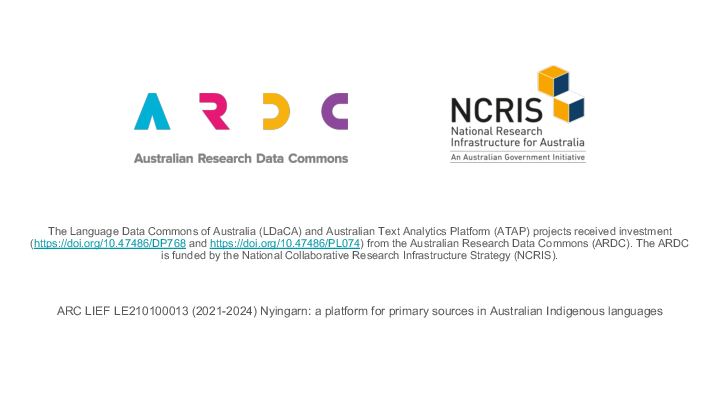

This work is supported by the Australian Research Data Commons.

</section>

 

<section typeof='http://purl.org/ontology/bibo/Slide'>

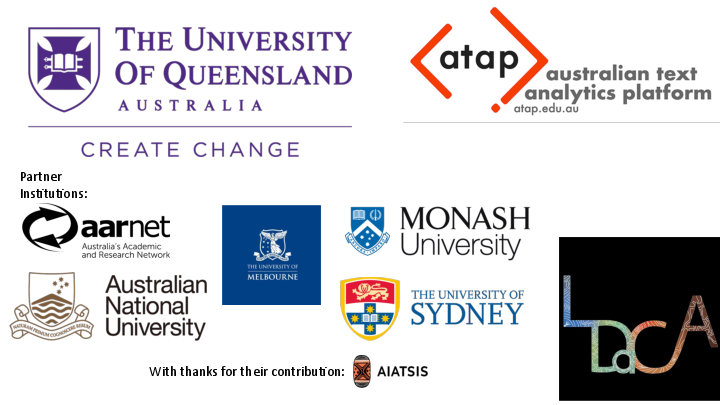

The Language Data Commons of Australia Data Partnerships (LDaCA) and the Australian Text Analytics Platform () are building towards a scalable and flexible language data and analytics commons. These projects will be part of the  (Humanities and Social Sciences) and Indigenous Research Data Commons (HASS+I ).

The Data Commons will focus on preservation and discovery of distributed multi-modal language  under a variety of governance frameworks. This will include access control that reflects ethical constraints and  rights, including those of Aboriginal and Torres Strait Islander, migrant and Pacific communities.

The platform will provide workbench services to support computational research, starting with code-notebooks with no-code research  provided in later phases. Research artefacts such as code and derived data will be made available as fully documented research objects that are re-runnable and rigorously described. Metrics to demonstrate the impact of the platform are projected to include usage statistics, data and article citations. These projects are led by Professor Michael Haugh of the School of Languages and Cultures at the University of Queensland with several partner institutions.

We would like to acknowledge the traditional custodians of the lands on which we live and work and the importance of Indigenous knowledge, culture and language to these projects. Peter Sefton lives and works on Wiradjuri land, and for Nick Thieberger and Simon Musgrave, it's the land of the Kulin nation.

</section>

 

<section typeof='http://purl.org/ontology/bibo/Slide'>

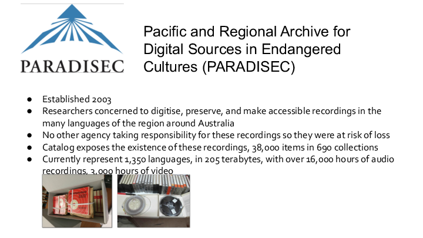}}) Established 2003 Researchers concerned to digitise, preserve, and make accessible recordings in the many languages of the region around Australia No other agency taking responsibility for these recordings so they were at risk of loss Catalog exposes the existence of these recordings, 38,000 items in 690 collections Currently represent 1,350 languages, in 205 terabytes, with over 16,000 hours of audio recordings, 3,000 hours of video ' title='Slide: 3' border='1'  width='85%%'/>

 is an online archive of cultural data which has been maintained for twenty years, in this presentation, we will look at some of the lessons learned from . In summary – the  approach to simple data and metadata storage is something we want to continue in , while the high cost for  of commissioning and maintaining its own software stack is something we want to address by taking a more standards-based approach to managing language and other data over the coming decades.

</section>

 

<section typeof='http://purl.org/ontology/bibo/Slide'>

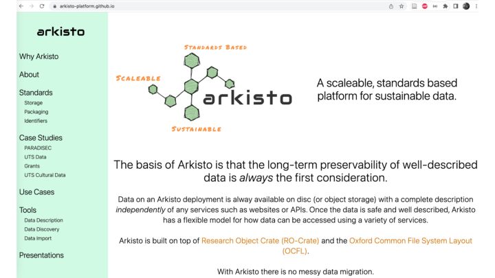

The  platform started in 2019 as a way to capture the lessons of  and other projects such as Alveo (another language data project similar in scope to LDaCA) which was presented at OR 2014: Sefton PM, Estival D, Cassidy S, Burnham D, Berghold J. The Human Communication Science Virtual Lab (HCS vLab): A repository microclimate in a rapidly evolving research-ecosystem. In: Open Repositories 2014. Helsinki; 2014 [cited 2016 Jul 19]. Available from: http://www.doria.fi/handle/10024/97740

</section>

 

<section typeof='http://purl.org/ontology/bibo/Slide'>

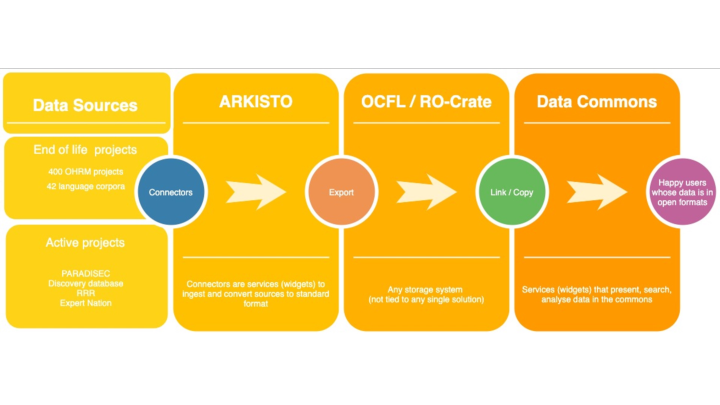

This diagram was used in the bid documents that established LDaCA - it shows the progression of data from end-of-life projects and active repositories into a standards-based data-commons.

</section>

 

<section typeof='http://purl.org/ontology/bibo/Slide'>

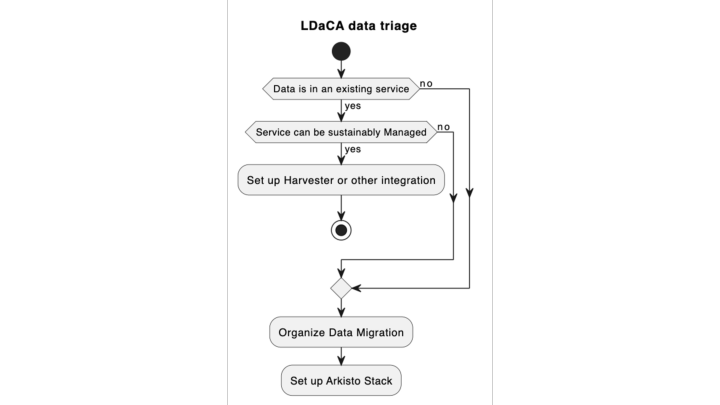

This is the data triage process we have been going through in LDaCA — and it should be noted that of all the data we are presented with, most of it needs to be reworked into the  Standards Stack. Even  which in 2019 received the international [Core Trust Seal](https://www.coretrustseal.org/why-certification/certified-repositories/) based on the [DSA-WDS Core Trustworthy Data Repositories Requirements](http://www.coretrustseal.org/requirements/) is still in the process of migrating data to more sustainable formats.

</section>

 

<section typeof='http://purl.org/ontology/bibo/Slide'>

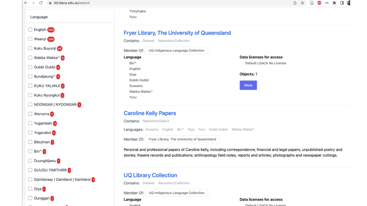

This is a taster of what data looks like in the kids of repositories we are talking about. This site contains harvested metadata about holdings on Australian Indigenous Languages in University of Queensland Libraries.

</section>

 

<section typeof='http://purl.org/ontology/bibo/Slide'>

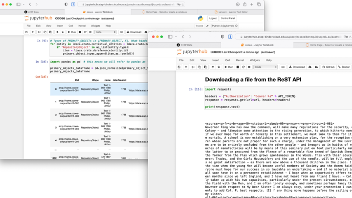

The LDaCA services we are building use an  to drive the data portals. The  can be used for direct access with appropriate access control – see [another eResearch presentation](../fair-care-eresearch-2022) which explains this in detail. These screenshots show code notebooks running in  on the Nectar cloud accessing language resources.

This work has also been [written up](https://digital.library.unt.edu/ark:/67531/metadc2114304/) for the _2nd International Workshop on Digital Language Archives (LangArc 2023) virtual workshop on digital language archives_ 2023-06-30.

</section>

 

<section typeof='http://purl.org/ontology/bibo/Slide'>

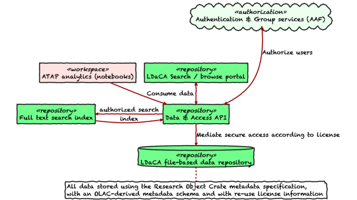

This is the overall architecture for data storage and delivery — missing is how data gets into to the repository, but we’ll come to that later.

</section>

 

<section typeof='http://purl.org/ontology/bibo/Slide'>

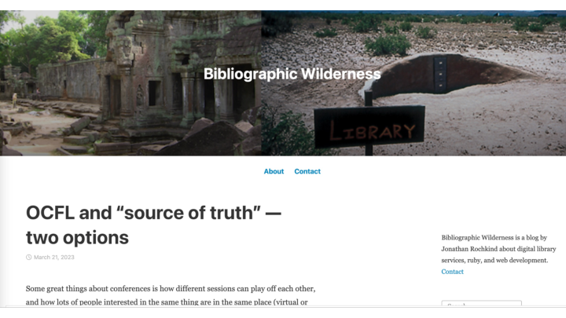

At this point, I will introduce one of the themes of this talk. In March this year, [this blog post was published](https://bibwild.wordpress.com/2023/03/21/ocfl-and-source-of-truth-two-options/) - looking at the pros and cons of using  (the Oxford Common File Layout) as the “source of truth” for a system (say a repository).

We are very much taking the  (that is file-in-storage-as-the-source-of-truth) approach in LDaCA. Which begs the question: “But doesn’t that mean that it’s very specific to language data?” No, because we’re using a very flexible, extensible, discipline-neutral format for data description – yes, we have ways to specialise metadata and interfaces to language and other cultural metadata, but NO, the systems are not locked-in to that mode of operation. This means we should be able to share development and maintenance more broadly than with a single archive.

Two main points we want to get across in this presentation:

- We are taking seriously the idea that data-in-storage should be “batteries included” – everything needed to preserve and use the data is stored together and systems can be reconstituted from this storage.
- This approach IS generic – different vocabularies/schemas can be plugged in by design.

</section>

 

<section typeof='http://purl.org/ontology/bibo/Slide'>

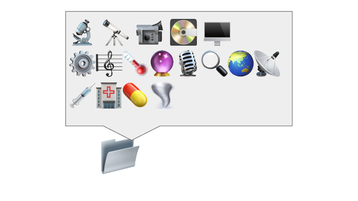

So let's now start looking at the standards involved in the  approach. This is a slide from “What is RO-Crate” – The dataset may contain any kind of data resource about anything, in any format as a file or URL

Stian Soiland-Reyes, Peter Sefton, Mercè Crosas, Leyla Jael Castro, Frederik Coppens, José M. Fernández, Daniel Garijo, Björn Grüning, Marco La Rosa, Simone Leo, Eoghan Ó Carragáin, Marc Portier, Ana Trisovic, RO-Crate Community, Paul Groth, Carole Goble (2022): Packaging research artefacts with RO-Crate.Data Science 5(2)https://doi.org/10.3233/DS-210053

</section>

 

<section typeof='http://purl.org/ontology/bibo/Slide'>

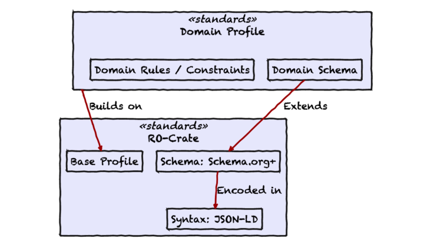

The core standard for this work is  (Research Object Crate) in which all data is input, stored and output. This a big step for eresearch systems – no longer is there a transformation step on  (we used the term ingest, but some project members and partners found the metaphor distasteful).

</section>

 

<section typeof='http://purl.org/ontology/bibo/Slide'>

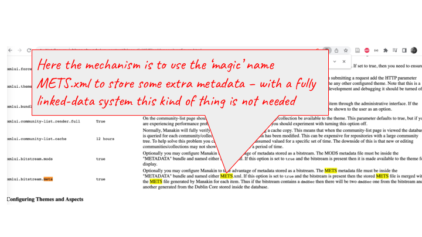

This screenshot is a bit of (undated) DSpace documentation found following a tip from Kim Sheppard – we have included it here to illustrate that storing additional metadata (in this case METS) for an object was done by convention. Using a linked-data system means that we no longer have to do this kind of thing – there’s still one magic file name in  but it’s only one for the metadata and one for the HTML preview – everything else is labelled and extensible.

</section>

 

<section typeof='http://purl.org/ontology/bibo/Slide'>

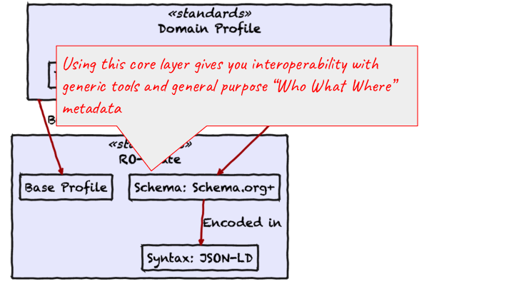

In the early days of the “Open Repositories” movement repositories had Dublin Core metadata (a standard with a few different flavours).

</section>

 

<section typeof='http://purl.org/ontology/bibo/Slide'>

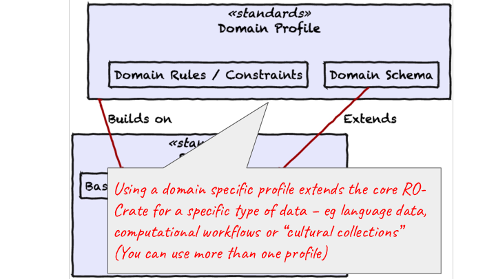

These days using linked data it is no longer necessary to have a bevy of  schemas with incompatible encodings to store data from different schemas, different vocabularies and ontologies can co-exist and be expressed in a common way.

</section>

 

<section typeof='http://purl.org/ontology/bibo/Slide'>

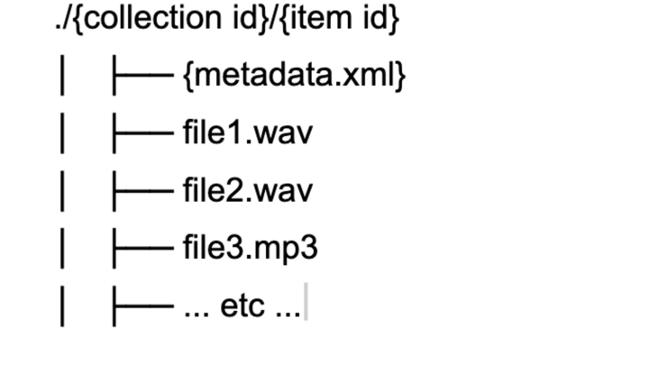

In the  system, this is achieved by storing files on disk in a simple hierarchy - with metadata and other resources stored together in a directory - this scheme allows for hands-on management of data resources, independently of the software used to serve them.

This approach means that if the  software-stack becomes un-maintainable for financial or technical reasons the important resources, the data, are stored safely on disk with their metadata and a new access portal could be constructed relatively easily.

Despite the valuable features of this solution, it is not generalisable. The metadata.xml is custom to , as is the software stack.

In 2019  and the eResearch team at UTS received small grants from the Australian National Data Service and began collaborating on an approach to managing archival repositories which built on this  approach of storing metadata with data.

The UTS team presented on this at [eResearch Australasia 2019](https://ptsefton.com/2019/11/05/FAIR%20Repo%20-%20eResearch%20Presentation/index.html)

</section>

 

<section typeof='http://purl.org/ontology/bibo/Slide'>

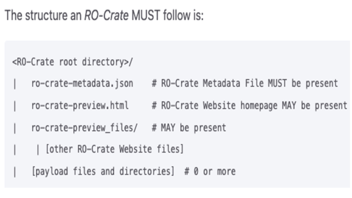

The [structure of an RO-Crate](https://www.researchobject.org/ro-crate/1.1/structure.html) is very similar to the  example above, but with a  file instead of , and an optional preview in HTML.

 has a growing number of [tools and software libraries](https://www.researchobject.org/ro-crate/tools/) which means that a team such as  does not have to maintain their own bespoke software.

</section>

 

<section typeof='http://purl.org/ontology/bibo/Slide'>

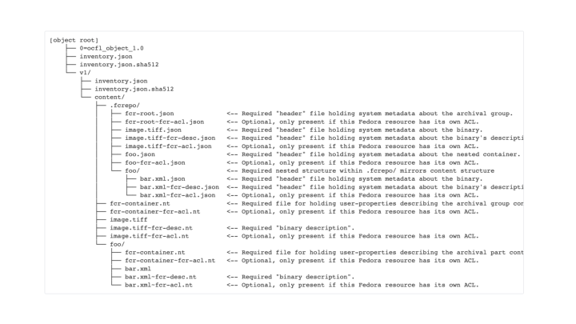

Here, for comparison is [how Fedora 6 would store an object (an Atomic Resource in Fedora-speak) like this with multiple files](https://wiki.lyrasis.org/display/FEDORA6x/Fedora+OCFL+Object+Structure#FedoraOCFLObjectStructure-FedoraAtomicResource-Container). Like  this uses linked-data but in this case, split up into multiple files containing RDF triples. (This is similar to the pre-RO-Crate approach taken by the Research Object spec).

This also shows some of what an  repository looks like – this is an  object with a single version.

</section>

 

<section typeof='http://purl.org/ontology/bibo/Slide'>

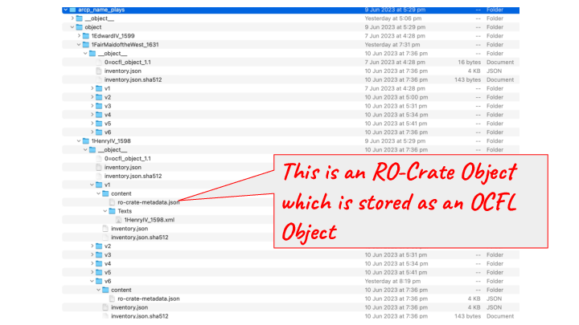

This screenshot shows an example of an -style use of  (all of the metadata is stored in the ro-crate-metadata.json rather than spread out as in Fedora).

</section>

 

<section typeof='http://purl.org/ontology/bibo/Slide'>

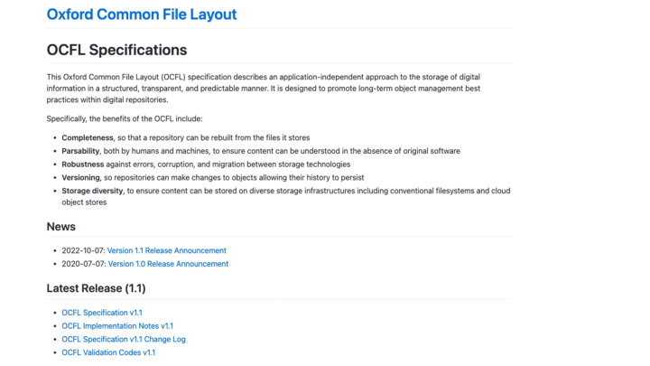

Now we come to the second core standard in our stack the [Oxford Common File Layout](https://ocfl.io) – which is something we found out about via OpenRepositories – I couldn’t make the presentation, but I got a corridor briefing on this from Neil Jeffries in Bozeman at OR 2018.

</section>

 

<section typeof='http://purl.org/ontology/bibo/Slide'>

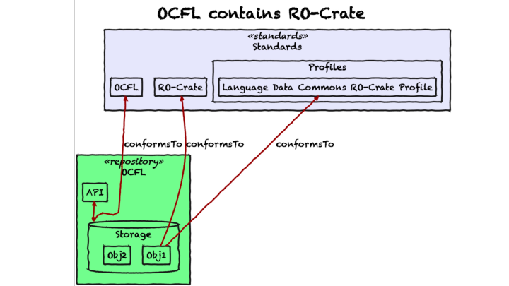

This slide shows the interface between our core standards – a compliant  repository has Objects within it that conform to the  specification.

</section>

 

<section typeof='http://purl.org/ontology/bibo/Slide'>

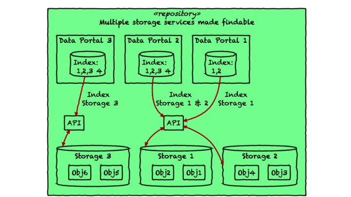

This slide illustrates the flexibility of the approach we’re taking. As LDaCA is a national project, our archival repositories and those of our partners such as  will be distributed with differences of governance, varying by organisation, language type and discipline, though there is still a desire to be able to aggregate data into services that make it findable.

</section>

 

<section typeof='http://purl.org/ontology/bibo/Slide'>

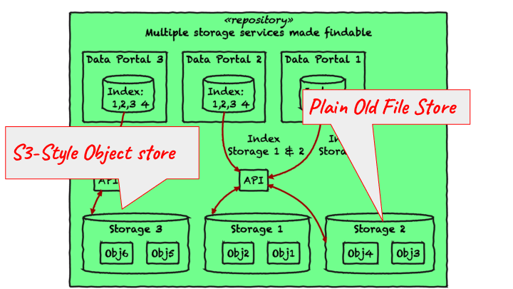

The storage services may not all be the same in this model, some may be file systems, some may be object stores, and they may be hosted by and governed by a variety of organizations.

</section>

 

<section typeof='http://purl.org/ontology/bibo/Slide'>

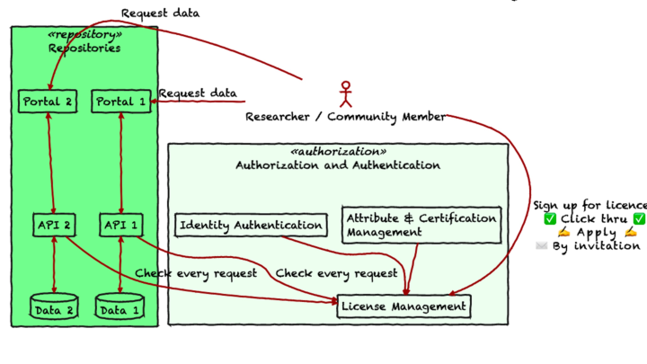

This slide shows how we have abstracted the “A” for Access in  out of the repository and into a separate centralised or at least _concentrated_ system. We have a [full write-up of this approach from the 2022 eResearch Australasia conference](../fair-care-eresearch-2022/) and we don’t have time to go through it in detail here, but in summary:

- Every object in the repository has a Data Reuse License with some management metadata.
- Each repository only needs an authoritative list of licenses and trusted license management systems to be able to serve the data.
- License management is handled by a dedicated system that can deal with application and invitation workflows to grant licenses (including simple self-serve click-through license agreements)

Note that our work is also informed by the  principles for Indigenous Data Governance (Collective benefit, Authority to control, Responsibility, Ethics) which frame the way  protocols are implemented. Again, see the [LangArc workshop write-up](https://digital.library.unt.edu/ark:/67531/metadc2114304/).

</section>

 

<section typeof='http://purl.org/ontology/bibo/Slide'>

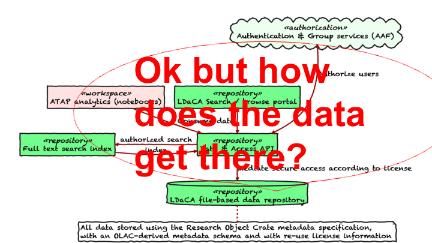

Let’s revisit this diagram. What’s missing?

</section>

 

<section typeof='http://purl.org/ontology/bibo/Slide'>

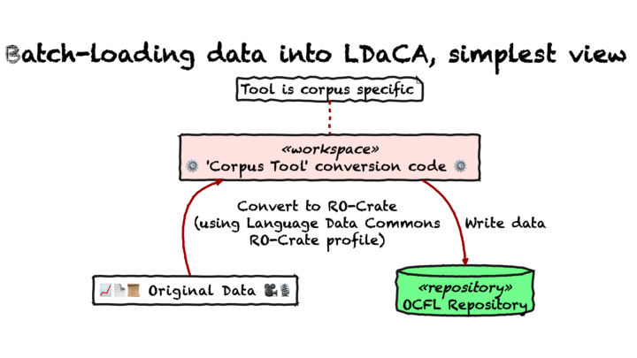

In the first phase of the LDaCA project, work focused on batch import of data using tools to convert  – this approach was used on contemporary collections as well as for “rescuing” collections from older repository systems.

</section>

 

<section typeof='http://purl.org/ontology/bibo/Slide'>

This slide shows some JSON-LD metadata that describes the way this  metadata was created – illustrating how  can be used to record .

(UPDATE: I didn't explain [JSON-LD](https://json-ld.org/) properly during the presentation. JSON-LD is a method of encoding linked-data (which can be quite esoteric and unapproachable) in  a method of describing data in simple text, which is widely used and understood by programmers.)

</section>

 

<section typeof='http://purl.org/ontology/bibo/Slide'>

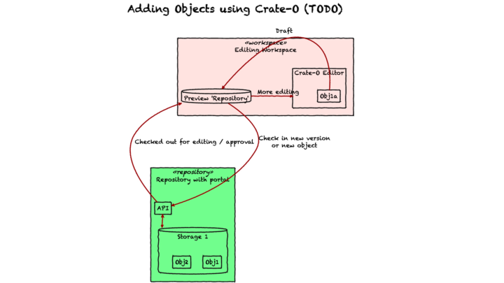

This part of the architecture we are working on now…

</section>

 

<section typeof='http://purl.org/ontology/bibo/Slide'>

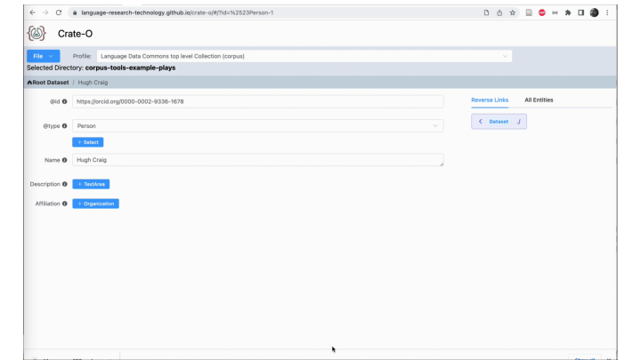

Here we see the  metadata tool (which is a zero-install web application that runs in Chrome and other browsers that support the new FilesystemAPI) being used to add an Organization as the Affiliation for a Person entity. Having imported this "Context Entity" (that's the  term) it can then be re-used within the crate which we see here as the schema.org `publisher` property is linked to the same organization.

(At this stage  is still to be connected to the repository stack - that will happen in the second half of 2023)

</section>

 

<section typeof='http://purl.org/ontology/bibo/Slide'>

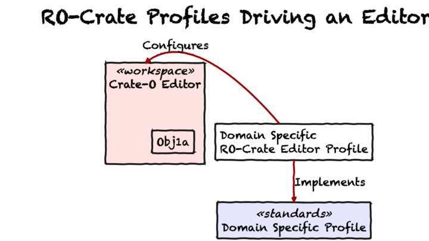

We hope to work with other editor projects (e.g. [Describo](https://describo.github.io/#/)) to make editor profiles as compatible as possible.

</section>

 

<section typeof='http://purl.org/ontology/bibo/Slide'>

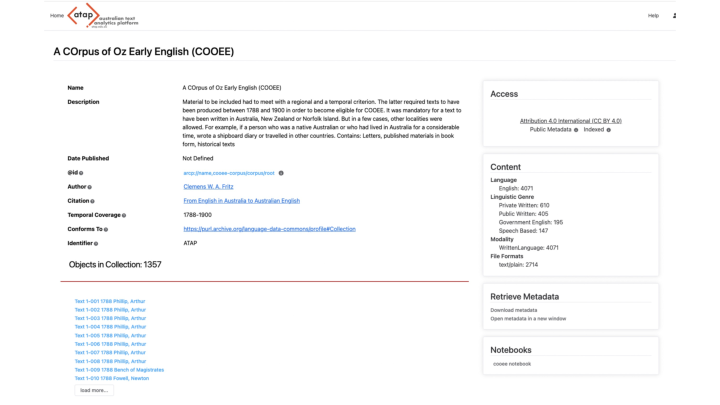

The next few slides show some examples of our approach implemented in a variety of contexts.

Here’s another repository that uses  metadata (from the Language Data Commons of Australia/Australian Text Analytics Platform) – here users can launch a  containing  code (and explanatory text) that processes a dataset.

</section>

 

<section typeof='http://purl.org/ontology/bibo/Slide'>

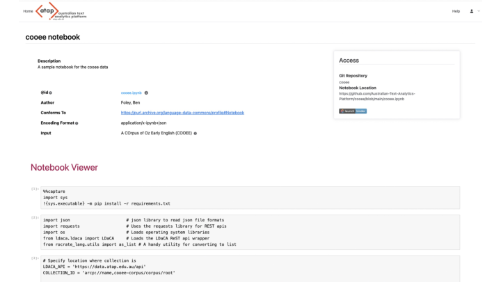

This is a screenshot of a  that can process data from a repository via its .

</section>

 

<section typeof='http://purl.org/ontology/bibo/Slide'>

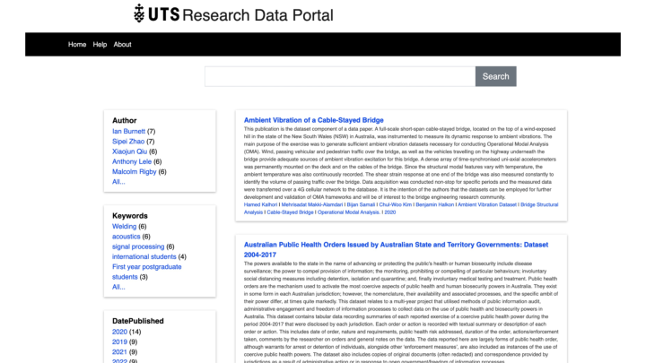

This slide shows the  stack powering the University of Technology Sydney’s Research Data Repository.

</section>

 

<section typeof='http://purl.org/ontology/bibo/Slide'>

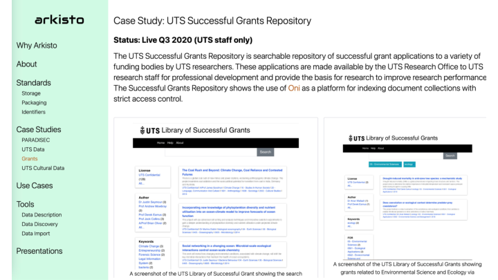

This page shows some screenshots of an internal-only application at UTS which gives academic staff access to successful research grant proposals – the data are stored in the same kind of  standards-based storage stack as we have presented here – with an interface that is tuned for this use case, with some custom access control to make sure that staff are _very_ aware that these are sensitive and confidential documents.

</section>

 

<section typeof='http://purl.org/ontology/bibo/Slide'>

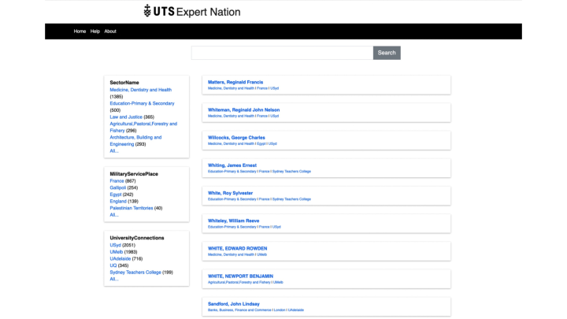

This is a screenshot of data from a history project [Expert Nation](https://expertnation.org/) exported to  format and [put online to support a book](https://expertnation.research.uts.edu.au/).

</section>

 

<section typeof='http://purl.org/ontology/bibo/Slide'>

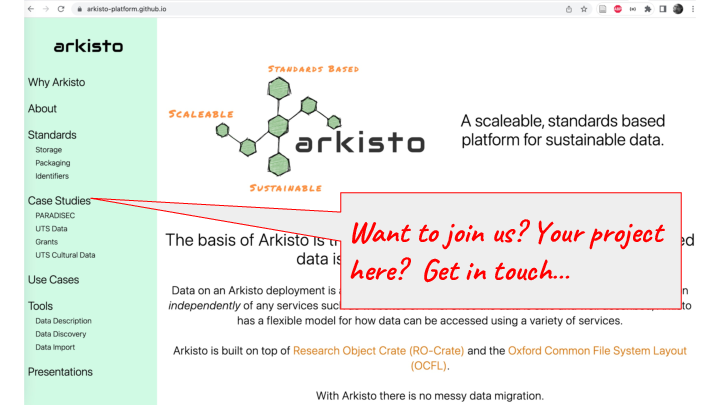

In conclusion, we have given a quick tour of a standards-based repository stack (loosely called ) and illustrated it with current work at the Language Data Commons of Australia and  projects, but along the way have tried to emphasise that this is generic, re-usable architecture – and is based on standards. By using an extensible metadata standard with a growing community, and a storage-layer standard forged from an acquired aversion to systems migration we aim to reduce the risk to very important cultural data by working with as many communities as possible on software tools, so that we reduce cost and risk for all of us.

</section>

 
