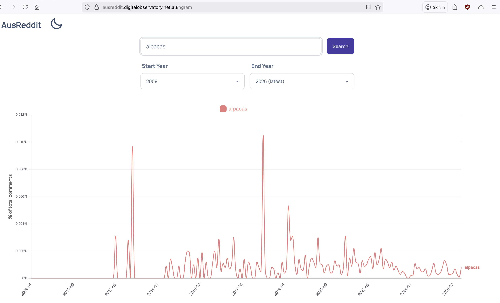

 

<figure>
  
  <figcaption>Reddit app icon</figcaption>
</figure>

 

[AusReddit](https://ausreddit.digitalobservatory.net.au/) is a research databank maintained by the [Australian Digital Observatory](https://www.digitalobservatory.net.au/) at Queensland University of Technology (QUT), containing Reddit posts and comments from Australian-related subreddits. The AusReddit collection is ongoing and continues to grow. With its most recent update in 2026, the databank spans 6.7 million submissions and more than 131 million comments from 593 subreddits considered “Australian”. Searchable aggregate data derived from the collection up to January 2025 is [now available to researchers via the Language Data Commons of Australia (LDaCA)](https://data.ldaca.edu.au/collection?id=arcp%3A%2F%2Fname%2Chdl10.25912~RDF_1754373503052&_crateId=arcp%3A%2F%2Fname%2Chdl10.25912~RDF_1754373503052).

Reddit is a social media platform organised around topic-based communities known as subreddits, each denoted by the prefix r/ (for example, r/science or r/australia). Users subscribe to subreddits that match their interests, and within each subreddit they can create posts containing text, images, links, or video to share content or start discussions. Other users can then leave replies, commonly called comments, on these posts, and replies can be nested under one another to form threaded conversations. This hierarchical structure of subreddit to post to reply means that content is naturally organised by topic first, then by individual discussion, making it straightforward to navigate and participate in conversations across a vast range of subjects.

The databank is constructed around a carefully curated list of Australian subreddits, identified through several criteria. Some subreddits are explicitly geography-specific, like r/brisbane, r/queensland and r/australia. Others focus on distinctly Australian entities and issues — think r/AusFinance and r/AFL. The collection also includes subreddits where substantial Australian communities congregate and discuss Australian issues, even if the subreddit itself isn't explicitly Australian. This list has been built iteratively, drawing on previous research and the Digital Observatory's ongoing [NewsTalk project](https://newstalk.digitalobservatory.net.au/home), which harvests user commentary on Australian news stories.

It's worth noting an important caveat about what "Australian-related" means in this context. The databank includes content from these Australian subreddits, but that doesn't necessarily mean every post was written by someone in Australia or by an Australian. Reddit is, after all, a global platform, and these communities attract international participants as well. What the collection captures is discourse *about* Australian topics and within Australian online spaces, rather than discourse exclusively *by* Australians.

## The challenge of access

For researchers, AusReddit represents a valuable resource, but accessing the raw data comes with significant challenges. Because Reddit posts can contain personally identifiable information and sensitive content, researchers need ethical clearance from their institution before they can work with individual posts and comments. For most projects, low-risk ethical clearance is sufficient, though this varies by institution. Researchers also need a data management plan and must agree to treat the data sensitively, avoiding direct quotes where possible and publishing findings in aggregate forms.

These requirements are entirely appropriate given the nature of social media data, but they create a catch-22 for researchers in the early stages of project development. How do you know whether AusReddit contains the right kind of data for your research without being able to look at it? How do you frame specific research questions and hypotheses when you're not yet sure what patterns exist in the corpus? This is where the searchable aggregate data comes in.

## A window without the walls: The aggregate dataset

If you've been intrigued by the AusReddit databank, but hesitant about diving straight into the full ethical approval process, the AusReddit searchable aggregate data offers a solution. It provides researchers with a way to explore what's inside this massive collection without needing to access the raw data itself. Think of it as looking through a series of carefully crafted lenses, each revealing different patterns and insights about how Australians communicate online. The dataset provides five distinct types of derived data, each offering its own perspective on the millions of conversations contained in the databank. 

### The building blocks: 1-grams and 3-grams

At their most fundamental level, 1-grams are simply individual words and their frequencies across the entire corpus. While this might sound basic, the patterns that emerge can be remarkably revealing. You might discover, for instance, which political terms dominate Australian Reddit discussions, or how frequently mental health vocabulary appears in different subreddits. Tracking 1-grams over time can show you when particular issues surge into public consciousness, perhaps a sudden spike in bushfire-related terminology, or the emergence of pandemic vocabulary throughout 2020 and beyond.

The 3-grams add crucial context to these individual words by capturing three-word phrases as they actually appear in conversation. This is where language really starts to come alive. While a 1-gram might tell you that "housing" is frequently discussed, 3-grams reveal whether people are talking about "housing market crash", "affordable housing crisis" or "public housing waiting". These phrase-level patterns expose the specific ways Australians frame issues, the collocations they naturally use and even the rhetorical patterns that characterise different communities. For linguists, this is a treasure trove for studying Australian English as it's actually used in informal digital spaces, complete with local idioms, slang and the distinctive turns of phrase that mark Australian online discourse.

 

<figure>
  
  <figcaption>Results of an N-gram search for 'alpacas' in the aggregate data, showing frequency over time</figcaption>
</figure>

 

### Following the links: Domain analysis

Reddit posts and comments are riddled with links to news articles, YouTube videos, government websites, personal blogs and everything in between. The domain data captures all of these URL patterns without exposing individual posts. What you can discover here is fascinating: Which news sources do Australian Reddit communities trust and share? Are there differences between how r/australia and r/AusFinance reference financial information? Do certain subreddits link predominantly to mainstream media, while others favour alternative sources?

This domain data can reveal information ecosystems and trace how information flows through Australian online communities. You might investigate which academic institutions or research organisations get cited in policy discussions, or explore how commercial versus government domains feature in conversations about specific issues. For researchers studying misinformation, media literacy or digital public spheres, understanding these linking patterns provides crucial context about where Australian Redditors are getting their information and which sources they consider authoritative enough to share.

### The emotional landscape: NRC Lexicon Analysis

The emotional tenor of online discussions matters enormously, yet, it can be difficult to capture at scale. The AusReddit aggregate data includes emotion analysis using the [NRC Emotion Lexicon](https://nrc-publications.canada.ca/eng/view/object/?id=0b6a5b58-a656-49d3-ab3e-252050a7a88c), which categorises text according to eight basic emotions (anger, fear, anticipation, trust, surprise, sadness, joy and disgust), as well as positive and negative sentiment.

This lets you explore questions like: How does emotional language vary across different Australian subreddits? Are discussions about climate change characterised more by fear, anger or hope? How did the emotional tone of pandemic-related conversations shift over time? You can compare the emotional profiles of different communities — perhaps r/AFL tends toward joy and anticipation during football season, while r/AusFinance shows more anxiety and fear during market downturns.

For researchers interested in public sentiment, mental health discourse or the psychology of online communities, these patterns offer quantitative insights into the emotional dynamics of Australian digital spaces. You can identify which topics generate the most polarised emotional responses, or discover whether certain communities maintain consistently different emotional registers.

### Discovering themes: BERTopic models

Perhaps the most sophisticated view into the data comes from the topic models generated using BERTopic, a modern machine learning approach to identifying thematic clusters in large text collections. Unlike the other aggregate data types that rely on counting and categorising, topic modelling reveals the latent themes and conversations that structure the corpus.

Topic models can show you that what appears to be a single conversation about "housing" actually breaks down into distinct discussions about investment properties, rental rights, homelessness, urban planning and first-home buyer schemes. They can reveal unexpected connections — perhaps discussions about regional migration patterns consistently intersect with themes about remote work and telecommunications infrastructure. These models are particularly valuable for researchers trying to map the terrain of public discourse, because they expose the conceptual structure of conversations, rather than just their surface-level vocabulary.

For those planning larger research projects, the topic models serve as a kind of qualitative preview, helping you understand not just what Australians are talking about on Reddit, but how different issues cluster together and what the major thematic divisions are within broader conversations. This can be invaluable for developing research questions and hypotheses, before you've even requested access to the raw data.

## Understanding the limitations

Before diving into the aggregate data, it's worth understanding what these derived datasets can and cannot tell you. Due to the sheer size and scope of the AusReddit corpus, some practical decisions were made during the creation of the aggregate data that affect what you'll find.

For the n-gram data (the 1- and 3-grams described above), frequency cutoffs were applied that exclude the long tail of rarely occurring terms and phrases. This means you're seeing the most common and recurring patterns in Australian Reddit discourse, but very infrequent expressions won't appear in the aggregate data. Similarly, the domain data has been trimmed to remove URLs that appear only a handful of times across the entire corpus. This makes the data more manageable and meaningful — after all, a domain mentioned once or twice tells you little about broader linking patterns — but it does mean the aggregate view is necessarily selective.

The emotion analysis comes with its own constraints. Some text simply couldn't be assigned emotional values by the NRC Lexicon — think of comments that consist entirely of URLs, or very brief responses that don't contain enough lexically rich content for the algorithm to work with. This doesn't mean these comments weren't emotional or meaningful, just that they fell outside what automated emotion analysis can capture.

Finally, the BERTopic models involved some careful decision-making about what constitutes a meaningful "topic". Because BERTopic creates hierarchical clusters, there's theoretically no limit to how granular you could make the topics, but at a certain point, clusters become so small or so specific that they stop being useful for understanding broader conversational patterns. The Digital Observatory team made reasonable judgements about where to set these boundaries to ensure the topics remain coherent and analytically useful, but this does mean some nuance at the edges might be smoothed over.

The important thing to remember is that all of these decisions are documented in the dataset metadata, so if, for your particular research question, you need to understand exactly what was included or excluded, that information is available. Think of these aggregate datasets as carefully curated views, rather than complete mirrors, of the raw data. They're designed to reveal patterns and guide exploration, not to replace the full dataset for detailed analysis.

## Getting started

If you're interested in exploring the AusReddit aggregate data or accessing the full databank, the best place to start is by checking out the collection on the [Data Portal](https://data.ldaca.edu.au/collection?id=arcp%3A%2F%2Fname%2Chdl10.25912~RDF_1754373503052&_crateId=arcp%3A%2F%2Fname%2Chdl10.25912~RDF_1754373503052) or by contacting the Digital Observatory team at [digitalobservatory@qut.edu.au](mailto:digitalobservatory@qut.edu.au). They can provide advice on everything from navigating the aggregate interface to understanding ethics requirements for accessing raw data, and they're happy to discuss how AusReddit might fit with your research needs.

 
