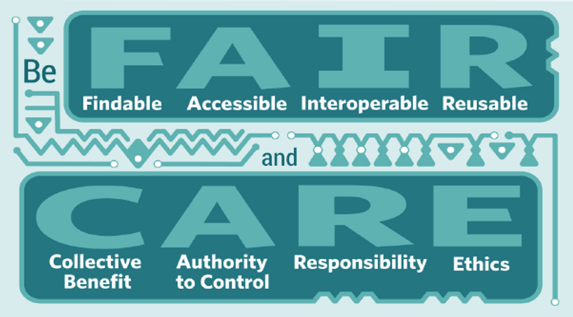

 

## FAIR and CARE

Data is becoming increasingly important in today’s world, so <GlossaryLink display="corpus" id="corpus" /> linguists might feel that the rest of the world is finally catching up. But the rest of the world are bringing with them new approaches to how data is handled. This means that fields such as corpus linguistics may need to reassess their practices. Such reassessment includes addressing concerns about how data is stored and who can access it (data stewardship) – concerns that are a part of the [Open Science](https://en.wikipedia.org/wiki/Open_science) movement, ultimately grounded on principles of equity and accountability.

The most influential approach to data stewardship today is the <GlossaryLink display="FAIR" id="fair" /> principles.
According to these principles, data should be:

- _Findable_

  &emsp; <GlossaryLink display="Metadata" id="metadata" /> and data should be easy to find for both humans and computers.

- _Accessible_

  &emsp; Once the user finds the required data, she/he/they need to know how can they be accessed, possibly including authentication and authorisation.

- _Interoperable_

  &emsp; The data usually need to be integrated with other data. In addition, the data need to interoperate with applications or workflows for analysis, storage, and processing.

- _Reusable_

  &emsp; The ultimate goal of <GlossaryLink display="FAIR" id="fair" /> is to optimise the reuse of data. To achieve this, metadata and data should be well-described so that they can be replicated and/or combined in different settings.

In general, <GlossaryLink display="corpus" id="corpus" /> linguists do well on the interoperability criterion. Corpus data is usually stored in non-proprietary formats; even when some structure is imposed on the data, this is almost always in a form which is saved as a simple text file (e.g. CSV files or <GlossaryLink display="XML" id="xml" /> annotations). Data stored in such formats is easy to move between applications. But what about the other three criteria?

Some <GlossaryLink display="corpus" id="corpus" /> data is easy to discover; it is findable. For example, CLARIN, the [portal](https://www.clarin.eu/content/data) to the European Union language resource infrastructure, provides access to many large <GlossaryLink display="data collections" id="data-collection" />, as does the [Linguistic Data Consortium](https://www.ldc.upenn.edu/) in the USA. However, some data is never made part of a large <GlossaryLink display="collection" id="collection" /> and often remains under the control of individual researchers or research teams. Such data may be almost impossible to find. Even if we can find such data, it is unlikely to be accompanied by good descriptions of the data and metadata, making reusability problematic. Of course, big corpora such as the [British National Corpus](http://www.natcorp.ox.ac.uk/) will be both findable and accompanied by comprehensive corpus manuals. However, it is worth considering how to make other corpora more findable, including the provision of corpus manuals or corpus descriptions. Corpus resource databases such as [CoRD](https://varieng.helsinki.fi/CoRD/) do aim to work towards this principle.

Accessibility may also be an issue for some data. <GlossaryLink display="Copyright" id="copyright" /> law may allow use of material for individual research but prohibit any further distribution of the material. The <GlossaryLink display="FAIR" id="fair" /> approach to such cases is that metadata should be available so that interested parties can know that a data holding exists (F), and the metadata will include information about the conditions under which the data may or may not be shared or reused (A and R).
 

<h4>Image from <a href="https://www.gida-global.org/" target="_blank">Global Indigenous Data Alliance</a></h4>

 

For linguists, there is another very important set of principles concerning data, the <GlossaryLink display="CARE" id="care" /> principles developed by the Global Indigenous Data Alliance:

- _Collective Benefit_

  &emsp; Data ecosystems shall be designed and function in ways that enable Indigenous Peoples to derive benefit from the data.

- _Authority to control_

  &emsp;Indigenous Peoples’ rights and interests in Indigenous data must be recognised and their authority to control such data be empowered.

- _Responsibility_

  &emsp;Those working with Indigenous data have a responsibility to share how those data are used to support Indigenous Peoples’ self-determination and collective benefit.

- _Ethics_

  &emsp;Indigenous Peoples’ rights and wellbeing should be the primary concern at all stages of the data life cycle and across the data ecosystem.

These principles are presented as applying particularly to Indigenous data, but we believe that researchers should adopt this approach in all cases where the people who participate in our research can be seen to have some moral rights in the information they have contributed. Respecting those moral rights should be demonstrated by recognising the participants’ authority to control how data is used, by seeking to ensure that participants derive benefit from use of the data, and by acting ethically and transparently in our relations with the participants. Deborah Cameron and her colleagues (Cameron et al 1993) raised similar issues almost 20 years ago, arguing that the imbalance of power in the relation between researchers and participants needed to be reduced. The <GlossaryLink display="CARE" id="care" /> principles continue along this path, but go even further in explicitly returning power to the sources of information.

<GlossaryLink display="Corpus" id="corpus" /> data is often written language. We have already mentioned that <GlossaryLink display="copyright" id="copyright" /> law is relevant to some such material, and that body of law protects at least some rights for the creators of the material. But corpus linguists also work with other kinds of data such as spoken language (spontaneous or produced as a response to some prompt) or written material produced by research participants according to some protocol. In such cases, ethical research practice should include addressing the issues raised by the <GlossaryLink display="CARE" id="care" /> principles. Some aspects of this practice will fall under institutional ethics requirements (for example, thinking carefully about what permissions we request on consent forms), but other questions must be part of the relationship between the researcher and the research participants. Corpus linguists working with spoken, computer-mediated, or otherwise particularly <GlossaryLink display="sensitive data" id="sensitive-data" /> have been aware of at least some of these issues, but the <GlossaryLink display="CARE" id="care" /> principles offer an opportunity to go further.

Acquiring data for linguistic research takes effort and often that means money. It is therefore a good use of resources if any data we collect can be used by others. The <GlossaryLink display="FAIR" id="fair" /> principles provide a framework to make sharing and reusing data easier, and applying the <GlossaryLink display="CARE" id="care" /> principles where relevant helps to ensure that our research has a sound ethical basis.

Note: This post is based on the presentation ‘Advance Australia FAIR’, given by Simon Musgrave and Michael Haugh to the 4th Forum on Englishes in Australia (LaTrobe University, August 27, 2021).

 

Thanks to Leah Gustafson and Monika Bednarek for helpful comments on drafts.

 

**Reference:**

Cameron, Deborah, Elizabeth Frazer, Penelope Harvey, Ben Rampton & Kay Richardson. 1993. Ethics, advocacy and empowerment: Issues of method in researching language. Language & Communication 13(2). 81–94. <a href="https://doi.org/10.1016/0271-5309(93)90001-4" target="_blank">https://doi.org/10.1016/0271-5309(93)90001-4</a>

 
