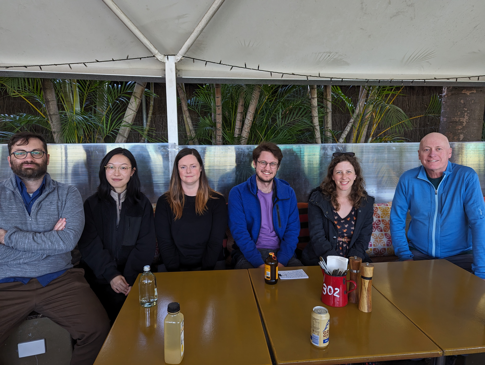

In 2018, when he was working at The University of Queensland's Research Computing Centre, Marco Fahmi initiated a [Graduate Digital Research Fellowship](https://rcc.uq.edu.au/article/2018/07/six-students-become-uq%E2%80%99s-first-graduate-digital-research-fellows) program focused on researchers in the Hunmanities and Social Sciences (HASS). The program has run in some years since then, hosted by the RCC ([2019](https://rcc.uq.edu.au/article/2019/03/second-round-graduate-digital-research-fellows-announced)) and also by the UQ Graduate School ([2020](https://rcc.uq.edu.au/article/2019/11/apply-now-uq-graduate-digital-research-fellowship-2020)).

In 2023, the program ran again, this time under the auspices of the Australian Text Analytics Program ([ATAP](https://www.atap.edu.au)). Two UQ staff members, [Sam Hames](https://languages-cultures.uq.edu.au/profile/8379/sam-hames) (Postdoctoral Research Fellow in Computational Humanities) and [Simon Musgrave](https://auslanguage.net/simon-musgrave/) (Engagement Lead for ATAP and for the [Language Data Commons of Australia](https://www.ldaca.edu.au)) led the program, and four students participated.

The program supports research students to explore the possibilities of digital scholarship, particularly in HASS. Our Fellows are students undertaking extended research projects who spent 12-15 weeks learning about digital and computational skills in order to enhance their current research/thesis topic or to work on an independent digital project. They explored digital research methods in areas including

- Computational analysis of text
- Creating new software tools to support their specific research area
- Social media analytics
- Assessment and analysis of digital environments including mobile apps
- Online games as social and cultural objects

The Fellows met regularly in activities to develop a sound understanding of digital research methods and tools, including seminars, reading groups, and training workshops. They also had access to mentors who advised and collaborated on their digital projects.

The four Fellows who participated in the 2023 program and their projects were:

#### Evelyn (Eve) Ansell (UQ, Linguistics):

Eve works in the field of Conversation Analysis which uses very detailed transcriptions of spoken interactions as data. The detail means the basic word forms involved are not easy to identify. For example, <u>dea</u>:::l indicates the word _deal_ with emphasis (the underlining) and a greatly lengthened vowel sound (the colons). Clearly, the search function in a word processor is not going to find this as an instance of the word _deal_! Eve's project looked at the possibility of developing code in a Jupyter notebook which could identify base word forms in such transcriptions and allow the researcher to see all instances of a word in an interaction. Eve also had the opportunity to work on the problem as part of an [industry placement](https://www.aarnet.edu.au/helping-researchers-search-and-manipulate-transcripts) with [AARNet](https://www.aarnet.edu.au/).

In Eve's words:

> My only regret is that I didn't do the GDRF sooner. This sort of learning should be required early on in all Humanities research training programs.

> I cannot speak highly enough of Simon and Sam. They enthusiastically share their domains of knowledge, but also engage with us about our own work. To have access to experts willing to talk through current projects, future scoping, frustrations, and wild ideas is incredibly valuable.

> Its easy to forget how much of our research work happens in the digital space. It's not just the data, it's how we interface with it. The GDRF taught me to think differently about how I treat my research workflow at almost every point.

#### Mengyan (Kelly) Hou (UQ, Electrical Engineering and Computer Science):

The core of Kelly's PhD project is designing an app to support young people who have completed active cancer treatment to enhance their experience in digital healthcare interventions. In the Fellowship program, Kelly began surveying existing apps with similar functions and aims as the start of her own design process. An important component of this work was considering methodological questions: when we want to answer the question "Is this a good app?", how do we go about that? Can we understand the intentions of the app designers and assess how effectively those intentions have been realised? Or should we try to judge what sort of experience the app provides for users (even if we are not members of the target audience)? Kelly examined these issues in relation to a number of relevant apps, as well as beginning to grapple with the (very topical) question of how an AI-based conversational agent might be included in her design.

#### Christina Maxwell (UQ, Psychology):

Christina's research investigates where cisgender women create the boundaries for ‘womanhood’ in relation to transgender women within the context of feminist social movements. In her work as Fellow, Christina looked at whether social media data, in this case from Twitter, could be another source of data to investigate the boundary creation issue. Similar to Kelly, Christina's work involved considering methodological issues: what methods for analysing texts could usefully be applied to the Twitter data? It is exciting for all of us involved in the program that Christina (with co-authors) presented this research to the [SASP-ACPID Conference 2023](https://sasp-acpid.squarespace.com/). To quote the abstract for that presentation: "As both anti-inclusion and pro-inclusion feminists are increasingly turning to social media to communicate their messages, we will collect data from Twitter to map out each movement online and how they position themselves and their goals in relation to the inclusion of transgender women. This exploratory mixed-methods project will use topic modelling, thematic analysis, and Linguistic Inquiry and Word Count...".

In Christina's words:

> The Fellowship was instrumental in honing my ideas and offering invaluable hands-on support to bring my vision to life. It played a pivotal role in developing one of the most exciting and interesting projects of my PhD and I look forward to using these new skills and ways of thinking in future digitally-based projects.

#### Giulio Pitroso (Griffith, Sociology):

Giulio's research examines gaming communities in Australia and in Italy, focused on the way stereotypes tied to Italians and organised crime are articulated among players of video games. He is also interested in digital communities, ethnic identities on the Internet, and cultural and social manifestations related to Italian criminal organisations. In his work as a Fellow, he looked at the intersection of these areas of interest by examining the discussions, speculations, and expectations of fans about the (yet to be released) Mafia IV video game. This was tackled using comment threads from YouTube channels as a source of data. Once again, methodological questions were important for Giulio, including the questions about what analytic techniques could usefully be used.


 




<h4>From left: Giulio, Kelly, Eve, Sam, Christina and Simon</h4>

 

A GDRF program will be offered again in 2024, this time under the banner of the Language Data Commons of Australia. If you think the program could benefit you, there is an [online form](https://forms.gle/prTfh5hpMWhT8wkW9) for expressions of interest (due by **February 19 2024**). For further information, you can contact [Sam Hames](mailto:sam.hames@uq.edu.au) or [Simon Musgrave](mailto:s.musgrave@uq.edu.au).
