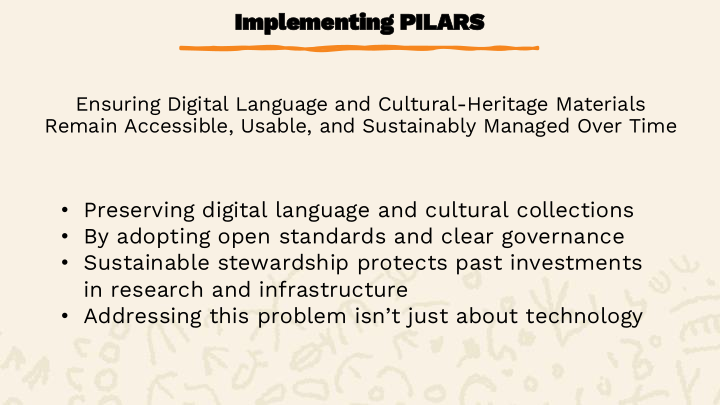
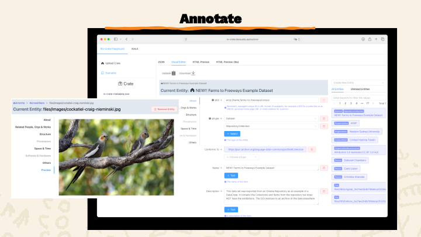
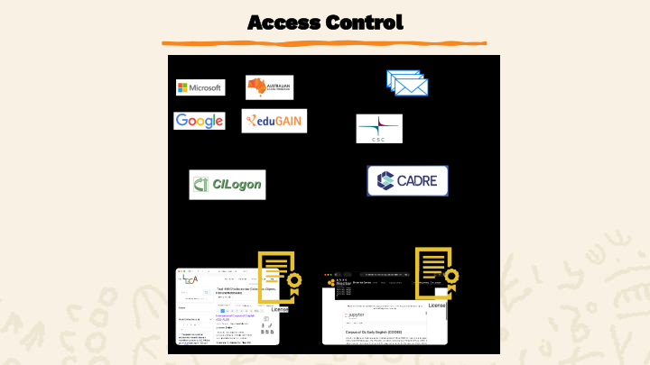

<a href="./implementing-PILARS.pdf">PDF version</a> | <a href="./implementing-PILARS.pptx">Powerpoint Version</a>

    

<section typeof='http://purl.org/ontology/bibo/Slide'>
 

An adaptation of a presentation delivered at the 2025 Annual Symposium of the HASS and Indigenous Research Data Commons.

Preserving digital language and cultural-heritage materials isn’t just a technical exercise—it’s about safeguarding knowledge, identity, and history for future generations. As collections grow and as data becomes increasingly fragmented across institutions, the challenge is no longer simply storing information. It’s ensuring that community-owned knowledge remains accessible, usable, and sustainably managed over time.

At the Language Data Commons of Australia (LDaCA), we’ve been working toward this goal by adopting open standards, building clear governance mechanisms, and designing infrastructure that communities can trust and control. The result of this work is **PILARS**: the Protocols for Implementing Long-Term Archival Repository Services.

</section>

<section typeof='http://purl.org/ontology/bibo/Slide'>
 

## How are we implementing our work. 

We designed the Protocols for Implementing Long-Term archival Repository Services
These are: Designed to work in low-resource environments, 

To allow communities to have agency and control over their materials. 

And prioritise sustainability, simplicity, standardisation, linked-data description and clear licensing over user interface features

</section>

<section typeof='http://purl.org/ontology/bibo/Slide'>
 

## Why PILARS?

PILARS is our framework for designing sustainable archival systems—particularly in low-resource environments where communities need agency, autonomy, and long-term reliability.

The protocols are guided by both the FAIR (Findable, Accessible, Interoperable, Reusable) and CARE (Collective Benefit, Authority to Control, Responsibility, Ethics) principles. Together, these ensure that while data remains discoverable and reusable, the rights and authority of communities are respected and embedded in the system itself.

Our goals are simple:

Autonomy: Reduce reliance on closed, proprietary, or opaque storage systems.

Sustainability: Ensure that data remains intact and accessible decades from now.

Value: Maximise the return on investment in digital collections and research infrastructure.

</section>

<section typeof='http://purl.org/ontology/bibo/Slide'>
 

## 1. Data Portability: The Foundation

PILARS insists on storing data in a way that is portable, stable, and independent of any particular platform.

We do this by using:

OCFL (Oxford Common File Layout)

A community standard that ensures digital objects are stored in a transparent, predictable, and platform-independent structure. LDaCA extends OCFL with a storage-layout specification that maps identifiers to directory structures in both filesystems and object storage.

</section>

<section typeof='http://purl.org/ontology/bibo/Slide'>
 

## RO-Crate

Every storage object we deposit is an RO-Crate—a research object composed of:

The data files themselves

A JSON-LD metadata file (ro-crate-metadata.json) that describes the content, its provenance, and licensing

An RO-Crate can represent a collection, an interview, a series, or any structured set of materials. Each file is described, linked, and licensed in machine-readable form so that tools, portals, and search engines can reconstruct meaning without custom logic.

</section>

<section typeof='http://purl.org/ontology/bibo/Slide'>
 

## Persistent Identifiers

While institutions may not always have PID systems in place, LDaCA supports temporary identifiers like ARCP until more formal identifiers (such as DOIs) are assigned. This means repositories can begin storing and organising data immediately, without waiting for institution-wide decisions.

</section>

<section typeof='http://purl.org/ontology/bibo/Slide'>
 

## 2. Metadata & Annotation: Making Data Understandable

Metadata is where collections become meaningful. For LDaCA, metadata runs across several layers:

**RO-Crate Metadata Schema**, built on Schema.org

**LDaCA Metadata Schema**,  an extension for language-specific concepts

**LDaCA RO-Crate Profile**,  a document that explains how schemas are applied in practice, including both human-readable guidance and machine-readable constraints

**Validation rules** and **Crate-O Mode Files** generated from the profile to ensure every dataset meets requirements

</section>

<section typeof='http://purl.org/ontology/bibo/Slide'>
 

These are our schemas available to the public.

<http://w3id.org/ldac/profile>

<http://w3id.org/ldac/terms>

</section>

<section typeof='http://purl.org/ontology/bibo/Slide'>
 

## Tools for creating metadata

To support researchers and communities, we created Crate-O, a Vue.js-based tool that:
Provides guided metadata creation
Integrates with services like ROR for organisation lookup
Accepts spreadsheets and converts them into RO-Crates
Allows batch upload of metadata
Can run locally, in portals, or as GitHub Pages

Most of the real work of metadata creation still happens in spreadsheets—but Crate-O helps turn that into structured, validated metadata.

</section>

<section typeof='http://purl.org/ontology/bibo/Slide'>
 

## Findability: From Storage to Search

Once data is stored and described, it must be discoverable.
LDaCA uses:

PILARS-compliant storage

An API layer that exposes data consistently

Indexing pipelines to make data searchable across distributed services

Tools for building portals on demand—automated via Terraform—that communities can manage themselves

</section>

<section typeof='http://purl.org/ontology/bibo/Slide'>
 

Our main portal aggregates language datasets curated by LDaCA, while community instances provide tailored environments for managing and exploring their own collections.

</section>

<section typeof='http://purl.org/ontology/bibo/Slide'>
 

## Access Control: Distributed, License-Based, and Interoperable

LDaCA has implemented a distributed access-control system that separates:
Authentication (who you are)
Authorization (what you’re allowed to access)

We use federated identity systems like CILogon and eduGAIN, and partner with platforms like CADRE and REMS to manage entitlement workflows.

Instead of role-based permissions locked inside a single system, we use license-based access control. Your entitlements—granted through a governance process—travel with you, allowing enforcement points at each data repository to make decisions consistently and automatically.

This approach:
Scales across institutions
Supports sensitive or community-restricted data
Ensures transparent auditing and revocation
Respects the governance requirements of language communities

</section>

<section typeof='http://purl.org/ontology/bibo/Slide'>
 

The above diagram represents our Authorisation and Authentication Infrastructure.

With **CILogon** - an Identity and access management platform enables researchers to use their existing credentials

Supported by AAF we are using **EduGAIN** - The eduGAIN interfederation service connects identity federations around the world

**CADRE** - for authorization – CADRE Coordinated Access for Data, Researchers and Environments is a shared platform for safely handling requests to access sensitive data, addressing governance, creation, management and sharing of data for research. We have a service agreement with CADRE to provide access controls. CADRE uses REMS at the backend for resource management – Resource Entitlement Management System is a tool for managing access rights to resources, such as research datasets.

These means – with this licensed based authorization mechanisms - You are licensed to access sensitive materials

</section>

<section typeof='http://purl.org/ontology/bibo/Slide'>
 

Photo of LDaCA workshop in Darwin at Charles Darwin University campus

</section>

<section typeof='http://purl.org/ontology/bibo/Slide'>
 

## Building Sustainable Systems, Not Just Dashboards

One of our biggest learnings is this: **Dashboards and portals are easy to build, but hard to maintain. **

Too often:

- Design choices prioritise speed over long-term care
- Knowledge is tied to individual developers
- Data, code, and dependencies get tightly coupled
- Tools become fragile and unmaintained once the project ends

We want to change that pattern.

By building with open standards, separating data from code, and treating maintenance as an expected part of system design, we ensure tools outlive projects—and people.

</section>

<section typeof='http://purl.org/ontology/bibo/Slide'>
 

What’s Next

There is still work ahead:

- Fixing bugs and improving the user experience
- Completing workflows for interactive deposits
- Expanding language data collections
- Adding analytical notebooks and tools
- Sharing the LDaCA approach across disciplines
- Strengthening governance frameworks

But the foundation—the PILARS protocols—gives us a sustainable, community-centered way forward.

</section>

<section typeof='http://purl.org/ontology/bibo/Slide'>
 

Acknowledging the iconography within the Language Data Commons of Australia (LDaCA) logo, designed by Dylan Sarra.
The design draws inspiration from the Burnett River Petroglyphs, and we recognise the Gureng Gureng communal knowledges that inhere within these symbols.

Much like the Indigenous language and cultural data dispersed across many institutions and archives which LDaCA engages with regularly, the Burnett River Petroglyphs themselves were jackhammered and scattered across Queensland in 1972 — this story lives on today through people… And it is ‘people’ who are central to the data which LDaCA intersects with.

</section>

<section>

Created with https://github.com/ptsefton/pptx_to_md
</section>