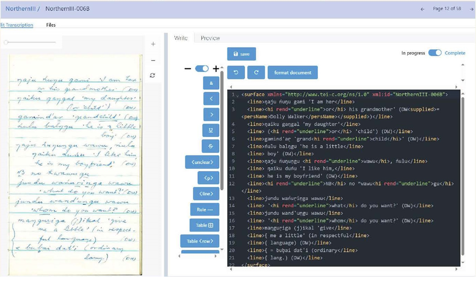

Since her retirement in 2022, Jane Simpson has been [Professor Emerita](https://researchportalplus.anu.edu.au/en/persons/jane-simpson) at the Australian National University ([ANU](https://www.anu.edu.au/)), the university from which she received both her bachelor’s and master’s degrees. She has carried out fieldwork on Indigenous Australian languages since 1979 and received a [PhD in linguistics](https://linguistics.mit.edu/alumni/#1983) from the Massachusetts Institute of Technology (MIT) in 1983 for [a study](https://link.springer.com/book/10.1007/978-94-011-3204-6) of [Warlpiri](https://collection.aiatsis.gov.au/austlang/language/c15) in the [Lexical-Functional Grammar](https://ling.sprachwiss.uni-konstanz.de/pages/home/lfg/) framework. She then worked in Central Australia on [Warumungu](https://collection.aiatsis.gov.au/austlang/language/c18) language and language maintenance, and helped set up a [language centre](https://www.papak.com.au/) in Tennant Creek. In 1987–1989, with David Nash, she worked as lexicography fellow at the Australian Institute of Aboriginal Studies ([AIATSIS](https://aiatsis.gov.au/)), helping set up a digital archive of Aboriginal language material, which became the Aboriginal Studies Electronic Data Archive ([ASEDA](https://doi.org/10.1515/ijsl.1995.113.147)). In 1989, she became a lecturer in Linguistics at [The University of Sydney](https://www.sydney.edu.au/), and then in 2011, she moved to ANU as the inaugural chair of Indigenous linguistics and head of the School of Language Studies (2011–2014). In 2014, the ARC Centre of Excellence for the Dynamics of Language ([CoEDL](https://legacy.dynamicsoflanguage.edu.au/)) was established, and she acted as Deputy Director until the Centre came to a natural end in 2022. Jane is a Project Advisor and a member of the Steering Committee of the Language Data Commons of Australia.

 

<figure>
  
  <figcaption class="text-center italic mt-2 font-bold">
    Figure 1: Jane Simpson, Professor Emerita at the Australian National University (ANU). (Image: ANU)
  </figcaption>
</figure>

 

Our discussion with Jane was the first in a series of interviews we are conducting on the topic of long-term storage of language data. We asked Jane about current possibilities for storing language data, obstacles to its long-term storage, her interest in making dictionaries accessible and how researchers at the end of their careers should manage data. What follows is an edited version of Jane’s comments organised around the main themes of the discussion<a name="back-1" >1</a>.

 

## Current storage options for language data

First, I've always thought that Australia is very lucky in having AIATSIS. Other countries, such as America (USA), don’t have anything similar. I can give digital copies of Aboriginal language material to AIATSIS and the reasons for depositing there are that it:

- is funded for the long term
- is a statutory authority
- has an act which says it's supposed to preserve material and make it accessible.

So, it is the obvious place to put material on Indigenous languages.

I can also put material in [PARADISEC](https://www.paradisec.org.au/), which I've done for some non-Indigenous stuff, like recordings made in field methods classes that I've run. PARADISEC has a very inclusive approach and that makes it easy for people to put things there. So it's been terrific as a way of getting material online, and a fair bit of Australian language material is actually up and available through PARADISEC. But it's not funded for the long term in the way that AIATSIS is.

Another potential option would have been the [National Library of Australia](https://www.nla.gov.au/). It's the national deposit institution, and therefore, I would have thought, if anything is published electronically in Australia on Australian topics, it should be held at the National Library. But they recognise they face large challenges in archiving complex digital materials. Lack of funding is part of the problem.

 

## Problems with permissions

I think there's a major concern with depositing digital material which includes recordings of more than one person, because these days you would probably require permission from absolutely everyone involved, and there's a massive backlog of legacy material where not all those permissions exist.

In the case of the Aboriginal Child Language Acquisition ([ACLA](https://arts.unimelb.edu.au/school-of-languages-and-linguistics/our-research/past-research-projects/acla1)) project, there is another problem in that it's data involving children. It was recorded when they were children and they're now grown-ups. During CoEDL, we funded some of the researchers to go back and try to get permissions from those participants to have their material archived and/or publicly available, but it's extremely difficult, time-consuming and expensive to go back and get permissions, especially when you've got natural conversation with a number of different speakers.

So, currently, that data is stored on [Mediaflux](https://dataservices.research.unimelb.edu.au/services/40/) at [The University of Melbourne](https://www.unimelb.edu.au/), and it's in a bit of a hiatus as to what should eventually happen to it. My conscience is certainly not clear on the fact that it's still sitting there and neither Jill Wigglesworth nor I have done anything about getting it into a long-term repository, such as AIATSIS.

 

## A potential solution: 'grey archives'

It seems to me that there's a place for a 'grey archive' where you keep digital material, hoping that, in the future, the permissions will be sorted out. There is a governance question — about whether material is accessible and how to make it accessible — but there seems to me also a moral question — an imperative — that this material is valuable, and if it can't be made publicly accessible at the moment, fine, but that doesn't prevent you from storing it. I feel pretty convinced that the wrong attitude is 'You shouldn't do anything with such material', because we know how easy it is with digital material to lose it.

I honestly can't see why long-term digital storage is such a problem. If the National Library or AIATSIS can't actually store digital recordings with appropriate catalogue metadata and make it accessible without formal permission from all the speakers recorded, then fine, keep it in a grey archive. We don't really have an idea what grey archives would be like, though we know that they're needed. In a way, the [Nyingarn](https://nyingarn.net/) workspace is a bit like a grey archive. It's kind of a holding place, a holding paddock, but only for the short term. We still need a long-term holding paddock.

 

<figure>
  
  <figcaption class="text-center italic mt-2 font-bold">
    Figure 2: A manuscript document and its text version being edited in Nyingarn. (Image: Paul Williams)
  </figcaption>
</figure>

 

LDaCA can certainly emphasise to data stewards that the material is valuable, and that they shouldn't be put off from trying to preserve it by the fact that they haven't got the required permissions for making it public. Data stewards should not throw up their hands and say, 'Oh, well, I'll just keep it on my laptop.' It is simply unrealistic with legacy material to expect retired researchers and literary executors to be able to afford to go back to communities to get the onerous permissions now being required by institutions. There is a real role for a grey archive where material can be kept safely, along with the metadata information needed in the future for contacting speakers. For instance, with our ACLA data, we need to know who's in the recordings and any possible ways of contacting them, so that there is, in the future, the possibility of easily getting the permissions.

However, that said, there are a number of recordings, like those made by [Stephen Wurm](https://en.wikipedia.org/wiki/Stephen_Wurm), where we don't necessarily even have the names of the people who've been recorded. But, again, that's not a reason for not doing anything about digitising those tapes and hoping in the future to be able to find the speakers and only then digitise and archive the recordings. Imagine how one would feel if the last recording of your language, your ancestors' language, had been trashed merely because people didn't know who the speaker was.

 

## Best practices for archival storage

### A beginner's guide

I think there's a real place for a beginner's guide to what material you should have, what metadata you should have and how it should be attached to your file. So that whichever archive you go to, you know that you're going to need to provide:

- the name of the speaker
- the name of the language
- the place recorded
- a permissions file for recording it
- any associated material, like a transcript.

Bundling the material together is important, so you need to include that in the beginner's guide too. But, one of the problems with AIATSIS, for instance, is that it doesn't currently have a good way of linking a transcript and the audio file associated with the transcript.

 

### Importance of accessibility

I see it as really important to have public access to digital dictionaries for language reclamation and language revival work. A good dictionary is in effect a standardisation of the language, and it acts as a resource for community members wanting to revive or have literacy in their own language.

Whereas, when you've got no publicly available dictionary, or a dictionary that only exists in paper form and is accessible to only a few people, then you tend to get people feeling worried about how to spell a language and arguing about it. This really delays having widespread knowledge of the language and widespread literacy.

In the case of Wiradjuri, John Rudder and Stan Grant Senior produced a dictionary of the language. I think because of Stan Grant’s prestige in the community and his involvement in language reclamation courses, the dictionary got widely accepted and acts as a real force for helping people reclaim Wiradjuri.

Similarly, the Kaurna dictionary has been a fantastic asset for the Kaurna community. It was published in 1840 by Teichelmann and Schürmann, reprinted by the Friends of the South Australian Library in the 1960s and made available in various forms, including a digitised copy which was put [online](https://nla.gov.au/nla.obj-1160965034/view?partId=nla.obj-1160987557). People have been able to take the original spelling system, and then develop a better one which uses pretty consistent spelling, so that you can recognise the same word on a street sign, in a place name and elsewhere. So, the public availability of that dictionary has helped Kaurna language revival.

 

<figure>
  
  <figcaption class="text-center italic mt-2 font-bold">
    Figure 3: Pages 32 and 33 from 'Outlines of a grammar, vocabulary, and phraseology of the Aboriginal language of South Australia, spoken by the natives in and for some distance around Adelaide' by C.G. Teichelmann and C.W. Schürmann (1840). (Image: Michael Treloar Antiquarian Booksellers, Adelaide)
  </figcaption>
</figure>

 

You can contrast that with the Wagiman digital dictionary, developed by Stephen Wilson, which was put up on the AIATSIS website. Then AIATSIS, for some reason, decided it didn't want to house electronic dictionaries. It was also put up on a Sydney University webpage, but the university went through one of its website changes and that webpage disappeared. So there were a number of years where you couldn't find a copy of the Wagiman dictionary — as Aidan Wilson [discussed](https://www.paradisec.org.au/blog/2008/10/more-good-news/) in 2008. Now, Stephen has put it up on his own website for his laboratory in neuroscience, which is not exactly the place where you might expect to find a [Wagiman dictionary](https://aphasialab.org/wagiman/).

 

### Ease of storage

I feel really worried about the imposition of even greater hurdles for depositing material in libraries or institutions. Ideally, you don't want a system like AIATSIS, where it takes a long time, like months and months and months, before anyone will be assigned to help you deposit the material or to accept a deposit.

It also seems that library deposit forms are getting much more complex. Once upon a time, you could rock up in person to the National Library with a book that you wanted to donate and they would look at it and say, ['Yeah,no'](https://theconversation.com/are-you-ready-for-it-yeah-nah-comes-back-stronger-with-a-little-help-from-taylor-swift-224062), or they'd say, 'Yes'. Now, you have to go through a whole lot of hoops in order to give them a book, which you already know is not in their collection because you looked through their catalogue.

What I do think is that it needs to be simple so that people are encouraged to put their material in an archive, and that could include a grey archive. We need to make it easy for people.

 

## Succession planning

With [Luise Hercus](https://en.wikipedia.org/wiki/Luise_Hercus)'s material — and this is where AIATSIS was terrific and helpful — Luise, Kazuko Obata and Grace Koch got all her recordings deposited at AIATSIS before she died. Kazuko and Grace were terrific in making sure that the metadata for the recordings was done with Luise insofar as they could, and kept with the files.

Grace and I, as her executors, are left with her papers, which are very valuable but which were not at all organised, and also her digital files on different computers and laptops. So, there are field notebooks, offprints, just an enormous amount of stuff. Daniel Majchrzak, an honours student at ANU, has been slowly digitising the material that Grace and I thought was the highest priority, e.g. field notebooks, which he's begun putting in Nyingarn. It will just stay in the Nyingarn workspace for a while, so again, that's kind of a holding paddock. Once we've identified what the language is, then we have to identify the people who can talk for that language or the descendants of the person she recorded, in order to get permissions to make it public. These are massive tasks. It took us, I think, close to three months of a part-time research assistant just to catalogue the contents of the boxes of papers and books from Luise's place, and that's before even digitising them let alone tracking down the descendants of speakers for permissions.

 

<figure>
  
  <figcaption class="text-center italic mt-2 font-bold">
    Figure 4: ANU student Daniel Majchrzak using a shelf-mounted digital camera for high-resolution image capture of the manuscripts of Luise Hercus. (Image: Julia Colleen Miller)
  </figcaption>
</figure>

 

Now that I've been a literary executor, I can see that you've got to think about your copyright, and the moral, intellectual and cultural property rights of the people you've recorded, and you have to name an executor in your will. Your literary executor needs to be able to produce a copy of that will in order to be able to do various things. You want someone as your literary executor who's going to be able to deal with the mass of papers, recordings and computer files that you've created over your lifetime.

The problem with computer files is that there's a lot more of them, probably, than there are of your paper material. If they're like mine, it's going to be really difficult for an outsider to look at your computer hard drive and work out:

- what has been archived where?
- what is fresh?
- what are the final copies of papers that have been written?
- what are just backup versions that can be deleted?

These are all things that would be really good to sort out.

The [Wenner-Gren Foundation](https://wennergren.org/) actually has grants for anthropologists, in particular, to get their field recordings and material into shape for succession planning, which is a good idea.

 

We are very grateful to Jane for making the time to talk with us about these important issues and we appreciate the insights she was able to provide, based on her experiences over her long and illustrious career.

 

<a name="fn-1">1</a> Teresa Chan, Bridey Lea, Rosanna Smith and Simon Musgrave collaborated in editing this material. [↩](#back-1)

 
