 

[PDF version](ldaca-metadata-ecosystem-eresearch-2022.pdf)

<section typeof='http://purl.org/ontology/bibo/Slide'>
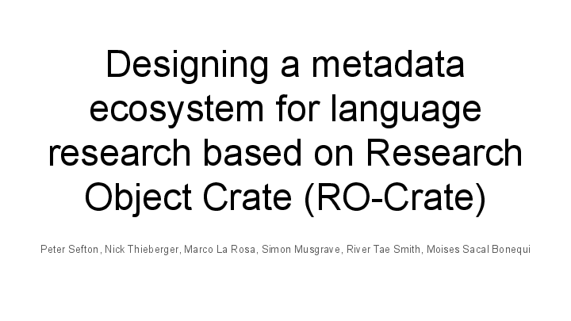

By Peter Sefton, Nick Thieberger, Marco La Rosa, Simon Musgrave, River Tae Smith, Moises Sacal Bonequi – delivered by Peter Sefton at eResearch 2022 in Brisbane

This work is licensed under CC BY 4.0. To view a copy of this license, visit http://creativecommons.org/licenses/by/4.0/

This presentation will look at how a Metadata Standard - RO-Crate - with Metadata Profile (the Language Data Commons) is being developed and implemented. Two major collections are collaborating on the standard, PARADISEC and the Language Data Commons of Australia (LDaCA). This ongoing standardisation effort for language data is designed to improve interoperability, reduce costs for data migration and allow storage on disk, object storage or in archival repositories.

[RO-Crate] is a linked-data metadata system which allows discovery metadata (Who, what where) based on the widely adopted Schema.org vocabulary to be seamlessly integrated with more discipline-specific metadata. RO-Crate uses metadata profiles to provide guidance for packaging resources for particular disciplines and purposes.

In this presentation, we will introduce a RO-Crate metadata profile for language data which extends the core RO-Crate standard with new vocabulary terms adapted from pre-linked-data discipline-specific metadata efforts, particularly the Open Language Archives Community (OLAC) standards. The profile has English-language guidance on how to structure collections of resources in a repository with links between them, such that they can be indexed and displayed via APIs and search/browse portals. The profile is also implemented as a series of machine-readable profiles for the Describo Online metadata description system.

We will demonstrate current ways of describing items in a variety of languages and modes (spoken, written and signed), from a large set of heterogeneous language resources held by PARADISEC and LDaCA. We will also show how to access them via API calls and a search portal, and how resources may be stored in simple storage systems using the Arkisto platform (a set of standards and principles).

[ro-crate]: https://www.researchobject.org/ro-crate/

</section>

 

<section typeof='http://purl.org/ontology/bibo/Slide'>
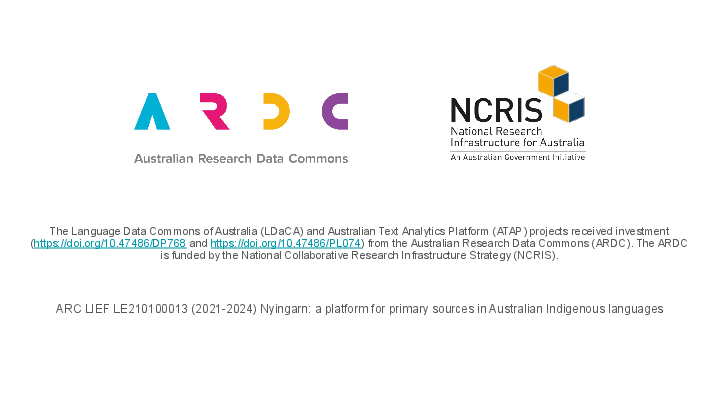

This work is supported by the Australian Research Data Commons.

</section>

 

<section typeof='http://purl.org/ontology/bibo/Slide'>
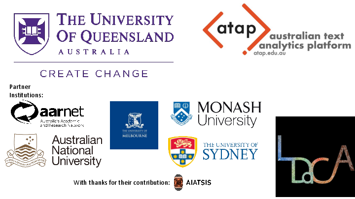

The Language Data Commons of Australia Data Partnerships ([LDaCA](https://doi.org/10.47486/HIR001)) and the Australian Text Analytics Platform ([ATAP](https://doi.org/10.47486/PL074)) are building towards a scalable and flexible language data and analytics commons. These projects will be part of the Humanities and Social Sciences Research Data Commons (HASS RDC).

The Data Commons will focus on preservation and discovery of distributed multi-modal language data collections under a variety of governance frameworks. This will include access control that reflects ethical constraints and intellectual property rights, including those of Aboriginal and Torres Strait Islander, migrant and Pacific communities.

The platform will provide workbench services to support computational research, starting with code-notebooks with no-code research tools provided in later phases. Research artefacts such as code and derived data will be made available as fully documented research objects that are re-runnable and rigorously described. Metrics to demonstrate the impact of the platform are projected to include usage statistics, data and article citations. These projects are led by Professor Michael Haugh of the School of Languages and Culture at the University of Queensland with several partner institutions.

</section>

 

<section typeof='http://purl.org/ontology/bibo/Slide'>
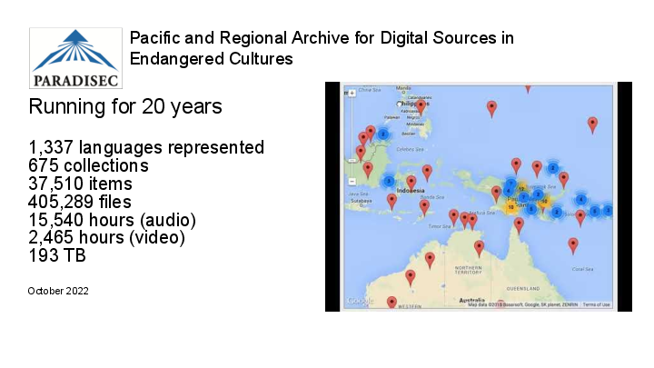

This page shows a [YouTube demo of the PARADISEC website](https://www.youtube.com/watch?v=CX-CODBwOVU&t=7s).

PARADISEC (the Pacific And Regional Archive for Digital Sources in Endangered Cultures) is a digital archive of records of some of the many small cultures and languages of the world and it has developed models to ensure that the archive can provide access to interested communities while also conforming with emerging international standards for digital archiving. Australian researchers have been making unique and irreplaceable audiovisual recordings in the region since portable field recorders became available in the mid-twentieth century, yet until the establishment of PARADISEC there was no Australian repository for these invaluable research recordings.

</section>

 

<section typeof='http://purl.org/ontology/bibo/Slide'>
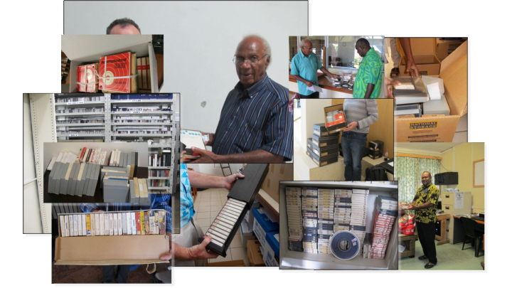

Goal: Be able to store data with an eye on preservation

In an archive like PARADISEC - it is important to be able to maintain resources over the long term. For example, much material which falls within the scope of PARADISEC is stored on legacy media. PARADISEC archives tapes from a range of sources, such as the agencies in the Pacific shown in the images above. Such material needs to be digitised and returned to the source with meaningful metadata.

</section>

 

<section typeof='http://purl.org/ontology/bibo/Slide'>
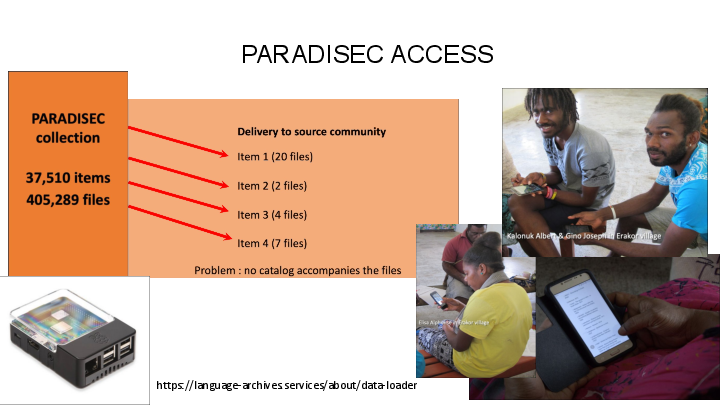

PARADISEC has learned the importance of making the collection self-describing so it is not dependent on a database as the sole metadata source. It does use a database for administrative services, from which a text file with metadata for any item can be exported. This allows us to select an arbitrary set of items, put them on a hard disk, and use the dataloader application to generate an HTML catalogue of just those items, drawing on the internal metadata file describing each item. This can be delivered on a hard disk to a local community or cultural organisation, or on a Raspberry Pi wifi local network to allow access on phones, as seen here in Erakor village in central Vanuatu.

</section>

 

<section typeof='http://purl.org/ontology/bibo/Slide'>
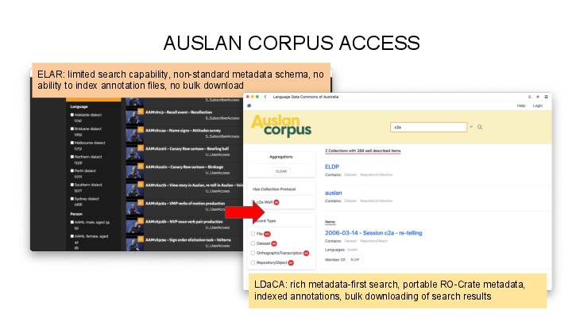

Another example of how good metadata practice can improve community access is the Auslan (Australian Sign Language) corpus, for which community access is very important.

The Auslan Corpus has been stored with the Endangered Languages Archive ([ELAR](https://www.elararchive.org/)) since 2008. However, ELAR does not currently suit the access needs of the Auslan corpus; it has low discoverability, and files must be downloaded individually. The corpus, along with the Auslan SignBank dictionary, is being included in LDaCA.

The Auslan Corpus holds great value as an educational tool for Auslan users and learners, both Deaf and hearing, and the move to LDaCA will allow further development of educational tools. One such tool is the ability, still under development, for Auslan Signbank dictionary to pull real-world examples of signs out of the corpus to show alongside dictionary entries.

</section>

 

<section typeof='http://purl.org/ontology/bibo/Slide'>
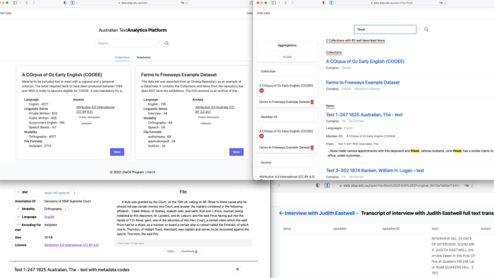

For all of the collections we are working with data is discoverable via some kind of web portal which indexes and displays the archive (repository) of data. These screenshots are of work in progress at LDaCA.

</section>

 

<section typeof='http://purl.org/ontology/bibo/Slide'>
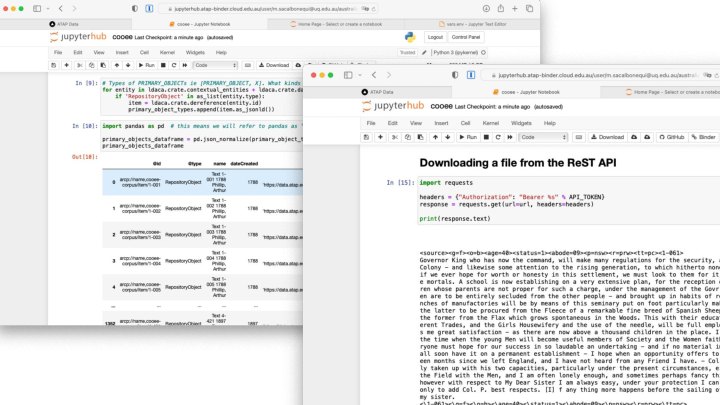

The LDaCA services we are building use an API to drive the data portals. The API can be used for direct access with appropriate access control – see [another eResearch presentation](../fair-care-eresearch-2022) which explains this in detail. These screenshots show code notebooks (running in BinderHub on the Nectar cloud) accessing language resources.

</section>

 

<section typeof='http://purl.org/ontology/bibo/Slide'>
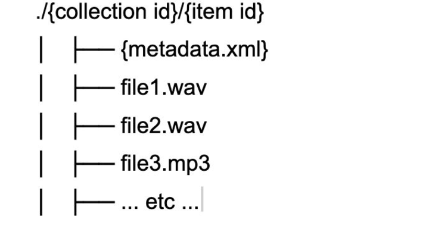

Having looked at the user-facing products, websites and APIs, we turn our attention to how data is managed on disk.

In the PARADISEC system, this is achieved by storing files on disk in a simple hierarchy - with metadata and other resources stored together in a directory - this scheme allows for hands-on management of data resources, independently of the software used to serve them.

This approach means that if the PARADISEC software-stack becomes un-maintainable for financial or technical reasons the important resources, the data, are stored safely on disk with their metadata and a new access portal could be constructed relatively easily.

Despite the valuable features of this solution, it is not generalisable. The metadata.xml is custom to PARADISEC, as is the software stack.

In 2019 PARADISEC and the eResearch team at UTS received small grants from the Australian National Data Service and began collaborating on an approach to managing archival repositories which built on this PARADISEC approach of storing metadata with data.

The UTS team presented on this at [eResearch Australasia 2019](https://ptsefton.com/2019/11/05/FAIR%20Repo%20-%20eResearch%20Presentation/index.html)

</section>

 

<section typeof='http://purl.org/ontology/bibo/Slide'>
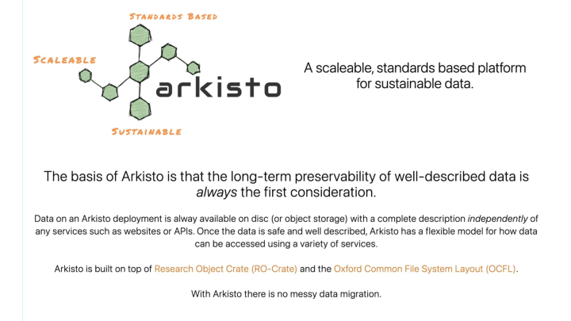

For this Research Data Commons work, we are using the Arkisto Platform (introduced [at eResearch 2020](http://ptsefton.com/2020/11/23/Arkisto/index.html)).

Arkisto aims to ensure the long-term preservation of data independently of code and services, recognizing the ephemeral nature of software and platforms. We know that sustaining software platforms can be hard and aim to make sure that important data assets are not locked up in databases or hard-coded logic of some hard-to-maintain application.

Inspired by PARADISEC’s approach the Arkisto platform is based on the idea of storing data in simple easy-to-manage file or object storage systems with metadata in an easily readable standard format.

The LDaCA repositories use the Oxford Common File Layout ([OCFL](https://ocfl.io/)) standard which is backed and used by a number of universities and has multiple implementations while PARADISEC data will be migrated to a simpler data storage approach [NOCFL](https://github.com/CoEDL/nocfl-js), which is a single-library implementation, inspired by some of the same aims, but with different implementation choices to avoid data being obfuscated by OCFL’s layout, which is a product of its commitment to immutable, write-once file management.

</section>

 

<section typeof='http://purl.org/ontology/bibo/Slide'>
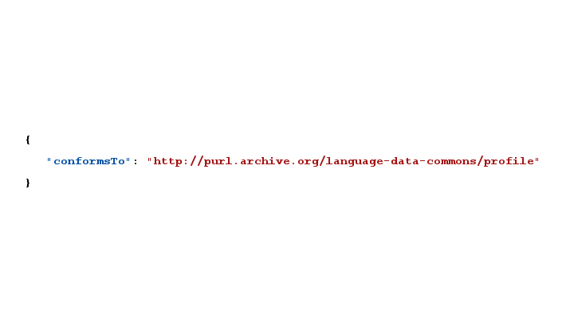

Now to the main focus of this presentation - the metadata “Profile” we are jointly developing to ensure that language resources can be described in a way that is interoperable between software, and re-usable over time.

The Profile is an “RO-Crate Profile”, a kind of Cook Book for how to describe and package language data.

</section>

 

<section typeof='http://purl.org/ontology/bibo/Slide'>
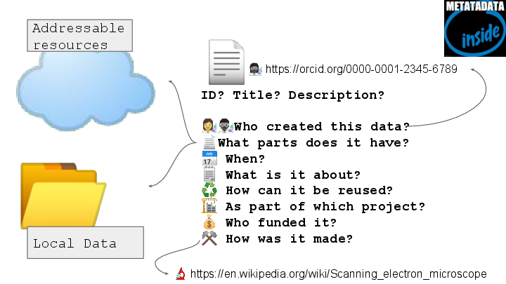

RO-Crate is a method for describing a dataset as a digital object using a **single linked-data metadata document**

</section>

 

<section typeof='http://purl.org/ontology/bibo/Slide'>
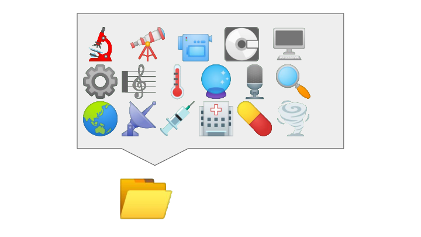

The dataset may contain any kind of data resource about anything, in any format as a file or URL

</section>

 

<section typeof='http://purl.org/ontology/bibo/Slide'>
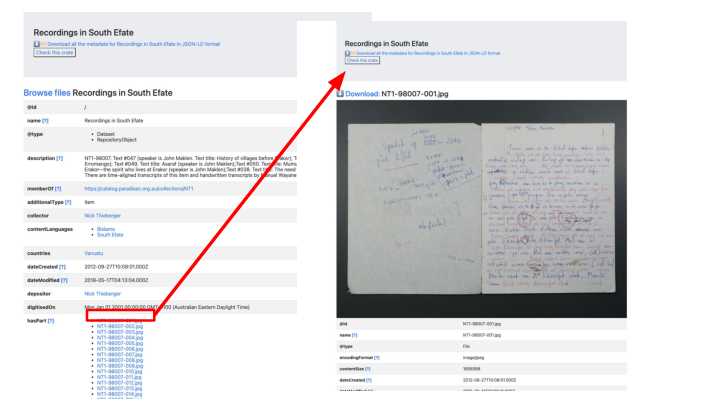

The RO-Crate standard also strongly recommends that JSON metadata is supplemented with an HTML preview - above we show what that looks like for a PARADISEC item. This is a screenshot of an HTML view of a PARADISEC Item generated using [an HTML rendering tool for RO-Crate](https://github.com/UTS-eResearch/ro-crate-html-js). The important point here is that this is a _generic_ viewer that can understand any RO-Crate. It may not be glamorous but it could be included in an archive as a way to provide human-readable access in the absence of portals that are data-specific (but cost money to build and maintain).

</section>

 

<section typeof='http://purl.org/ontology/bibo/Slide'>
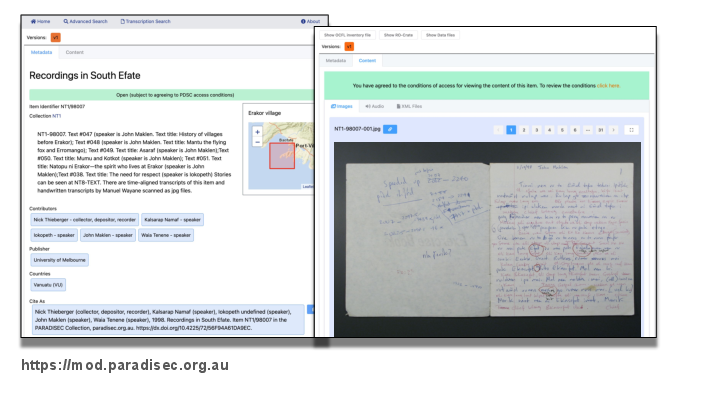

Here is the same page from the previous slide seen in a working model of an RO-Crate set exported from the current PARADISEC catalogue, with a single-page viewer using an elastic search. The two pages shown here are generated directly from metadata that was stored in an RO-Crate in a storage system using PARADISEC-specific, rather than generic code.

</section>

 

<section typeof='http://purl.org/ontology/bibo/Slide'>
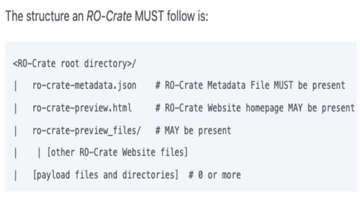

The [structure of an RO-Crate](https://www.researchobject.org/ro-crate/1.1/structure.html) is very similar to the PARADISEC example above, but with a JSON file instead of XML, and an optional preview in HTML.

RO-Crate has a growing number of [tools and software libraries](https://www.researchobject.org/ro-crate/tools/) which means that a team such as PARADISEC do not have to maintain their own bespoke software.

</section>

 

<section typeof='http://purl.org/ontology/bibo/Slide'>
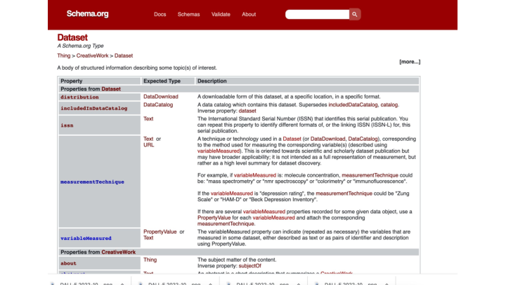

The base vocabulary for the JSON-LD used in RO-Crate is schema.org - a widely used linked data standard. RO-Crate uses a handful of terms from other ontologies but importantly it allows for seamless extensibility with domain-specific vocabularies, which is what we will talk about next.

</section>

 

<section typeof='http://purl.org/ontology/bibo/Slide'>
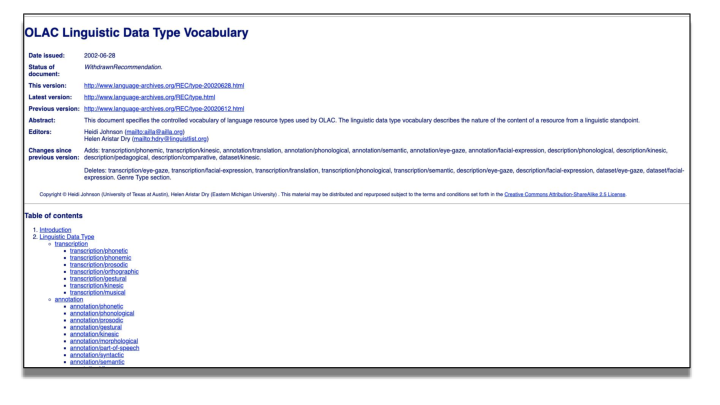

The PARADISEC metadata model is based on the Open Language Archives (OLAC) metadata standard. This is an XML-based standard, but has good online documentation, which is perfect for migrating to a Linked Data approach.

We used the OLAC terms, including [some that were proposed but withdrawn](http://www.language-archives.org/REC/type-20020628.html) as the basis for a new vocabulary.

As part of a LIEF project (2022-23, led by author Thieberger), revisions to the OLAC scheme are planned, together with rebuilding the OLAC metadata harvester and aggregator.

</section>

 

<section typeof='http://purl.org/ontology/bibo/Slide'>
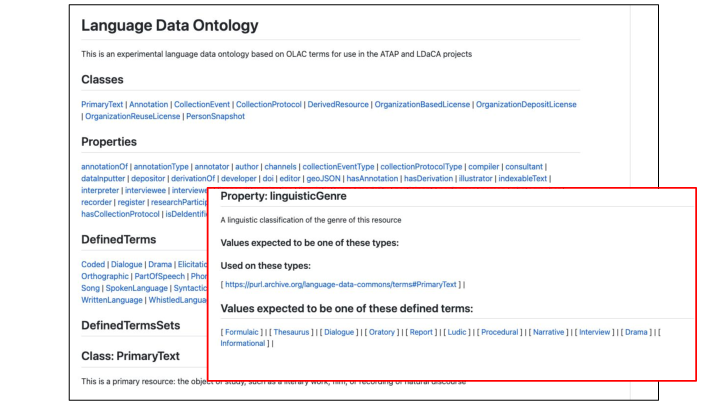

The new Langauge Data Terms have been published at <https://purl.archive.org/language-data-commons/terms>

These terms have been modernised and mainstreamed from previous ways of describing resources, for example, instead of describing the main item of interest as a PrimaryText (where text is any kind of communicative resource – not a bitstream of characters) we use the term PrimaryResource. And in the example in the image, the type of genre _Informational_ has been added to the set proposed in the OLAC vocabulary.

</section>

 

<section typeof='http://purl.org/ontology/bibo/Slide'>
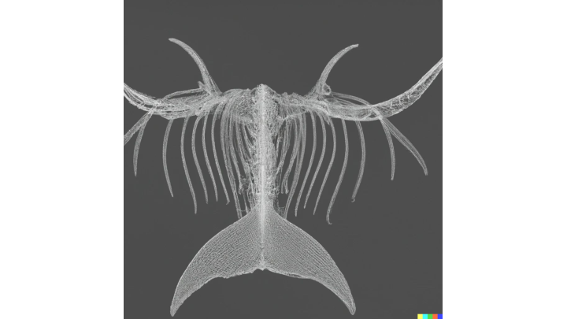

(Image prompt DALL-E a hierarchical whale skeleton digital art)

Before we come back in detail to how RO-Crate works we will discuss the structure or skeleton of our language collections stored in a repository

</section>

 

<section typeof='http://purl.org/ontology/bibo/Slide'>
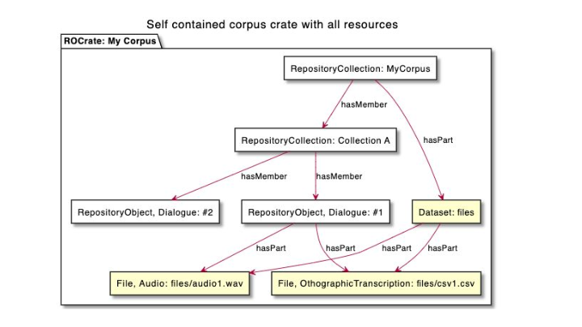

Broadly speaking there are two ways that an Arkisto-style repository can be structured and the profile sets out criteria for choosing one of the options.

For small, stable collections of data, an entire collection (often referred to as a ‘corpus’ by linguists) can be stored in a single directory or directory-like structure in an object store.

</section>

 

<section typeof='http://purl.org/ontology/bibo/Slide'>
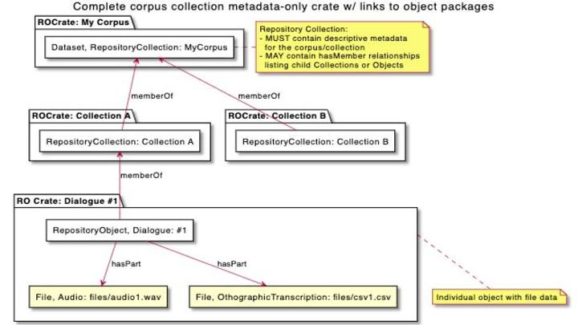

For larger collections, the approach used by PARADISEC and most LDaCA collections is to store each Object or Item (typically a related set of recordings, or a single document) in a directory (or directory-like thing).

In this mode, each Object MUST link back to the Collection Object.

A Collection Object MAY have explicit listing of hasMember properties - which makes it possible to construct repository navigation (such as websites) more cheaply. This is the approach used in PARADISEC, while in LDaCA these links are constructed by an indexer servicer or summarizer application.

</section>

 

<section typeof='http://purl.org/ontology/bibo/Slide'>
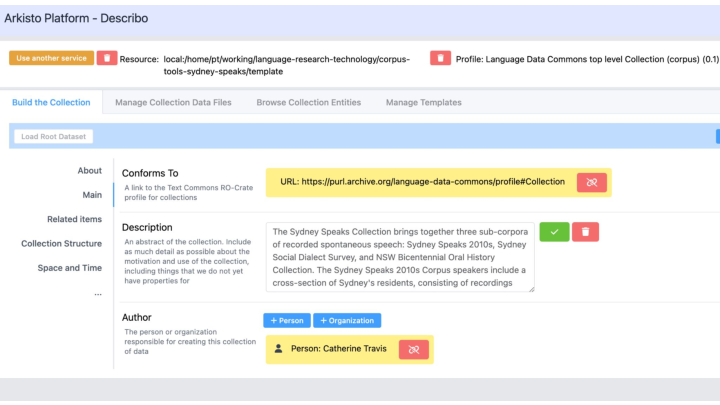

This screenshot shows the Language Data Commons RO-Crate Profile in action. This is the [Describo Online] metadata editor, with configuration that reflects the profile being used to describe a language data collection using linked-data metadata.

In this case, the description is of the collection object.

[describo online]: https://github.com/Arkisto-Platform/describo-online

 

<section typeof='http://purl.org/ontology/bibo/Slide'>
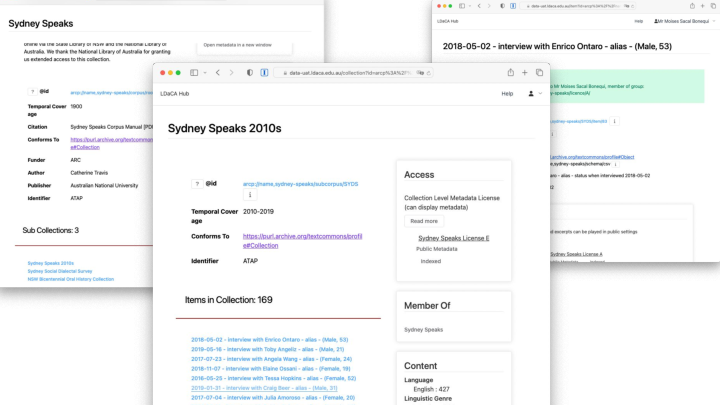

Once the data is described, we ingest it into a repository, as a set of files on disk or object storage and index it in a portal, as you can see in these screenshots.

</section>

 

<section typeof='http://purl.org/ontology/bibo/Slide'>
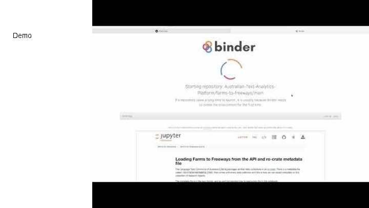

[Video of browsing a collection in an LDaCA repo](https://www.youtube.com/watch?v=p-GZbe-Kzww&t=5s) showing:

- Going to the portal
- Selecting a collection
- Searching for content
- Selecting a notebook
- Launching Binder

This example notebook explores the collection via the rest API.

 

# Conclusion

In this presentation, we have shown the major components of an ecosystem for storing, discovering and analysing language data using common standards for describing objects in a repository. The [RO-Crate](https://www.researchobject.org/ro-crate/) standard is used as the key metadata container, with a common vocabulary of language-specific terms for describing data. This approach should reduce development costs and increase data reuse. The approach can also be adapted to other disciplines and domains with the development only of new profiles.

</section>

 