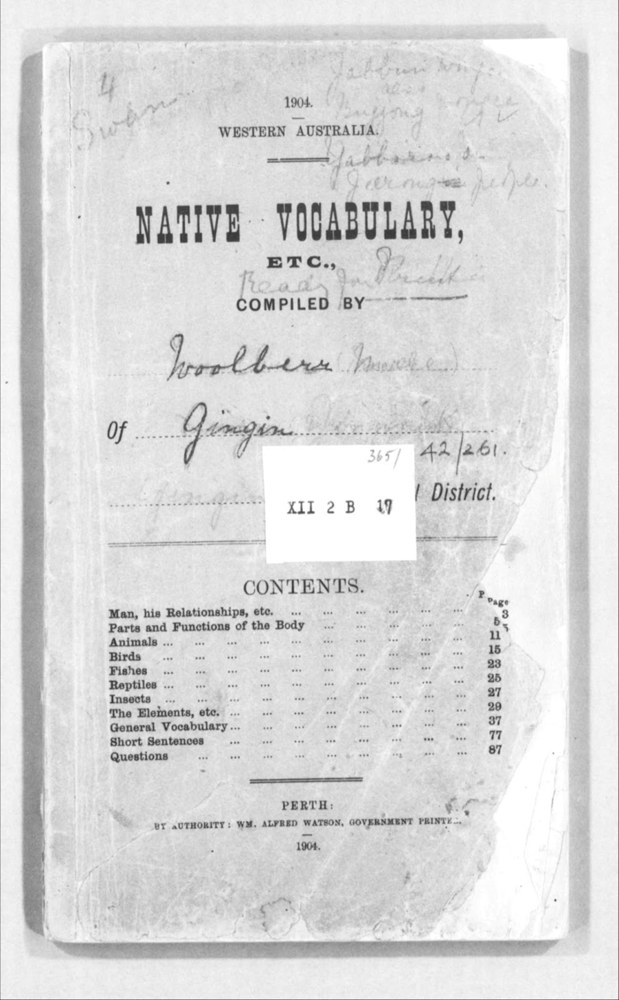

 

Nick Thieberger (Figure 1) is an Associate Professor in the [School of Languages and Linguistics](https://arts.unimelb.edu.au/school-of-languages-and-linguistics) at The University of Melbourne ([UniMelb](https://www.unimelb.edu.au/)). After an undergraduate degree in linguistics, Nick worked with various Indigenous groups, before creating a handbook of languages in Western Australia and then helping to set up the [Wangka Maya Pilbara Aboriginal Language Centre](https://www.wangkamaya.org.au/home) in Port Hedland. That experience, together with an interest in harnessing new technologies, took Nick to the Australian Institute of Aboriginal and Torres Strait Islander Studies ([AIATSIS](https://aiatsis.gov.au/)) in Canberra, before a period of living in Vanuatu, where he also collected data on the Nafsan (South Efate) language, the topic of his doctoral dissertation. Documenting the Nafsan language reinforced Nick's commitment to making enduring and high-quality records of cultural and linguistic material, and when he returned to Australia, he was part of the group which founded the Pacific and Regional Archive for Digital Sources in Endangered Cultures ([PARADISEC](https://www.paradisec.org.au/)), of which he is now Director. During a period at the [University of Hawai'i](https://manoa.hawaii.edu/), Nick set up the [Kaipuleohone](https://scholarspace.manoa.hawaii.edu/communities/533eb99e-2e59-47a5-9c4e-652352bfc5a6) digital archive. Other aspects of Nick's work have included leading a stream in the [ARC Centre of Excellence for the Dynamics of Language](https://legacy.dynamicsoflanguage.edu.au/), serving as Deputy Director of the [Research Unit for Indigenous Languages](https://arts.unimelb.edu.au/research-unit-for-indigenous-language) at UniMelb, assisting in the founding of the journal _[Language Documentation & Conservation](https://nflrc.hawaii.edu/ldc/)_ and now being a Chief Investigator in .

 

<figure style="text-align: center;">
  
  <figcaption style="font-style: italic; margin-top: 0.5rem;">Figure 1: Nick Thieberger. (Image: Nick Thieberger)</figcaption>
</figure>

 

(NT — Nick Thieberger, SM — Simon Musgrave, BL — Bridey Lea)<a name="back-1" >[1](#fn-1)</a>

 

**SM**: When the group of people involved started , did you see it as being a solution for long term storage?

**NT**: When we started PARADISEC, we mainly saw it as a way of digitising a whole lot of material that was at risk. We didn't see it as a long term storage, we saw it as a transitional phase. So the material would be digitised, it would be described, and at some point, the  would be able to accommodate it. That was our plan. And so I suppose what's happened is, since then we've shepherded that material through, and we're still waiting for the national data fabric to catch up.

For the current phase, PARADISEC has taken on a role of curating the material that it has. So it won't be permanent storage. It will be whatever we can do to keep it going now, and we really do hope that there will be some national infrastructure which can deal with these kinds of material. It's not just the material, but it's the way that it's curated, right? So that you have , you have , you have ways of accessing the material that PARADISEC provides, and ideally, that's what a national service would provide. Unlike what we typically have from universities and institutions, which is storage. And storage is OneDrive or Sharepoint or so many of these things which don't give you good accessibility. They're usually tied into a particular university environment. There are many reasons why those things aren't sufficient for the kinds of material that we work with.

 

**BL**: I might take us back a bit. I'm curious about what your first  looked like, as an early career researcher, and also in setting up . What was that like and how did that look in terms of your data storage?

**NT**: Right, early collections. Well, I suppose the first collection that I really worked with was at [Edith Cowan University](https://www.ecu.edu.au/), which was then the West Australian College of Advanced Education. I built a repository of information about West Australian Aboriginal languages, which were files — drop files ([suspension files](https://dictionary.cambridge.org/dictionary/english/suspension-file)). So this was not dynamic media, it was all , and that went into the [Handbook of WA Aboriginal Languages](https://doi.org/10.15144/PL-C124) (Figure 2)<a name="back-2" >[2](#fn-2)</a>. The handbook had little code numbers which related to the primary material that was in those drop files, and after I left that institution, they threw it all out. So it gave me some good insights into how to look after material a little bit better than that. Luckily most of it wasn't unique, but the assembly of it was unique.

But then I used a similar sort of style at the language centre in Port Hedland<a name="back-3" >[3](#fn-3)</a>. So that was in the late 1980s, and it was drop files with an index. The original documents were in there, and you could find them through the index. So you know, I had a sort of a sense of how to build a collection. The  in the collection could have arbitrary identifiers, as long as that linked to a description somewhere and you could then find the object.

And then I went on to build the Aboriginal Studies Electronic Data Archive ([ASEDA](http://olac.ldc.upenn.edu/archive/aseda.aiatsis.gov.au)) at , and that was also just sequential numbers. So every object that came in was given the next number, but there was a catalogue that told you what those items were. And that was dictionaries of Australian languages, all kinds of stuff that was being produced on CP/M and DOS<a name="back-4" >[4](#fn-4)</a>, five inch floppy disks back in those days, and the whole collection was stored on a huge magneto optical disk, which was 500 MB, and that was enormous. But it was just textual, and with that collection, you could search over a whole range of different dictionaries of Australian languages and get results. For example, if Patrick McConvell<a name="back-5" >[5](#fn-5)</a> was looking for meat and fish terms, we could do a proximity search of characters or words or whatever around the words _meat_ and _fish_, and get a whole dataset from that collection in a whole lot of different Australian Indigenous languages. But that's not possible today, unfortunately.

 

<figure style="text-align: center;">
  
  <figcaption style="font-style: italic; margin-top: 0.5rem;">Figure 2: Title page of the Handbook of WA Languages. (Image: Public Domain)</figcaption>
</figure>

 

**SM**: I want to pick up on one thing you said because it intrigued me, Nick. You said that the kind of crosslinguistic searching that ASEDA was able to do was something that's not possible any longer. Do you think that's poor design, poor implementation or people lost interest?

**NT**: So ASEDA was the early 1990s and it was a different regime. Indigenous people had very little input into what was going on. And I think we're at a historical stage now where Indigenous people are asserting their sovereignty over material, and that means that the material isn't available for those kinds of searches anymore. You can't look at a whole range of material, because you would have to get permission for each piece of that material. So up until probably a decade ago, that kind of stuff was more possible. But now, it's not. I think we are starting to enter a different historical phase, and you can see already that some younger Indigenous people are much more interested in creating rich and accessible data that they can work with, and they appreciate that other people can work with it, and they know that helps everybody. But that's not the case everywhere. So we can't do those kinds of searches, unfortunately.

 

**BL**: Given that the way we access materials has changed in the last few decades — digital rather than analogue access, different  considerations — do you find that there are particular ways that you've been able to make sure that people are using materials in archives? The [Toksave](https://www.paradisec.org.au/toksave-podcast/) podcast, I suppose, is a great example of people using materials and then possibly feeding that back into the archive.

**NT**: Yes, absolutely. I think the fact that  was always digital, and really took advantage of what digital access provides, meant that we could do things like get material back to places. So all the Papua New Guinea material that we digitised in the very early days, we made that available to the [Institute of Papua New Guinea Studies](https://www.ipngs.gov.pg/). Similarly, with the [Vanuatu Cultural Centre](https://vanuatuculturalcentre.gov.vu/) and so on, if the conditions under which we had that material allowed it to be returned, and usually, it did. Early analogue recordings didn't have permission forms, they didn't have consent forms. The collector usually told us what could be done with them, and we took the risk that it was more important to make that material available and get it to those places. So we talk about the dialogic archive. That is, the archive that holds material, gets it out to places, gets new information about the material and puts that information back into the collection so that it enriches the collection. And one of the classic ways to enrich recordings is transcription.

We've got quite a number of items that have handwritten transcripts or Microsoft Word transcripts, and then we sometimes get volunteers who come along and say they want to do something, and they can put that into [ELAN](https://archive.mpi.nl/tla/elan/). They can type it, if it's on paper, or they can copy the text, if it's in Word, and then we get these rich time-aligned transcriptions, which the player in our catalogue allows us to present. People can then search within the transcripts, and they can resolve to a sentence or whatever they want, and listen to that sentence directly through the catalogue. The Toksave podcast too, of course, is a fantastic way of getting people who are interested together with material, having them interpret it or relearn it, and then the podcast is really looking at the way that they've done that. And maybe if they're performing, capturing their performances of that material as well.

 

**BL**: Thinking about the dialogic archive process — taking materials to people and then bringing them back enriched — do you see a role for local organisations in long term storage or in that process somewhere? I know you've worked in the Pacific, as well as in Australia.

**NT**: Often, they really don't have the capacity, that's the thing. I worked at the Vanuatu Cultural Centre for a few years, and I still have a very good relationship with them. They have in the order of 5,000 tapes, and they have a lot of videos and other material there — they just don't have the capacity to digitise all that material. And at the moment, they don't have any good platform for finding and delivering that material either. That would be the ideal, that they would be able to do that locally, but these are very small countries, and they just often don't have the capacity to do everything that a country should do. So we can help with that.

One of the ways that we do that is we store that material — we have the Vanuatu Cultural Centre's materials in PARADISEC. They have a copy, as well, but we can refresh their copy periodically, if need be, if their computers crash and die, or they have a cyclone or an earthquake, which they do periodically. So, I mean ideally, these capacities would all be available locally. But there is also a role, I think, for us to keep safe copies, so that they can be refreshed every now and then. And our collection, too, we have a copy in Melbourne. So every night, there's a copy made of any additions to the collection that's stored in Melbourne. And there's another online backup as well. So it is backed up in a few different locations.

 

**SM**: In the situation we have in Australia nowadays, with AIATSIS being there for a while and with LDaCA now existing, how do you see PARADISEC fitting into that landscape?

**NT**: Well, PARADISEC is a beneficiary of LDaCA. So LDaCA supports positions in PARADISEC, and ultimately, PARADISEC seems to just keep going and growing to the point where you'd like to think it was too big to fail. [The University of Sydney](https://www.sydney.edu.au/) has taken it very seriously and is looking after it. The main office of PARADISEC is at Sydney, at the [Conservatorium](https://www.sydney.edu.au/music/). It's been going for 22 years. So that's not bad for a research project. But you can't take for granted that it will always be there. We try to just keep it going and hope that it will keep going. We do get various bits and pieces of funding from various sources, but never enough to keep it as a going concern, it always has to be patched together. So the ideal would be that it gets a big injection of money, at some point, to allow us to take it seriously, to be able to take materials back to the Pacific, rather than just happening to be able to go when we have a conference or something, and we take some tapes out and bring some tapes back. But so far, nothing has eventuated.

 

**SM**: And how do you see PARADISEC internationally?

**NT**: PARADISEC is really well regarded internationally, it's really got a great reputation. We've won all kinds of prizes. We recently won the [Digital Preservation Coalition prize for innovation](https://www.dpconline.org/events/digital-preservation-awards). And we're part of DELAMAN, which is the [Digital Endangered Language and Music Archives Network](https://www.delaman.org/). So we're part of the international framework of digital archives. For example, we helped a [language archive in Tahiti](https://v-anavevo.upf.pf/), which is now up and running, and they talk about us as their big sister, I think. And there's a new archive in Japan also; we've done quite a bit of promoting in Japan, that they should have a language archive there. So we hope that more and more archives will be built around the place. PARADISEC is quite a good model in that it's fairly easy to get material into it and out of it and find it. So yes, I think it's done pretty well. There's much more we could do, and there are things we could do better. But given the resources we have, I think it's not too bad.

 

**BL**: In [our interview with Jane Simpson](../jane-simpson/), we talked about succession planning in relation to [Luise Hercus's](https://en.wikipedia.org/wiki/Luise_Hercus) materials. Do you have a succession plan that you've ever had to think about for PARADISEC?

**NT**: Yes, there have been times when we haven't had many staff and things just keep running, we've built systems that run pretty much by themselves. And that's become even more the case. We've just had an  [LIEF](https://www.arc.gov.au/funding-research/funding-schemes/linkage-program/linkage-infrastructure-equipment-and-facilities) grant, which is an infrastructure grant, over the last couple of years, which has really let us move to Amazon S3 Storage, and you can write routines in Amazon's environment for processes which we were doing manually before, and now they're just all done automatically. So the ingestion of new material, that is, if you put a new digital file in, all the checking of file naming conventions, the data structure, the conversions, all of that's now done almost straight away, automatically. If you put a [TIFF](https://en.wikipedia.org/wiki/TIFF) file in, it will generate a JPEG. If you put a WAV file in, it will generate an MP3, and so on. The systems run pretty well by themselves. The University of Sydney is paying for the storage that we have, so that will keep going. It's become part of the University's infrastructure. We already have had a handover from [Linda Barwick](https://www.sydney.edu.au/music/about/our-people/academic-staff/linda-barwick.html), who was the original director of PARADISEC, to me, and [Amanda Harris](https://www.sydney.edu.au/music/about/our-people/academic-staff/amanda-harris.html) is the director in Sydney and is the person who will probably take over when I retire, and we have a good team in Sydney, as well. We have an advisory committee and structure around that, as well. So there is good scope for succession planning. I think that as much as we can, we've prepared for the project just to keep going.

 

**SM**: Related to that, if there was the kind of national facility that you talked about earlier, if that was being set up, would it look different from PARADISEC or do you think the kind of systems and structures you've set up would be, more or less, transferable and scalable?

**NT**: Yes, it's interesting. We've had various summits and position papers and roadmaps, where we've talked about these kinds of things, and I think you could envisage a national infrastructure which had the same storage underneath, but had different skins, so PARADISEC would be a kind of a skin, if you like. Or you could call it a profile. This is the way we talk in [RO-Crate](https://www.researchobject.org/ro-crate/) world, I suppose. We are a language and music archive, and we have a , which is the sorts of things that we're interested in, and that would guide the terms that we use, the kind of metadata that we use, like language identifiers. And that would then be crosswalked back into the national service. So the national service would allow you to have whatever particular disciplinary vocabularies you wanted to use, but they would map back into a bigger structure. That would be how I think it could work.

The whole approach with  is interesting in that we can keep using whatever database we use, and we have a [Ruby on Rails](https://en.wikipedia.org/wiki/Ruby_on_Rails) database, which is a catalogue, but it exports to RO-Crate. And so then if other people did that, and we had this commons of RO-Crate files, which was searchable and whatever through the RO-Crates rather than through our catalogue, that's really a . I think that's a really interesting and robust model. And what is so exciting, I think, about LDaCA and , is that we're moving in that direction. But we're not there yet.

 

**BL**: Are there any other problems with long term storage that you've experienced over your career so far? Apart from there not being this national infrastructure yet, have there been other barriers?

**NT**: Well, not really, I think because people understand the value of the collection, we've been able to get national storage. We had national storage at the [National Computational Infrastructure](https://nci.org.au/) in Canberra for a long time, and they did all the backup and the basic storage, and we had a catalogue separate to that. And then eventually it moved to Sydney on disk. And we only discovered towards the end of the time there that the disk storage was costing a quarter of a million dollars a year for The University of Sydney. We didn't know that, we could have used that in our funding applications, but moving to Amazon has been much, much cheaper. But what's interesting is the potential to do something like this. So this is rendering digital data on [microfilm](https://en.wikipedia.org/wiki/Microform). Now, I'm not convinced about it but it's a thing that people are doing.  has apparently put a lot of its data onto this kind of storage, and then it's held in a storage system in [Svalbard](https://arcticworldarchive.org/about/). It's extremely expensive, but it would give you a time slice of the collection, and potentially mitigate the risk of [nuclear pulse](https://en.wikipedia.org/wiki/Nuclear_electromagnetic_pulse) — we're told that if there's a nuclear pulse, it would wipe out digital data. So, I suppose we could look into that a bit more. But even if it doesn't work, it's an interesting story, isn't it, that you would render digital data on microfilm (Figure 3).

 

**SM**: How does that even work?

**NT**: Well, apparently it really is taken seriously. As I say, GitHub and Google have also done some of this. The company's called [Piql](https://piql.com/). It's in Norway. We're talking to them about a proof of concept just to see what that could be. And then you could imagine, we could take a time slice of PARADISEC. But we have getting up to 280TB of stuff, which I imagine would cost millions of dollars to put into this system. So it's not something that we really want to do. But there are emerging technologies. People have started [storing on DNA](https://en.wikipedia.org/wiki/DNA_digital_data_storage). There are going to be interesting new ways of storing data that potentially are much more robust than what we're doing at the moment.

 

<figure style="text-align: center;">
  
  <figcaption style="font-style: italic; margin-top: 0.5rem;">Figure 3: Storing digital data on microfilm. (Image: Piql)</figcaption>
</figure>

 

**SM**: Over the course of PARADISEC's life, are there common problems that people come to ask advice about? What are the top three things that people worry about, do you think?

**NT**: Well, the first thing is, that people who should worry about things, typically aren't worrying about things. That's a major problem. So there are a lot of people who are happily creating a whole lot of data and not thinking about what should happen to it. But those who are thinking about it, I suppose the issues are their own data management issues. How do I do this? How do I describe my files? How do I store them until I get them into the archive? Then how do I transcribe them? And while we do run training in this periodically, we could do more. But people don't always think in terms of what they're creating. They're thinking of the end product. They're thinking of a thesis or they're thinking of a website. And they're not really thinking of the way the components of that could be separated and preserved in a way that gives them some longevity, rather than just putting them into a website where they potentially will not have a long life.

 

**SM**: Do you have at this point in the history of this endeavor a sense of what's an achievable goal for long-term storage?

**NT**: Look I think the current effort should be on finding and digitising material that's at risk. And that particularly is analogue media. And then what do you do with that stuff? It needs good curation, good description, lots of backups. I don't think there's much more that we can do at the moment than that. In France, they have a national data service called [Huma-Num](https://www.huma-num.fr/) for humanities data, which is, I think, a model that we could look to. There are probably other models in the world. In the UK, there was for a while, but they've defunded it, so that's not a great model. But Huma-Num is where they have an archive that's similar to ours. They have [Pangloss](https://pangloss.cnrs.fr/about-us?lang=en&mode=pro) and [COCOON](https://cocoon.huma-num.fr/exist/crdo?lang=en), which are their Indigenous language data, and are stored in Huma-Num, as well. So you'll have local research groups creating these collections, like PARADISEC. But Huma-Num takes the responsibility of looking after it in the long term. So I suppose as I said before, we're waiting and hoping that we don't just have these 3–4 year funded efforts, all of which say, "Oh, we can't think of longevity, because it's not within our funding bucket", but that we have something longer.

 

**BL**: So is that similar to the model that you suggested where there's kind of the same infrastructure, but different skins?

**NT**: Yes, I think that would be one approach. I'm open to others, but like I said, with RO-Crate, it seems very promising that we would have all of our data in this common , and then we'd be able to search over a whole range of different kinds of material, but know that the data structure underneath it is conformant to a particular .

 

**BL**: Returning to something we were talking about earlier, in setting up Wangka Maya — have those materials been stored long term, do you think that they are secure?

**NT**: I don't know. I really don't know. I mean, it was a filing cabinet. I know since then, they've developed an online system, but I haven't looked at it. So I'm not sure. But thinking of online systems, something we haven't talked about is [Nyingarn](https://nyingarn.net/) and the issue around manuscripts for Indigenous languages in Australia. Well, not just in Australia, but Nyingarn is specifically focused on Australia. Many of these manuscripts are really important for language revitalisation. And yet, on paper, they're really difficult to work with.

Here I just happen to have a [Daisy Bates vocabulary](https://bates.org.au/) (Figure 4), this is genealogies, and this is what you get from the [National Library](https://www.library.gov.au/), if you're lucky, or else it's on microfilm, which is even trickier to deal with. And if you want to do something with that, if you want to use that in a language program, what do you do? And I know again, at the language centre in Hedland we had a lot of that kind of material on paper in a drop file. But what do you do with it? So converting that into a textual format and making a  out of it makes it then open to searching, to thinking about analysis if you want, but also just reproducing it in books or making it into dictionaries or whatever.

That's what  aims to do. It lets you upload manuscript images, transcribe them, and then download those files and do what you will with them. Nyingarn is ongoing. The original project will finish at the end of this year, and then LDaCA has committed some money to development work of Nyingarn, and AIATSIS is hosting Nyingarn. It's got, at the moment, in the order of 1,400 manuscripts in it. A lot of people are using it and finding it very useful as a conversion . Really, that's what its primary goal is.

But we did have in mind that there would be a repository where those manuscripts, once they were transcribed, would be available so that other people could use them. Creating a virtuous environment, right? And really that came from my experience of the [native title](https://en.wikipedia.org/wiki/Native_title_in_Australia) process, where lots of people were using all of these manuscripts for native title projects, but none of that work was going back into a place that anybody else could use it. It wasn't even going back into the libraries. So you'd have people transcribing Daisy Bates, [Tindale](https://en.wikipedia.org/wiki/Norman_Tindale), all of these early sources, but none of that was ever being saved anywhere.

Nyingarn was a sort of way of saying, well, we can do that. We could save all that material. But the problem is getting all of the permissions required for the repository. So, while there are 1,400 odd manuscripts in the workspace, there are fewer than 20, I think, in the repository. And that's interesting — it really speaks to people liking the workspace as a tool, as a transient space where they can do their work, and then take it out and do something else with it.

 

<figure style="text-align: center;">
  
  <figcaption style="font-style: italic; margin-top: 0.5rem;">Figure 4: A Vocabulary of an Indigenous language collected by Daisy Bates. (Image: Nick Thieberger)</figcaption>
</figure>

 

**SM**: Are there any other things that you wanted to talk about, Nick, that we haven't asked you?

**NT**: I think one of the great things about PARADISEC is that it's an example of us, 'us' being academics in universities, taking responsibility for the material created by our forebears. The initial impetus really was all of the tapes that were sitting at [The ANU](https://www.anu.edu.au/) and The University of Sydney made in the 1950s, 60s, 70s in the Pacific, in Papua New Guinea, that nobody was looking after. So we decided that this is important, we have to look after it, we have to preserve it. And in doing that, we created a place where current digital research could be located and which also allows people to cite material. It makes much better scholarly practice that you can cite your recordings in your publications, so that people can verify that that example occurred, but also, that people can then build on your research.

A great example is my research in Central Vanuatu. I put some effort into creating that corpus of Nafsan as part of my PhD Work. But then, after that, I had other people work on it. [Ana Krajinović](https://anakrajinovic.com/) wrote a PhD on tense, aspect, mood in the language, and she did that initially by working in the archival material, and then . And similarly, [Rosie Billington](https://cass.anu.edu.au/research/people/dr-rosey-billington) worked on the phonetics of the language, again starting with the corpus that was in the archive, then going out in the field, and then creating her own archival collection, as well. This is really a great example of both the responsibility to look after this old material, and by doing that, creating the environment in which we build on previous research, which is what we should be doing. And unfortunately, what's happening with a lot of research is, it's just lost at the end of every research project. So you have a research project, you create a whole lot of great stuff, nobody looks after it, you lose interest or you die, and it's gone. We need to do better than that.

**SM**: Those are really inspiring examples.

**NT**: There are others. For example, somebody who has young children and can't do fieldwork can do fieldwork on a collection. Ian Green has a [big collection of recordings and notes](https://dalylanguages.org/overview_Corpus.php), which we digitised. This is a collection of material that he produced from the north west of the top end — Daly River languages. And there was a lot of material, he'd done analysis of some of it, but a lot of it was just recordings, and only some of it was transcribed. So then, [Katie Bicevskis](https://www.paradisec.org.au/blog/2023/04/grammars-from-archival-records/) here worked on those recordings and did a lot of analysis on the recordings in the collection. She was then able to do some fieldwork, but not as much as would have been required to do a PhD. These are great examples, and there need to be more of them, where people can take a collection, do something really interesting with it and add new insights into it.

 

>We are very grateful to Nick for making the time to talk with us about these important issues and we appreciate the insights he was able to provide, based on his experiences over his long and illustrious career.

---

### Footnotes

<a name="fn-1">1</a> <Profile id="lea" /> and <Profile id="musgrave" /> collaborated in editing this material. [↩](#back-1)

<a name="fn-2">2</a> Published as Thieberger, Nicholas (Ed ). 2015. [_Handbook of Western Australian Aboriginal languages south of the Kimberley Region_](http://web.archive.org/web/20000816224023/http://coombs.anu.edu.au/WWWVLPages/AborigPages/LANG/WA/wahbk.htm#.). PDF. (Ed.) CRCL. C-124. Pacific Linguistics. [↩](#back-2)

<a name="fn-3">3</a> Wangka Maya Pilbara Aboriginal Language Centre. [↩](#back-3)

<a name="fn-4">4</a> [CP/M](https://en.wikipedia.org/wiki/CP/M) was an operating system which was important in making PCs more accessible in the 1970s. [DOS](https://en.wikipedia.org/wiki/DOS) (disk operating system) refers to a family of operating systems, of which MS-DOS is the best known, which run on Intel x86 processors. [↩](#back-4)

<a name="fn-5">5</a> Patrick McConvell is a linguist who worked on Australian Indigenous languages, especially in the west of the Northern Territory, and the Kimberleys and Pilbara of Western Australia. [↩](#back-5)

 
