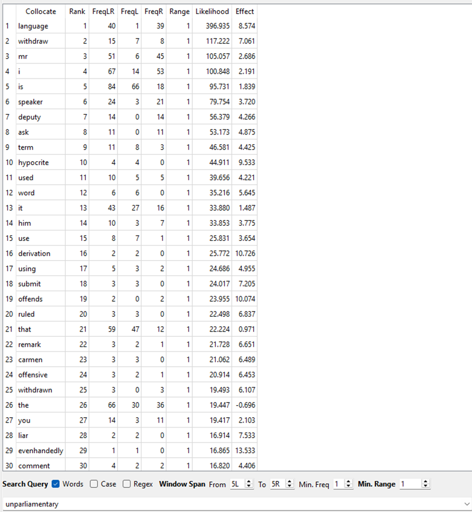

by <Profile id="musgrave" />

 

In a [recent post on this blog](../putting-data-to-work/), I tried to illustrate how a researcher interacts with data in the process of building an argument. Now, I want to do the same thing, but in relation to a much more complicated case. This project was complicated not by our interdisciplinary team (my colleagues <Profile id="hames" /> and <Profile id="haugh" /> were a joy to work with as ever), but by the huge and (currently) unfriendly nature of our data source. The data we worked with came from [Federal Hansard](https://www.aph.gov.au/Parliamentary_Business/Hansard), the record of the proceedings of the Australian Parliament. Before I start explaining to you the kinds of problems we encountered and how we tried to solve them, let me give you a little background.

 

Over a year ago, another of our colleagues from The University of Queensland (UQ), <Profile id="schweinberger" />, sent out a call for expressions of interest to contribute to a special issue of the journal *[Lingua](https://www.sciencedirect.com/journal/lingua)* on the topic of vulgar language. I knew that Sam was already working with Hansard, and in an early conversation with Michael and Sam, I suggested that looking at how vulgar language did or did not appear in parliamentary debate might be an interesting topic. We suggested this to Martin and he was enthusiastic. We realised fairly quickly that vulgar language occurs rarely in Parliament (or at least, it doesn't make it into the formal record — who knows what some of those members are saying to each other off microphone?). More importantly, we also realised that there were interesting questions to examine about how linguistic behaviour is constrained by long-established procedural restrictions.

 

Our focus moved from vulgar language to the idea of 'unparliamentary language'. In parliaments that draw on the British parliamentary tradition, such as the Australian Federal Parliament, language is ruled by the presiding officer (the Speaker or President) to be unparliamentary when it impugns the character of another member through personal reflections and imputations of improper motives, as well as when language is used about members that might be considered offensive, objectionable or otherwise disorderly. For example, [Standing Order 203](https://www.aph.gov.au/About_Parliament/Senate/Practice_and_Procedure/aso/so203) of the Australian Senate deals with Infringement of Order and Section 1c of that Order states that a senator who "uses objectionable words, and refuses to withdraw such words" will have committed a sanctionable offence. We knew what we were looking for — now we just had to find it in the data...

 

## The access problem

 

<figure style="text-align: center;">
  
  <figcaption style="font-style: italic; margin-top: 0.5rem;">Figure 1: Several volumes of Hansard. (Image: The Conversation)</figcaption>
</figure>

 

'Hansard' is used as a general term for the published proceedings of Westminster-style parliaments, originating with the records published by a 19th-century London printer called Hansard. The record of the Australian Federal Parliament stretches from the first parliament at federation in 1901 through to the recently commenced 48th parliament. The entire record exists as a physical resource (see Figure 1) and is now also available as a digital resource via the wonderful [ParlInfo website](https://parlinfo.aph.gov.au/parlInfo/search/search.w3p) — but not in a version that is ideal for our purposes. At ParlInfo, you can search the parliamentary record, filter results in various ways and view relevant proceedings in your browser. The unit in which material is presented is the 'speech', of which there have been 1.7 million over the life of the Australian parliament. Matters are already a little complicated here — a speech does not necessarily correspond to a single speaker. If a member interjects while another member is speaking, that contribution is included as part of the 'speech', and for Question Time, a 'speech' consists of the question, the answer and any follow-ups.

 

Once you have found a section of Hansard which interests you, you can download the material in various ways. You can have a PDF version of the fragment which you are viewing on your screen (that is a single 'speech'), or you can have the proceedings for the whole day (for whichever chamber you are looking at) as a PDF or as an <GlossaryLink display="XML" id="xml" /> file (see Figure 2).

 

<figure style="text-align: center;">
  
  <figcaption style="font-style: italic; margin-top: 0.5rem;">Figure 2: Sample of Hansard in XML format. (Image: ParlInfo)</figcaption>
</figure>

 

The XML <GlossaryLink display="format" id="format" /> provides a lot of valuable information, but is also verbose — the example in Figure 1 encodes a speech which consists of only 24 words! ParlInfo does not have functionality to download more than the proceedings of one House on one day at a time. Fortunately, the indefatigable [Tim Sherratt](https://timsherratt.au/) has created an [archive](https://glam-workbench.net/hansard/) of the XML versions, but there are still problems. No XML versions exist for the period 1980 to 1998 (because... because) and Tim's archive finishes with 2005, after which [Open Australia](https://www.openaustralia.org.au/) is the source for XML.

 

We wanted to be able to work with the whole record of the Australian Parliament with the actual text easily accessible. Given the intermission in the XML source and because Sam is very clever in these matters, the solution we adopted was to scrape the data from ParlInfo and store it all in a database. The underlying source of the web version contains less information than the XML version, but does provide basic <GlossaryLink display="metadata" id="metadata" />, such as which parliament the material came from, what date the speeches occurred on and what debate they were part of.<a name="back-1" >[1](#fn-1)</a>

 

## The scale problem

There have been around 15,000 sitting days over the life of the Australian Parliament with 1.7 million speeches given. All of those speeches are made up of more than 919 million words, i.e. chunks which are separated by white space or punctuation. So our first problem was: How does one get a grip on so much data?

 

Using the search capability of a text processor might seem like a good starting point, but in fact, this is not all that helpful. What should we search for exactly? We could have started by searching for words which we already knew might be treated as unparliamentary (for example, calling another member a liar is completely forbidden), but there is no comprehensive list of such words (and as I will discuss later, any such list would change over time). We also considered the possibility of searching for words reflecting the procedural aspects of what interested us, words such as _unparliamentary_ itself. But language is not the only thing that can be referred to as _unparliamentary_, and we soon realised that this would not work well either.

 

## Clustering

Not all examples of _unparliamentary_ relate immediately to unparliamentary language, but we would expect most instances of unparliamentary language to have the word somewhere in the vicinity. Text analysis has one well-known <GlossaryLink display="tool" id="tools" /> for looking at words which tend to co-occur, called 'collocation analysis'. The idea is that software can count co-occurrences of words in a window of a certain size around a target word (generally around five words on either side). The probability can be calculated of a pair of words occurring in that window given their rate of occurrence in the whole text sample, and this can be compared with the observed rate of co-occurrence. If a word is co-occurring with the target more often than we would expect from overall frequencies, this can be significant.

 

<figure style="text-align: center;">
  
  <figcaption style="font-style: italic; margin-top: 0.5rem;">Figure 3: The top 30 collocates of 'unparliamentary' in the proceedings of the House of Representatives, 37th Parliament. (Image: Public Domain)</figcaption>
</figure>

 

Collocation analysis gave us some insights into two kinds of other words which occurred in proximity to the word _unparliamentary_. One group was associated with the procedural aspects of unparliamentary language; in Figure 3, you can see examples of these words, such as _withdraw(n)_, and of words referring to the presiding officers, such as _speaker_ and _deputy_. The second group of words relate to the content of language which might be unparliamentary. Examples of such words in Figure 3 are _hypocrite_ and _liar_.

 

We also applied a more complex <GlossaryLink display="method" id="methods" /> for examining clusters of words, a method for which Sam has been developing a tool. This method starts by clustering words algorithmically according to patterns of co-occurrence across some unit of analysis, in this case, the speech (as discussed above, this is the unit into which proceedings are divided). The initial clusters can then be sorted according to how similar they are to the words which occur in speeches which include the word _unparliamentary_. We selected the 50 clusters most similar to the unparliamentary speeches and then focused on the 20 most similar words in each of those clusters. This analysis confirmed and extended the collocation analysis, and we identified six broad conceptual clusters in the data:
- procedural
- type of unparliamentary language
- uptake of unparliamentary language
- contesting unparliamentary language
- mediatisation of unparliamentary language
- characterising unparliamentary language.

 

It was at this point that we were confident that our focus on the context, rather than the content, was leading to interesting results. Our computational methods had allowed us to get to grips with the huge amount of data and those methods were providing fascinating insights into what the people involved understood about their procedures and how they acted within those constraints. 

 

## Close reading

The methods described in the previous section gave us a rich picture of the landscape in which unparliamentary language happens, but it was still a high-level picture. We were keen also to try to understand what happened at the level of individual interactions. In order to do this, we chose one theme within the broad 'Type of unparliamentary language' category mentioned above, a cluster of words associated with racism and bigotry. We chose to look at this topic, because we hypothesised that it would be one which had changed across the time period represented in the data, in contrast to a topic such as 'lying', which would be a steady presence. This turned out to be a correct hypothesis — the words _racist(s)_ and _racism_ do not appear in Hansard until 1956, which means that we were able to trace how these words came to be treated as unparliamentary.

 

Of course, we still had a problem in finding the data which was relevant for our purposes; just searching for the crucial words would return large lists of hits, many of which would not be relevant. For example, the word _racist_ returns more than 3,600 hits in the parliamentary record at ParlInfo. The approach we used was to write a simple script which searched for occurrences of the words _racist(s)/racism_ and then checked whether _(un)parliamentary_ appeared in either the preceding or following 200 characters. Running the script across the whole data set gave us 132 candidate instances which might be relevant for research. Not all of them were, but establishing that was a lot easier than checking several thousand possibilities!

 

What we found, in summary, is that the new content which could be regarded as unparliamentary quickly became part of the procedural landscape: presiding officers rapidly moved to (almost complete) consensus that calling someone a racist was offensive and, therefore, unparliamentary, and members of Parliament equally rapidly adopted the same kind of rhetorical manoeuvres which have always been used to sneak in attacks on other parliamentarians. In the case of racism, this has the bizarre result that a member can be required to withdraw remarks on the basis that they express a racist attitude and are therefore unparliamentary, but another member cannot then say that the first member is a racist — that is also unparliamentary!

 

## Concluding remarks

I will start here by quoting a passage from the methodology section in our [published paper](https://www.sciencedirect.com/science/article/pii/S0024384125000579) (references omitted):

> We approached the analysis of this dataset through an iterative computational-interpretive approach … involv[ing] the dialogic use of 'distant' computational methods, such as (un)supervised machine learning and algorithms, alongside 'close' interpretive analysis of individual cases to analyse sociopragmatic phenomena. In a dialogic approach to analysis it is presumed that one cannot make sense of phenomena that occur across large datasets without both closely engaging with close reading of contextualised instances of the phenomenon in question and the broader patterns that can only be identified through computational means.

I hope that what I have described above gives you, the reader, a sense of what this approach means in practice.

 

A central problem in this dialogic approach, especially when working with such a huge dataset, is identifying which examples are appropriate for close analysis. In the previous related post, I discussed finding evidence to support a position — there, the issues were mainly about building an evidence base large enough to generate confidence in observations, but the nature of the observations (whether a word occurs or not) were straightforward. The research described here had different problems — having enough data was not an issue, but the nature of the observations which would support an argument (how participants behaved in an interaction and how they understood it) were much more complex and required very specific pieces of evidence to be retrieved from the data. We believe that we found the data which supported our arguments and I have tried here to illuminate that process for you.

---

### Footnote

<a name="fn-1">1</a> A plan to improve access to Hansard and other public interest documents is currently being developed as part of the [ARDC Community Data Lab](https://ardc.edu.au/project/ardc-community-data-lab/). The project is called Re-usable and Accessible Public Documents (RAPID) and the draft project plan is available on [this page](https://ardc.edu.au/article/draft-project-plans-for-the-ardc-community-data-lab/). [↩](#back-1)

 

### Acknowledgments

Thanks to Sam Hames and Michael Haugh for their collaboration, and to Teresa Chan and Bridey Lea for helpful editing suggestions.

 
