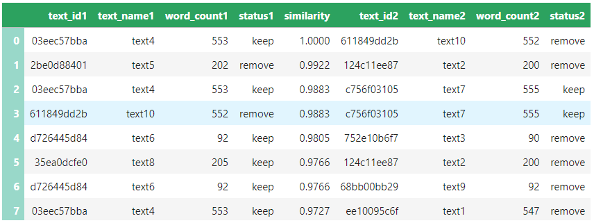
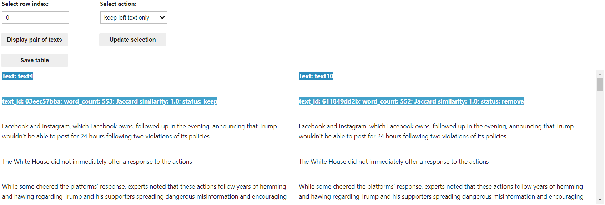
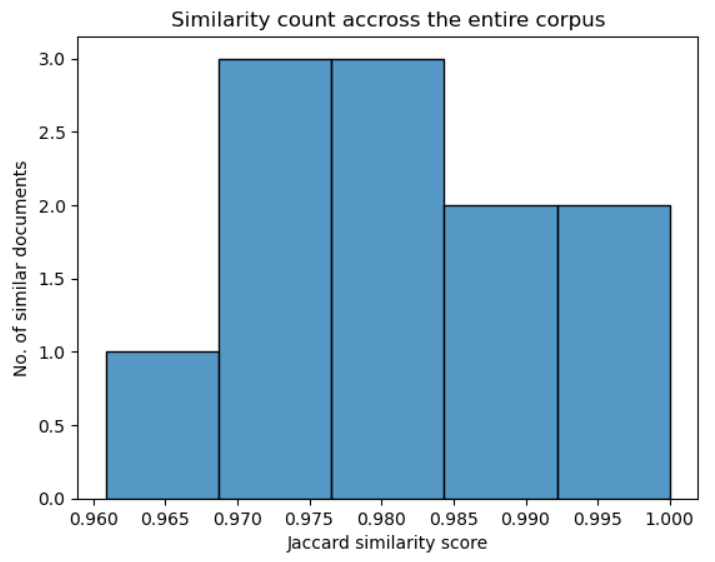

# Introducing the Document Similarity Tool: A new tool for corpus building

The Document Similarity tool is a Jupyter notebook containing code that was developed by the Sydney Informatics Hub ([SIH](https://www.sydney.edu.au/research/facilities/sydney-informatics-hub.html)) in collaboration with the [Sydney Corpus Lab](https://sydneycorpuslab.com/) as part of the Australian Text Analytics Platform ([ATAP](https://www.atap.edu.au)) project. It uses [MinHash](https://ekzhu.com/datasketch/minhash.html) to estimate the [Jaccard similarity](https://en.wikipedia.org/wiki/Jaccard_index) between sets of documents. This tool is helpful in cleaning data files in a dataset or corpus. This is particularly useful to those who collect media texts (e.g. of newspaper articles, tweets) where fully or partially duplicated texts are common occurrences.

The tool is designed to compare every pair of texts in a dataset or corpus and produce similarity scores. Based on a similarity cut-off that has been specified (either the default cut-off parameters or ones that you set yourself), the tool retrieves pairs of texts where the similarity score exceeds the pre-determined cut-off. The result of this analysis is presented as a table containing a list of similar documents (in pairs) found by the tool – an example is shown in Table 1 below. Based on this analysis, the tool makes recommendations about which text within each similar pair should be kept or removed – as shown in the ‘status1’ and ‘status2’ columns in Table 1.

#### Table 1. Results of similarity analysis

The tool allows you to view each pair of similar documents (by specifying the row index you wish to analyse; see Figure 1 below), analyse them, and update the action/recommendation (i.e. ‘keep’ and ‘remove’). You can then download the non-duplicated texts (those labelled as *keep*) or the duplicated ones (those labelled as *remove*) into a zip archive of text (.txt) files.

#### Figure 1. Viewing and comparing each pair of texts in order to adjust the action (i.e. ‘keep’ or ‘remove’)

Additionally, the tool allows you to visualise the Jaccard similarity scores as a histogram (Figure 2). The histogram shows the Jaccard similarity scores for every pair of texts/documents in the corpus, and how many similar documents are found at those Jaccard similarity score ranges across the corpus. This is useful for estimating the extent of duplicated content in a corpus.

#### Figure 2. Histogram of the count of similar documents in the corpus found in particular Jaccard similarity score ranges

Another, optional, visualisation shows the Jaccard similarity scores between specific pairs of texts/documents as a heatmap. This can be useful for identifying the texts that are most similar to each other, but works best with small numbers of texts. This optional feature of the tool could be used to compare the texts produced by different speakers/authors in a dataset.

The tool is available on [GitHub](https://github.com/Australian-Text-Analytics-Platform/document-similarity/) where you can launch the tool on Jupyter Notebook via Binder. That instance of Binder uses CILogon authentication, and you can access it by signing in with your (Australian) institutional login credentials or Google/Microsoft/Outlook account. If you have access to software that supports Jupyter Notebooks, you can also download the notebook to use locally (i.e. without Internet connection) on your own computer.

If you have any questions, feedback, and/or comments about the tool, you can contact the SIH at [sih.info@sydney.edu.au](mailto:sih.info@sydney.edu.au).

### Acknowledgments

This Jupyter notebook and relevant python scripts were developed by the Sydney Informatics Hub (SIH) in collaboration with the Sydney Corpus Lab. 

The notebook incorporates MinHash, which is introduced by Andrei Z. Broder in this [paper](https://cs.brown.edu/courses/cs253/papers/nearduplicate.pdf). Details can be found [here](https://ekzhu.com/datasketch/minhash.html).

### How to cite the notebook:

If you are using this notebook in your research, please include the following citation or an appropriate variation thereof:

Jufri, Sony & Sun, Chao (2024). Document Similarity. Australian Text Analytics Platform. Software. https://doi.org/10.5281/zenodo.20542430

In addition, please inform LDaCA ([ldaca@uq.edu.au](mailto:ldaca@uq.edu.au)) of publications and grant applications deriving from the use of this notebook in order to support continued funding and development.
