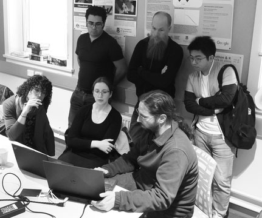

by <Profile id="raadgever" />

 

>*As part of a regular feature in our quarterly newsletter, we asked LDaCA Data Migration Developer Mark Raadgever for a tip to pass on to readers. Read on to find out Mark's tip for working with metadata.*

 

When it comes to <GlossaryLink display="metadata" id="metadata" />, consistency is key. What this means is that, within your <GlossaryLink display="collection" id="collection" />, it is best to use the same terms for the same data, rather than changing how you describe data over time. It also means that, if possible, it is better to use an existing metadata <GlossaryLink display="schema" id="schema" /> to describe your materials — whether this is [Schema.org](https://schema.org/), [Dublin Core](https://www.dublincore.org/), [Portland Common Data Model](https://pcdm.org/) or even a combination of different schemas, depending on which schema best describes the data that you have to hand. If you are using terms from a range of different metadata schemas, it is always best to identify which metadata schema the term comes from.

If you absolutely cannot find a term in a metadata schema that matches the data that you have collected, then you can create your own terms, but when you share the data with others, then it is best practice to have a definition for all the terms that you have created included with the data.

Because we are using <GlossaryLink display="RO Crates" id="ro-crate" /> in <GlossaryLink display="LDaCA" id="ldaca" />, where possible, terms in the incoming data will be mapped to an equivalent Schema.org or [LDAC OLAC-derived term](https://github.com/Language-Research-Technology/language-data-commons-vocabs/blob/master/ontology.md). The best place to start looking for an appropriate metadata schema is in our documentation.

 

<figure style="text-align: center;">
  
  <figcaption style="font-style: italic; margin-top: 0.5rem;">Mark in action, lower right, demonstrating data migration to RO-Crate. (Image: Peter Sefton)</figcaption>
</figure>

 

### Metadata resources

>[LDaCA's approach to metadata](https://www.ldaca.edu.au/resources/ldaca-resources/metadata/)

>[Open Language Archives Community (OLAC)](http://www.language-archives.org/)

>[Designing a metadata ecosystem for language research based on RO-Crate](https://www.ldaca.edu.au/news/posts/ldaca-metadata-ecosystem-eresearch-2022/)

 

### Mark Raadgever
Mark Raadgever is a developer for LDaCA, focusing on the <GlossaryLink display="transformation of data" id="data-transformation" /> from supplied <GlossaryLink display="formats" id="format" /> into RO-Crates and <GlossaryLink display="OCFL" id="ocfl" />. Having trained as a librarian, he spent 16 years working at the [National Library of Australia](https://www.library.gov.au/), with most of that time working on loading data to [Trove](https://trove.nla.gov.au/). Moving to LDaCA coincided with a move to Northern NSW, where building a house competes with data transformation for Mark's time.

 
