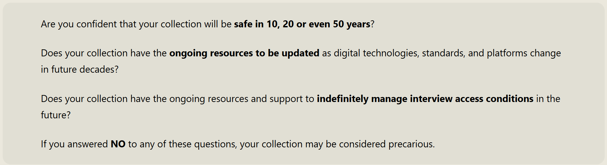

**Oral history collections hold invaluable insights into our historical, cultural and linguistic past, yet little is known about precarious collections that are at risk of being lost.**

Many collections that have been compiled by individuals, communities and organisations over several decades are held outside of state and nationally funded institutions and lack the resources for ongoing digital preservation and the long-term management of access conditions. Collections stored on fast-deteriorating formats like reel-to-reel tapes, cassette tapes and CDs are particularly vulnerable. The Identifying Precarious Victorian Oral History Collections project, launched in 2025, took an important first step by identifying and gathering metadata about at-risk collections in Victoria. The project was led by Dr Anisa Puri at the Australian National University (ANU) with a team of Language Data Commons of Australia (LDaCA) researchers from ANU.

The project asked any individual, group or organisation in Victoria who hold a precarious oral history collection to complete an online survey with details of their collection, open from May to September 2025. The focus was on identifying and finding out more about collections, not accessing the collections at this stage.

<figure>
    
    <figcaption>Fig 1: What is a precarious collection?</figcaption>
</figure>

# Outcomes and learnings

The team produced a final report sharing findings from the project, as well as an online database listing the collections identified.The outputs provide a snapshot of precarious Victorian oral history collections at a point in time and offer a foundational resource for future work advocating for the preservation and reuse of these collections. This multidisciplinary project also strengthened connections between the disciplines of Linguistics and Oral History, resulting in several publications advocating for collaboration between these two fields.

# Further reading

[Oral History and Linguistics: Exploring Connections](https://oralhistoryaustralia.org.au/wp-content/uploads/2025/11/2025_OHAJ47_Article_Puri.pdf)

[The Identifying Precarious Victorian Oral History Collections Project](https://oralhistoryaustralia.org.au/wp-content/uploads/2025/11/2025_OHAJ47_Reports_Puri.pdf)

[Engaging with Oral Community Language Collections in Australia: Practices, Challenges, and Ways Forward](https://doi.org/10.1080/07256868.2025.2592305)
