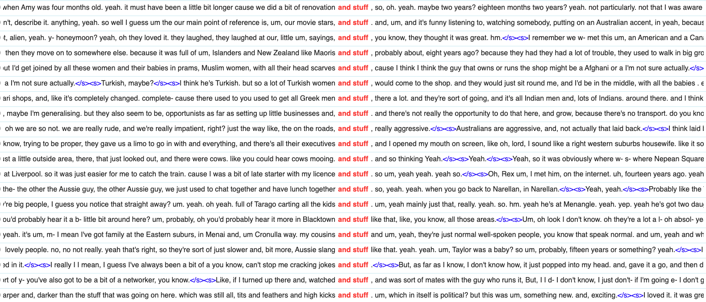
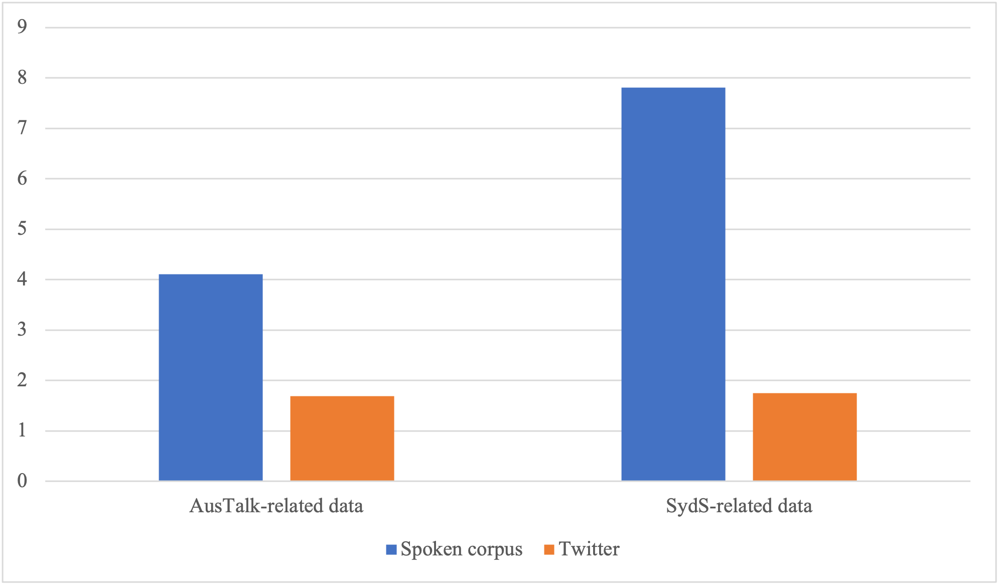

by <Profile id="chan" />

 

During a Master of Applied Linguistics degree at [UNSW Sydney](https://www.unsw.edu.au/), I was given the opportunity to enrol in a course in which students become interns in the School of Humanities and Languages' Language Processing Lab. Although I would still have readings and assessments to complete, the teaching model would be different to a standard postgraduate course: I would attend regular online lab meetings with my supervisor and other interns, and design and conduct my own research project.

The first few weeks of the course were dedicated to learning about real-world applications and key methods in computational linguistics and language technology. We then focused on the research project for the remainder of the course.

 

## Project proposal

The idea for the project stemmed from an intriguing observation I had made about language use in my circle of friends. Certain friends, who had grown up in south-west Sydney and were mostly from a Vietnamese background, were prone to using the expression _and whatnot_, something that I never said myself. Researching this phenomenon revealed that it was a discourse-pragmatic feature called a general extender (GE).

 

 

GEs are phrase-final expressions such as _and stuff_ and _or whatever_ that prototypically 'extend' the referent of a phrase by evoking a more general set of items to which it belongs. They serve a range of discourse and interpersonal functions, such as hedging, establishing solidarity or marking in-group affiliation (Norrby & Winter, 2002). Regional and social variation in the use of GEs has been found across spoken and written English, including Australian English (Travis, Grama & Gonzalez, 2017), with different patterns of usage depending on variables like age, gender and socio-economic class. However, at the time of the project, ethnicity had rarely been considered (e.g. Secova, 2017), despite the fact that the high frequency of a specific GE form in a region can make it a statistical "marker of ethnic identity" (Aijmer, 2013, p. 146). There was also only one study on GEs in computer-mediated communication (CMC) (Fernandez & Yuldashev, 2011). Additionally, although GE usage in Australian English had been compared to its usage in varieties of English spoken in other countries, no research had looked at usage across different cities within Australia.

My project would attempt to fill these gaps in the literature and explore socio-regional variation in GE usage in spoken and CMC settings. "Socio-regional" refers to the stratification of socio-economic class by region (Sheard, 2019, p. 486).

The research questions I would aim to address were:

1.  _Are there differences in GE usage in Australia between:_

    a. _different cities?_

    b. _different ethnicities?_

2.  _Does GE usage differ between spoken settings and CMC settings in Australia?_

3.  _Do the results corroborate or refute previous findings, particularly those for Australian English?_

 

## Data selection and collection

Several factors influenced the selection of the data sources and the collection of data from these sources, which were X (formerly Twitter) and two spoken <GlossaryLink display="corpora" id="corpus" /> of Australian English: AusTalk (Burnham et al., 2011) and Sydney Speaks (Travis, 2014–2021).

 

### Project scope and timeline

The limited scope of the project and the short timeline I had for data collection meant I had to be strategic when selecting data sources. For the spoken language component, I could not construct my own <GlossaryLink display="corpus" id="corpus" /> of recordings without requiring a potentially lengthy ethics clearance process, and so would need to rely on existing datasets like AusTalk and Sydney Speaks.

For the CMC component, I needed to create my own dataset, which was reliant on both the suitability of the data source for my purposes and the skills required to access the data. Previous studies have found linguistic differences by geographical location within the same country on X (e.g. Rechkemmer, Wilson & Mihalcea, 2020), making it an appropriate choice for a CMC site. Furthermore, the website had an advanced search engine that allowed you to search for geolocated posts. X was also compatible with commercial web scraping software, allowing me to compensate for my lack of knowledge and experience as a novice researcher whose only relevant capability was a rudimentary knowledge of <GlossaryLink display="Python" id="python" />.

 

### Dataset accessibility

Accessibility needed to be considered when selecting and collecting data. The spoken <GlossaryLink display="corpora" id="corpus" /> must already have transcriptions of the recordings available and the <GlossaryLink display="metadata" id="metadata" /> needed to contain fields that matched the variables I was looking for.

A small portion of the recordings in the AusTalk dataset had already been transcribed and made available online. This data could be downloaded from two separate (now defunct) web-based <GlossaryLink display="tools" id="tools" />: the transcriptions via the Alveo website and the metadata via the Alveo Query Engine. The metadata contained detailed demographic information about the speakers in the recordings, allowing me to operationalise different fields into my chosen variables: age, gender, socio-economic class (education level), ethnicity (cultural heritage) and geographical location (current city).

For the Sydney Speaks <GlossaryLink display="corpus" id="corpus" />, I submitted an application for access to the main researcher, <GlossaryLink display="LDaCA" id="ldaca" /> Chief Investigator Catherine Travis, and once granted, she sent me a link to download the data files. The metadata was encoded in the file names, with different codes used for ethnicity, gender and age. Luckily for future researchers, the majority of the [Sydney Speaks](https://www.ldaca.edu.au/resources/general-resources/case-studies/sydney-speaks/) corpus will be incorporated into the [LDaCA portal](https://data.ldaca.edu.au/), where the data and metadata will be made <GlossaryLink display="FAIR" id="fair" />: findable, accessible, interoperable and reusable.

Aside from the metadata requiring more manual work to extract, the utility of the Sydney Speaks dataset was lower than AusTalk for three main reasons:

1. Only a limited number of ethnicities were included: Anglo (Australian), Chinese, Greek and Italian.

2. The data was collected solely in Sydney, meaning it could only be analysed for a single geographical location.

3. No metadata field was available to operationalise into a class variable.

The accessibility of data and metadata from the CMC source was also key. Posts on X were highly accessible compared to other CMC sites, such as Facebook, where posts could be hidden from those outside of the user's social network. However, the reverse was true when looking for information about a user on X, as usernames, user profiles and profile pictures were less likely to reflect the user's true identity compared to Facebook.

As a result, the metadata was sparser, and aside from geographical location, only one other variable was operationalised: gender. I assigned a gender to each user based on their username and handle, consulting profile pictures and descriptions in ambiguous cases (see Figure 2 for examples). While being arguably limited in making such a determination, this method was the most suitable option available at the time. If I wanted more reliable user information, ethics clearance would be needed, as it was only possible to determine all variables conclusively by contacting the users.

 

 

### Dataset size

The data sources needed to contain enough instances of GEs to allow robust analysis. In previous studies, the frequency of GE usage across major varieties of English ranged from about 20 to 40 GEs per 10,000 words of speech, though rates of 50 to 60 GEs per 10,000 words had been observed among adolescents (Cheshire, 2007; Norrby & Winter, 2002). See Figure 1 for the rates of use of GEs (per 10,000 words) by age across several of these studies.

 

 

These studies looked at spoken language, as the prevalence of GEs was found to be higher in spoken <GlossaryLink display="corpora" id="corpus" /> compared to written corpora. Indeed, one study (Martínez, 2011) found the frequency of GEs was approximately 9 to 10 per 10,000 words in the spoken subcorpus compared to 1 to 1.5 in the written subcorpus of two different corpora of British English (International Corpus of English-GB component and the British National Corpus). Additionally, in the written subcorpora, GEs were mainly found in fictional dialogue or conversation, or in informal writing, such as emails. This evidences the fact that GEs appear to be predominantly features of spoken language.

Based on the frequency figures outlined above, datasets needed to contain hundreds of thousands of words of speech in order to produce a sufficient number of GE tokens. Both AusTalk and Sydney Speaks featured spoken language and proved to be large enough datasets (274,676 words and 568,555 words, respectively). For the AusTalk <GlossaryLink display="corpus" id="corpus" />, participants completed a number of different tasks, but only data from two of the tasks were considered for the dataset: a story re-telling task, where a participant was asked to re-tell a story from a previous task in their own words, and an interview task, where the participant and researcher discussed a topic of interest to the participant. These tasks were designed to elicit a more spontaneous speech style, which would be fruitful ground to find GEs.

Although interactions on CMC sites generally feature more written than spoken language, they seem more like oral interactions than written interactions. In a study on a synchronous CMC site (instant messaging), Fernandez and Yuldashev (2011) found GE usage patterns were closer to those used in spoken interaction rather than written interaction, though the frequency of occurrence was noticeably lower compared to the spoken <GlossaryLink display="corpora" id="corpus" /> they investigated. I theorised an asynchronous CMC site like X should also demonstrate usage patterns that were similar to spoken interaction.

 

### Dataset novelty

To corroborate and extend previous findings, data sources that had never been analysed before were preferred, which was the case for AusTalk and X. Although patterns of GE usage by age, gender and socio-economic class had been studied previously in Sydney Speaks (Travis, Grama and Gonzalez, 2017), re-analysis of the dataset could illuminate further trends.

 

## Data analysis

Once I had cleaned and organised the data for all three datasets, I uploaded them into commercial <GlossaryLink display="corpus" id="corpus" /> manager and text analysis software ([Sketch Engine](https://www.sketchengine.eu/)) and conducted [concordance](https://www.atap.edu.au/text-analysis/methods/#counting-words) searches. I searched for GE variants from a list I had compiled before starting data collection, based on those found in previous studies. Figure 2 shows the first 20 results of a concordance search for the GE _and stuff_ in the Sydney Speaks dataset.

 

 

Each search result was manually inspected to ensure it could be identified as a GE. After selecting only genuine instances, the results of each search were exported as CSV files, then imported into Microsoft Excel for annotation. Each GE token was coded with the relevant variables for the dataset, e.g. age, gender. Each token was also sorted into a GE subcategory and broader GE category, for instance, _or something_ was in the _(or) something (like that)_ subcategory and _something_ category. Once all tokens were coded and sorted, statistical analysis was completed in Excel using the Data Analysis ToolPak add-on.

 

## Project results

Addressing each research question in turn:

 

1. _Are there differences in GE usage in Australia between:_

   a. _Different cities?_

   There were no statistically significant differences in frequency of GE usage between different Australian cities in AusTalk. However, the Sydney Speaks mean frequency per 10,000 words was significantly higher than the mean frequencies of the other cities in AusTalk, including Sydney<a name="back-1" >[1](#fn-1)</a>.

   Looking at GE categories, there were no statistically significant results. However, there were apparent trends, such as Sydney AusTalk speakers using less common variants more often compared to other cities<a name="back-2" >[2](#fn-2)</a>. Thus, there is some evidence of linguistic differences by geographical location.

   b. _Different ethnicities?_

   There were no statistically significant differences in frequency of usage between Anglo and non-Anglo Australians within both spoken <GlossaryLink display="corpora" id="corpus" />. However, when the corpora were compared, the mean frequency of both Anglo and non-Anglo Australians in Sydney Speaks was significantly higher than that of both Anglo and non-Anglo Australians in AusTalk<a name="back-3" >[3](#fn-3)</a>.

   There were no statistically significant differences in preferred variants, though there were some evident trends. For instance, Chinese Australians in the Sydney Speaks dataset used _whatnot/what not_ variants more often than other ethnicities<a name="back-4" >[4](#fn-4)</a>, which might relate to my original observation about Vietnamese Australians.

 

2. _Does GE usage differ between spoken settings and CMC settings in Australia?_

   There were more GE tokens on X than in the spoken <GlossaryLink display="corpora" id="corpus" />. However, the mean frequency per user was significantly lower on X than the mean frequency per speaker in the spoken corpora<a name="back-5" >[5](#fn-5)</a>, likely due to the limitation in post lengths on X. Figure 3 illustrates the mean GE frequency for Sydney speakers in the AusTalk and Sydney Speaks datasets compared to X users<a name="back-6" >[6](#fn-6)</a>.

   There were also GE variants such as _(and) stuff (like that)_ that were used significantly more frequently by speakers in the spoken corpora than by X users<a name="back-7" >[7](#fn-7)</a>. Therefore, it seems usage patterns on X differ from those in spoken Australian English.

 

 

3. _Do the results corroborate or refute previous findings, particularly those specific to Australian English?_

   The AusTalk results corroborated the robust finding on age (e.g. Secova, 2017; Travis et al., 2017), that is, younger speakers used GEs more frequently than older speakers<a name="back-8" >[8](#fn-8)</a>. There was also support across both <GlossaryLink display="corpora" id="corpus" /> for previous studies that found no gender and class differences in frequency of usage.

 

## Project reflection

Though the analysis revealed interesting trends, more data is necessary to make further claims about the difference between GE usage in spoken Australian English and on X. I considered expanding on this in a PhD degree, but decided against pursuing this, before I ended up working at <GlossaryLink display="LDaCA" id="ldaca" />.

If I do resume my research, I would need to consider other CMC sites, with X on the decline and no clear winner among the alternatives. However, other large platforms like Reddit and Facebook come with their own challenges, including restrictions in access to their underlying <GlossaryLink display="APIs" id="api" /> (Application Programming Interfaces). Using the APIs would allow me to avoid web scraping and its associated risks (e.g. potential violation of website terms) and limitations (e.g. difficulty in handling large or complex websites).

Additionally, I would drastically change how I approach data capture and analysis, with a focus on digital automation and open-source software. The [LDaCA portal](https://data.ldaca.edu.au/) would also be an invaluable resource to locate <GlossaryLink display="corpora" id="corpus" /> of Australian English, with a clear and straightforward path in accessing both the data and associated <GlossaryLink display="metadata" id="metadata" />.

 

## References

Aijmer, K. (2013). General Extenders. In H. Pichler (Ed.). _Understanding Pragmatic Markers: A Variational Pragmatic Approach_ (pp. 127–147). Edinburgh, United Kingdom: Edinburgh University Press.

Burnham, D., Estival, D., Fazio, S., Viethen, J. Cox, J., Dale, R., Cassidy, S., Epps, J., Togneri, R., Wagner, M., Kinoshita, Y., Göcke, R., Arciuli, J., Onslow. M., Lewis, T., Butcher, A., & Hajek, J. (2011). Building an audio-visual corpus of Australian English: large corpus collection with an economical portable and replicable Black Box. _Proceedings of 12th Annual Conference of the International Speech Communication Association (Interspeech 2011)_ (pp. 841–844). Retrieved from [https://austalk.edu.au/bibliography](https://austalk.edu.au/bibliography)

Cheshire, J. (2007). Discourse variation, grammaticalisation and stuff like that. _Journal of Sociolinguistics, 11_(2), 155–193.

Fernandez, J. & Yuldashev, A. (2011). Variation in the use of general extenders _and stuff_ in instant messaging interactions. _Journal of Pragmatics, 43_(10), 2610–2626.
Martínez, I. M. P. (2011). _"I might, I might go I mean it depends on money things and stuff"_. A preliminary analysis of general extenders in British teenagers' discourse. _Journal of Pragmatics, 43_(9), 2452–2470.

Norrby, C. & Winter, J. (2002). Affiliation in Adolescents' Use of Discourse Extenders. In C. Allen (Ed.), _Proceedings of the 2001 Conference of the Australian Linguistic Society_. Retrieved from [http://www.als.asn.au/proceedings/als2001.html](http://www.als.asn.au/proceedings/als2001.html)

Rechkemmer, A., Wilson, S. R. & Mihalcea, R. (2020). Small Town or Metropolis? Analyzing the Relationship between Population Size and Language. In N. Calzolari, F. Béchet, P. Blache, K. Choukri, C. Cieri, T. Declerck, ... & S. Piperidis (Eds.), _Proceedings of the 12th Language Resources and Evaluation Conference_. Retrieved from [http://www.lrec-conf.org/proceedings/lrec2020/index.html](http://www.lrec-conf.org/proceedings/lrec2020/index.html)

Secova, M. (2017). Discourse-pragmatic variation in Paris French and London English: Insights from general extenders. _Journal of Pragmatics, 114_, 1–15.

Sheard, E. (2019). Variation, Language Ideologies and Stereotypes: Orientations towards _like_ and _youse_ in Western and Northern Sydney. _Australian Journal of Linguistics, 39_(4), 485–510.

Travis, C. E. (2014–2021). _Sydney Speaks_. Australian Research Council Centre of Excellence for the Dynamics of Language, Australian National University: [http://www.dynamicsoflanguage.edu.au/sydney-speaks/](http://www.dynamicsoflanguage.edu.au/sydney-speaks/)

Travis, C. E., Grama, J. & Gonzalez, S. (2017). _General extenders over time in Sydney English: From or something to and stuff_. Paper presented at the Australian Linguistic Society Annual Conference, Sydney, Australia, 4–7 December. Retrieved from [http://www.dynamicsoflanguage.edu.au/sydney-speaks/dissemination/](http://www.dynamicsoflanguage.edu.au/sydney-speaks/dissemination/)

 

### Footnotes

<a name="fn-1">1</a> The mean frequency per 10,000 words for AusTalk speakers was significantly lower than Sydney Speaks speakers, in Sydney (t(129) = 2.40, p = .018), Adelaide (t(154) = 3.01, p = .003), Brisbane (t(29) = 4.89, p < .001) and Canberra (t(129) = 2.03, p = .044). [↩](#back-1)

<a name="fn-2">2</a> Less common variants made up 15.00% of AusTalk tokens in Sydney, compared to 9.03% in Adelaide, 6.90% in Brisbane and 7.20% in Canberra. [↩](#back-2)

<a name="fn-3">3</a> The mean frequency of Anglo Australians in the Sydney Speaks dataset was significantly higher than both Anglo Australians (t(108) = 4.66, p < .001) and non-Anglo Australians (t(69) = 3.67, p < .001) in AusTalk. The mean frequency of non-Anglo Australians in the Sydney Speaks dataset was significantly higher than both Anglo Australians (t(121) = 3.15, p = .002) and non-Anglo Australians (t(55) = 2.85, p = .006) in AusTalk. [↩](#back-3)

<a name="fn-4">4</a> _Whatnot/what not_ variants made up 9.04% of Sydney Speaks tokens for Chinese Australians, compared to 0.99% for Anglo Australians, 4.49% for Greek Australians and 1.61% for Italian Australians. [↩](#back-4)

<a name="fn-5">5</a> The mean frequency per speaker/user for AusTalk speakers was significantly higher than X users (t(64) = 4.51, p < .001). The mean frequency for Sydney Speaks speakers was significantly higher than X users (t(117) = 9.85, p < .001). [↩](#back-5)

<a name="fn-6">6</a> The mean frequency for AusTalk speakers was significantly higher than X users in Sydney (t(877) = 4.00, p < .001). The mean frequency for Sydney Speaks speakers was significantly higher than X users in Sydney (t(117) = 9.85, p < .001). [↩](#back-6)

<a name="fn-7">7</a> The _(and) stuff (like that)_ variant was used significantly more frequently by speakers in the AusTalk (t(15) = 3.17, p = .006) and Sydney Speaks (t(78) = 6.21, p < .001) datasets compared to X users. [↩](#back-7)

<a name="fn-8">8</a> Speakers in the datasets were assigned one of three age brackets: Young (19-29 year-olds), Middle (30-59 year-olds) and Old (60-79 year-olds). The mean frequencies for the Young (t(36) = 4.07, p < .001) and Middle (t(48) = 2.42, p = .02) age brackets in AusTalk were significantly higher than the Old age bracket. [↩](#back-8)
