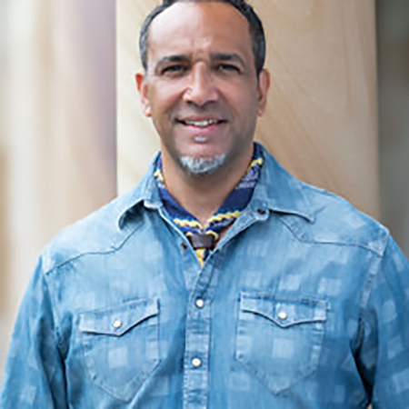
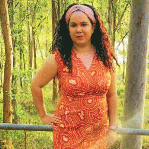
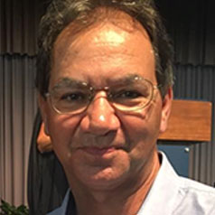
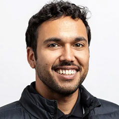
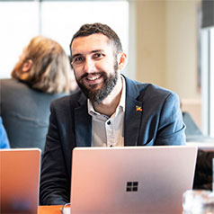

 

This year's NAIDOC Week theme, **50 Years of Deadly**, celebrates the strength, resilience and achievements of Aboriginal and Torres Strait Islander peoples over the past five decades, while looking ahead to the future that is being built today.

We invited several of LDaCA's Chief Investigators, Advisors and collaborators to reflect on what the theme means to them, their research and the future of Indigenous-led research. Together, their reflections speak to the importance of community, language, sovereignty and the ongoing work of creating research that serves Indigenous peoples.
 
 

# Standing on the shoulders of ancestors

<figure>
  
  <figcaption>Alistair Harvey (Image: Marc Grimwade/ARDC)</figcaption>
</figure>

> **"Saibai language and cultural knowledge are not simply subjects to be studied; they are knowledge canons, with their own frameworks for understanding, interpreting and engaging with the world."**  
—  <cite>Alistair Harvey </cite>

Alistair Harvey is of Saibai Island descent and an Industry Fellow with the Language Data Commons of Australia (LDaCA). He reflected on the enduring strength of Saibai Islanders and Torres Strait Islander communities. He highlighted the generations who have protected language, governance and cultural authority and described a future where Indigenous languages and knowledge systems shape research on their own terms. His response reminds us that research is strongest when knowledge remains connected to people, place and community.

### What does “50 Years of Deadly” mean to you in your research?
“50 Years of Deadly” speaks to the strength of Torres Strait Islander and Aboriginal peoples and to the ongoing reality that our communities are still adapting to rapid and often disruptive changes affecting language, culture and governance. In my research, it recognises the deliberate work of Saibai Islanders and Torres Strait Islander communities to maintain cultural authority, economic independence and governance autonomy in the face of colonial systems. It also signals a shift in how our knowledge is positioned. Saibai language and cultural knowledge are not simply subjects to be studied; they are knowledge canons, with their own frameworks for understanding, interpreting and engaging with the world. “Deadly” therefore honours the foresight of our forebears, who preserved language and culture so future generations have pathways back to knowledge, identity and self-determination.

### What past struggles, achievements or breakthroughs shape your research today?
My research is shaped by Torres Strait Islander struggles for autonomy and by the achievements of Elders and communities who protected language, land, labour and governance. The 1936 maritime strike demonstrated collective resistance to colonial control and asserted Islander labour rights. The “Border no change” movement of the 1970s protected Northern Torres Strait families, lands and cultural systems from being divided by the proposed Australia–Papua New Guinea border. Saibai Islanders have also asserted cultural governance through efforts to align local government structures with our seven-clan system. These moments sit alongside the quieter but equally significant work of Saibai Islanders that teach and transmit language and cultural knowledge, as our predecessors have for thousands of years. Together, these histories show strategic resistance, adaptation and renewal. They remind me that our knowledge systems are central to governance, decision-making and self-determination.

### How have Indigenous histories, knowledge systems or communities challenged mainstream research assumptions?
Indigenous histories, knowledge systems and communities challenge the assumption that knowledge can be isolated, translated and understood outside its cultural context. For Saibai Islanders and Torres Strait Islander communities, knowledge is inseparable from language, kinship, Country, spirituality, governance and economic life. Colonial collecting and research practices have often recorded knowledge in fragmented ways, separating songs, photographs, recordings and written accounts from the relationships and systems that give them meaning. Saibai knowledge is relational and living; it cannot be reduced to data objects or disciplinary categories. This challenges research approaches that prioritise extraction, classification and institutional ownership. It also highlights that translation is not neutral. When knowledge is translated into Western frameworks, meaning can shift and authority can be displaced. Indigenous approaches insist that knowledge remains connected to people, place, cultural authority and the systems that sustain it. 

### What will “deadly research” look like in the next 50 years?
In the next 50 years, “deadly research” will be Indigenous-led, community-governed and grounded in Indigenous languages and knowledge systems. Indigenous languages will not only appear within research; they will function as primary languages of research, analysis and knowledge creation. Our cultural frameworks will be recognised as knowledge canons that shape how questions are asked, how evidence is interpreted and how outcomes are measured. Research will increasingly produce outputs for Indigenous knowledge holders, including white and grey literature that communities can use, critique and build upon. Archives and digital infrastructure will support community custodianship, long-term safekeeping and the reintegration of materials into living cultural systems. While Western institutions may continue to provide support, research will strengthen familial, cultural and community-based systems so knowledge is sustained and adapted on Indigenous terms for future generations.

### Is there a word or phrase in your language that you associate with “50 Years of Deadly”?
I associate “50 Years of Deadly” with a Saibai saying *‘Saibailgaw za ngaru Saibailgaw za’*, Saibai things belong to Saibai people. Its continued presence reflects a responsibility that has endured long before this theme and will continue beyond it: Saibai knowledge, language and cultural materials belong to Saibai people, and Saibai people carry a duty of care to look after them.

# Language revitalisation is community work

<figure>
  
  <figcaption>Blanche Alexander (Image: Blanche Alexander)</figcaption> 
</figure>

> **"Deadly research is built on community-led practice across generations."**  
—  <cite>Blanche Alexander</cite>

Blanche Alexander is a Gooreng Gooreng, Yidinji, Pitta Pitta and Mitakoodi woman from tribes spanning Queensland. She is the Data and Research Infrastructure Intern at the Australian Research Data Commons (ARDC) working with LDaCA.

Blanche reflected on the decades of work Aboriginal and Torres Strait Islander communities have invested in protecting and revitalising languages. She noted the importance of community-led research, decolonising language revitalisation and creating research that strengthens identity, wellbeing and connection to Country. Her vision for the future places Indigenous storywork and community priorities at the heart of research.

### What does “50 Years of Deadly” mean to you in your research?
“50 Years of Deadly” in my research means recognising and honouring the long, community‑driven work that has made today’s language revitalisation possible. In my current research on language data and revitalisation, I note that Aboriginal and Torres Strait Islander communities have established their own language centres and recorded Elders, creating grassroots archives that protect and share deep cultural knowledge. Communities have further developed and led local language classes, school programs and learning resources, highlighting how using Indigenous languages supports identity, wellbeing and community pride, and showing that deadly research is built on community-led practice across generations. 

### What past struggles, achievements or breakthroughs shape your research today?
Colonisation and government policies actively suppressed Aboriginal and Torres Strait Islander languages, banning them from schools and missions and enforcing “assimilation,” which led to many languages becoming critically endangered. In this context, decolonising language revitalisation is essential, because it challenges oppressive power structures and returns control of language, knowledge and data to communities. Decolonising approaches for Indigenous leadership is at the forefront, ways of knowing, being, doing and feeling and community priorities, are making revitalisation not just about saving words, but about restoring sovereignty, healing and strong futures grounded in Country and culture. 

### How have Indigenous histories, knowledge systems or communities challenged mainstream research assumptions?
Indigenous communities have challenged extractive research models and data collection methods where outsiders take knowledge and leave without embedded reciprocity for the community. The development of participatory and community-led approaches that prioritise local control, benefit and consent means mainstream research will need to acknowledge respectful engagement and holistically assess research design to avoid misrepresentation and cultural harm.

### What will “deadly research” look like in the next 50 years?
“Deadly research” over the next 50 years will centre Indigenous storywork as both theory and method, treating stories themselves as the primary way of generating, sharing and evaluating knowledge. Storywork, as articulated by Jo-ann Archibald, could guide research that weaves language, culture and relationships together, so projects create learning spaces where people hear, speak and interpret the language inside meaningful narratives rather than in isolated data points or word lists. This kind of research will be deadly because it supports language revitalisation while strengthening identity and connection to Elders and Country, building vocabulary, fluency and confidence in using the language at the same time as transforming what counts as “rigorous” research. 

### Is there a word or phrase in your language that you associate with “50 Years of Deadly”?
*Beerarlem Munjoorum*  (“Learn Together”) - Gooreng Gooreng Tribe Language.

# Looking back to look forward

<figure>
  
  <figcaption>Desmond Crump (Image: Desmond Crump)</figcaption> 
</figure>

> **"It has been inspiring to see the impact of Aboriginal and Torres Strait Islander research coming to the forefront"**  
—  <cite>Desmond Crump</cite>

Desmond Crump is from the Gamilaroi Nation in South-West Queensland and is an Advisor for LDaCA. His reflection is deeply personal, tracing his own journey from being one of the few Aboriginal students at his school to becoming involved in language research. He reflected on the mentors and experiences that shaped his career and his response celebrated the growing recognition of Indigenous knowledges across education and research, while looking ahead to the role these knowledges will play in solving future challenges.

### What does “50 Years of Deadly” mean to you in your research?
In terms of research, I think there is a lot more Aboriginal and Torres Strait Islander led research now — certainly 50 years ago, it seems that there was still a lot of research 'about' Indigenous people and topics rather than 'with us'.

### What past struggles, achievements or breakthroughs shape your research today?
50 years ago, I was still completing Year 11 and aspiring to be a teacher — working in language and language research wasn't even on the radar or something that I had thought about — my career aspirations were on being a Primary School Teacher. As the only Aboriginal student in the Senior School of 250+ students, the main struggle was not to stand out or be too obvious as Aboriginal and Torres Strait Islander issues were not that visible in the 1970s. Later, at Teacher's College, meeting like-minded Aboriginal and Torres Strait Islander people broadened my horizons — not just in terms of career opportunities but also having a presence in tertiary study. Research into language for me became a personal journey around 2002 and brought me into contact with inspirational researchers such as the late Jeanie Bell whom I admire for her brilliant mind and forging the trail for language workers who followed.

### How have Indigenous histories, knowledge systems or communities challenged mainstream research assumptions?
It has been inspiring to see the impact of Aboriginal and Torres Strait Islander research coming to the forefront and having an impact in the areas of history, language and education. Aboriginal and Torres Strait Islander worldviews are now integral to any course of study or research.

### What will “deadly research” look like in the next 50 years?
I think it will be innovative and continue to use Aboriginal and Torres Strait Islander research and knowledges to solve some of the challenges and problems facing the world; whether that be in science, medicine or the environment.

### Is there a word or phrase in your language that you associate with “50 Years of Deadly”?
In Gamilaraay we have a word *dhirrabuu* that means very flash / deadly!!

# Research that serves community

<figure>
  
  <figcaption>Gavin Stanbrook (Image: ARDC)</figcaption> 
</figure>

> **"Indigenous world-views flip research practice on its head."**  
—  <cite>Gavin Stanbrook</cite>

Gavin Stanbrook is from Gumbaynggirr country on the New South Wales mid-north coast and is the Program Manager (Indigenous Data Governance) for the ARDC. He reflected on the generations of Indigenous leaders whose advocacy made today's research landscape possible. He said that Indigenous protocols are transforming research by shifting the focus from institutions and data towards people, community benefit and accountability. While recognising there is still work to do, he remains optimistic about the growing movement for Indigenous-led research and solidarity across the sector.

### What does “50 Years of Deadly” mean to you in your research?
It's a culmination of resistance by generations of Indigenous communities against racism and oppression, for genuine self-determination.

### What past struggles, achievements or breakthroughs shape your research today?
Our place as Indigenous people in research stands on the shoulders of giants like Pearl Gibbs, Mum Shirl (Shirley Colleen Smith), Oodgeroo Noonuccal, Bill Ferguson and many more. Recognising Indigenous protocols in research and Indigenous rights to our data is just one success realised through their campaign for civil rights and justice. 

### How have Indigenous histories, knowledge systems or communities challenged mainstream research assumptions?
Indigenous world-views flip research practice on its head. They challenge the pervasiveness of de-contextualised data, deficit-based analysis and the dictatorial nature of how institutions manage data. Indigenous protocols in research move the sector towards a 'people-centered' research practice that values Community benefit and empowerment over profit and unaccountable authority. 

### What will “deadly research” look like in the next 50 years?
We have a long way to go, embedding Indigenous protocols into research practice remains an uphill battle. However, I am hopeful. I'm hopeful because we have a vibrant and active Indigenous research community that is standing on business and asserting our rights as Indigenous people in research. They are joined by hundreds of thousands of non-Indigenous colleagues from all walks of life who value Indigenous protocols, knowledges and culture — and who are prepared to put their necks out to do what's right. It's solidarity, and in the rapidly changing world we live in today, we need solidarity now more than ever.  

# Keeping the fire burning

<figure>
  
  <figcaption>Robert McLellan (Image: Marc Grimwade/ARDC)</figcaption> 
</figure>

> **"Although fifty years of NAIDOC is a significant milestone, it is not the culmination of a journey. It is one chapter in a story that stretches back millennia and forward to generations yet to come."**  
—  <cite>Robert McLellan</cite>

Robert McLellan is a proud Gooreng Gooreng descendant of the Wide Bay region and the Senior Project Manager for LDaCA. He reflected on the origins of NAIDOC in protest and advocacy, and the responsibility today's researchers have to honour those who created the opportunities they are now afforded. His response looks both backwards and forwards, recognising the advances made through Indigenous-led research while reminding us that the work of strengthening Indigenous self-determination is ongoing.

 

NAIDOC was born not from celebration, but from struggle. It emerged through the courage of Aboriginal and Torres Strait Islander people who came before us, those who marched, protested the systemic mistreatment of our people, and tirelessly advocated for our rights, often at great personal cost. Their work was neither easy nor without sacrifice, yet it created opportunities for future generations to occupy spaces from which our people had long been excluded.

This is particularly evident in research. Today, Indigenous researchers and communities are advancing Indigenous Cultural and Intellectual Property, Indigenous Data Sovereignty, Indigenous Data Governance, Indigenous-led research, policy reform and governance frameworks that centre Indigenous authority, knowledge systems and aspirations. This includes refined methodologies that transcend their historical predecessors, specifically extractive research models, by adopting approaches grounded in Indigenous self-determination.

As researchers, we have a responsibility to honour that legacy, not simply by occupying these spaces, but by reshaping them in ways that uphold dignity and humility, strengthen Indigenous self-determination and create opportunities for those who follow.

Although fifty years of NAIDOC is a significant milestone, it is not the culmination of a journey. It is one chapter in a story that stretches back millennia and forward to generations yet to come. We look back with respect for those who carried the struggle before us, and forward with optimism, knowing it is now our responsibility to keep the fire burning.

 
 

Although each reflection offers a different perspective, together they paint a compelling picture of what "50 Years of Deadly" means for research. It is about honouring those who fought for the spaces Indigenous researchers occupy today. It is about recognising the leadership of communities who have always cared for language, culture and knowledge. And it is about building a future where Indigenous-led research, governance and knowledge systems continue to shape the next fifty years and beyond.

 
 
