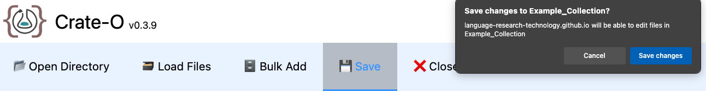

 

> This guide takes you through the steps to create an <GlossaryLink display="RO-Crate" id="ro-crate" /> <GlossaryLink display="metadata" id="metadata" /> file, using a top-level collection for language data as an example. To view more details and screenshots of each section discussed, select the click-through links throughout the page.

 

##### [Open Directory](#ro-crate-creationopen-directory)

##### [Select Mode](#ro-crate-creationselect-mode)

##### [Load Files](#ro-crate-creationload-files)

##### [Add Entity Metadata](#ro-crate-creationadd-entity-metadata)

##### [Save RO-Crate](#ro-crate-creationsave-ro-crate)

 

## Open Directory {#ro-crate-creationopen-directory}

- Open [Crate-O](https://language-research-technology.github.io/crate-o/#/) in a compatible browser.
- In the [Main Menu](/resources/user-guides/crate-o/basic-navigation/#main-menu), select **_Open Directory_**.
- Navigate to a folder where the <GlossaryLink display="RO-Crate" id="ro-crate" /> will be saved, or create a new one, then confirm your selection.
- For the pop-up message asking _Let site view files?_, select **_View Files_**.
- Your current working directory will be displayed in the _Selected Directory_ section next to the [Mode Selector](/resources/user-guides/crate-o/basic-navigation/#mode-selector).

 

<figure>
  
  <figcaption class="text-center italic mt-2 font-bold">Crate-O: Open Directory. (LDaCA)</figcaption>
</figure>

 

## Select Mode {#ro-crate-creationselect-mode}

- In the [Mode Selector](/resources/user-guides/crate-o/basic-navigation/#mode-selector), the **_Mode_** dropdown shows the current <GlossaryLink display="mode" id="mode" /> that is being displayed, i.e. the <GlossaryLink display="metadata" id="metadata" /> framework associated with your <GlossaryLink display="collection" id="collection" />.
- Change the mode from the default _Simple RO-Crate Dataset_ to _Language Data Commons Comprehensive Collection_.

 

<figure>
  
  <figcaption class="text-center italic mt-2 font-bold">Crate-O: Select Mode. (LDaCA)</figcaption>
</figure>

 

## Load Files {#ro-crate-creationload-files}

Selecting the ___Load Files___ button in the main menu will load all files from your selected working directory into the RO-Crate. These will then appear under the ___All Entities___ section on the left-hand panel.

 

## Add Entity Metadata {#ro-crate-creationadd-entity-metadata}

Crate-O allows two options for entering your metadata to an RO-Crate:
- Manual Entry: use the Crate-O interface to enter metadata using the availale fields and navigation.
- Append Metadata from Spreadsheet: use a Crate-O compatible spreadsheet to bulk add metadata to the Crate-O interface.

 

### Manual Entry of Metadata in Crate-O

- The [Current Entity](/resources/user-guides/crate-o/basic-navigation/#current-entity) section shows your location in the current <GlossaryLink display="RO-Crate" id="ro-crate" />.
- The [Property Groups](/resources/user-guides/crate-o/basic-navigation/#property-groups) panel allows you to navigate to the various groups associated with your RO-Crate.
- The [Entity Properties](/resources/user-guides/crate-o/basic-navigation/#entity-properties) panel is where you can add data about your <GlossaryLink display="collection" id="collection" />.
- For blank RO-Crates, the following missing property messages will appear by default. Clicking the blue **_Add_** buttons will automatically add these missing items to your RO-Crate.

 

<figure>
  
  <figcaption class="text-center italic mt-2 font-bold">Crate-O: Missing Properties. (LDaCA)</figcaption>
</figure>

 

- Enter the entity properties you have for your collection. Add as little or as much information about your collection as you like, as this can be saved and worked on further later. To browse all the <GlossaryLink display="metadata" id="metadata" /> entities associated with the Language Data Commons (LDAC) Mode, see [Metadata for Language Data](https://ldaca.gitbook.io/metadata-for-language-data).

 

<figure>
  
  <figcaption class="text-center italic mt-2 font-bold">Crate-O: Add Entity Metadata. (LDaCA)</figcaption>
</figure>

 

### Append Metadata from Spreadsheet 

If you have a spreadsheet in a compatible format that you want to add to your <GlossaryLink display="collection" id="collection" /> to assist with <GlossaryLink display="metadata" id="metadata" /> description, or you want to create a new RO-Crate only using spreadsheet data, select **_Bulk Add_** in the [Main Menu](/resources/user-guides/crate-o/basic-navigation/#main-menu) and load the spreadsheet. This will append it to your existing or new <GlossaryLink display="RO-Crate" id="ro-crate" />.

For more guidance on the spreadsheet requirements and a template, see [Convert Spreadsheet](/resources/user-guides/crate-o/convert-spreadsheet). If using the template, use the [mode](#ro-crate-creationselect-mode) _Language Data Commons Comprehensive Collection_ in Crate-O.

> Note that this option currently only has functionality to add new data, and cannot overwrite or edit existing data in your RO-Crate. **_Bulk Add_** also only reads from the spreadsheet and does not write to it.

 

## Save RO-Crate {#ro-crate-creationsave-ro-crate}

- In the [Main Menu](/resources/user-guides/crate-o/basic-navigation/#main-menu), select **_Save_**.
- For the pop-up message asking _Save changes to [Selected Directory]?_, select **_Save changes_**.

 

<figure>
  
  <figcaption class="text-center italic mt-2 font-bold">Crate-O: Save RO-Crate. (LDaCA)</figcaption>
</figure>

 

- Your <GlossaryLink display="RO-Crate" id="ro-crate" /> is now successfully saved in your working directory, with two files:
  - _ro-crate-metadata.json_: The saved RO-Crate in <GlossaryLink display="JSON" id="json" /> format.
  - _ro-crate-preview.html_: An HTML file that can be viewed on a web browser and shows the contents of your RO-Crate.

 

| ro-crate-metadata.json                                                                                                                                                    | ro-crate-preview.html                                                                                                                                                  |
| ------------------------------------------------------------------------------------------------------------------------------------------------------------------------- | ---------------------------------------------------------------------------------------------------------------------------------------------------------------------- |
|  |  |

 

### Required Properties

After saving, if there are required properties missing from your <GlossaryLink display="RO-Crate" id="ro-crate" />, the section _Saved with warnings_ will appear. You can select the dropdown on this message to view the missing required properties. Clicking on one of these warnings will take you to the relevant <GlossaryLink display="property" id="property" /> group. If you choose to edit any of these sections, select **_Save_** again to ensure your most recent changes are not lost.

 

<figure>
  
  <figcaption class="text-center italic mt-2 font-bold">Crate-O: Saved with Warnings. (LDaCA)</figcaption>
</figure>

 
