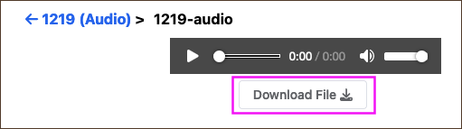

 

> This user guide uses 'portal' to refer to the interface across all of the available <GlossaryLink display="Oni" id="oni" /> portals (see [Available Portals](/resources/user-guides/portal/available-portals/) for more details).

 

##### [Download Individual Files](#download-individual-files)

##### [Download Collections](#download-collections)

 

## Download Individual Files

Files from a <GlossaryLink display="collection" id="collection" /> can be downloaded from two locations:

- the File section of an <GlossaryLink display="Object" id="object" /> page
- the File page for the selected item.

 

To download a file from an Object page, navigate to the _Files_ section at the end of the page (ensuring you click on the arrow to expand the relevant file) and select **_Download File_** on the right-hand side of the file entry.

 

<

 

To download a file from a File page, navigate to the end of the page and select **_Download File_**.

 

<

 

## Download Collections

Complete collections can be downloaded from the Downloads widget on the right panel of:

- a <GlossaryLink display="Collection" id="collection" /> page
- an <GlossaryLink display="Object" id="object" /> page.

 

<

 

The widget shows the number of files and overall file size, provides the ZIP download, and links to a **_Show All Downloads_** page with additional license details.

 

A complete collection cannot be downloaded as a single ZIP file if it is distributed, that is, the collection has additional sub-collections or sub-objects. Instead, **_Show All Downloads_** will display all the component ZIPs of the collection for individual download.

 

<

 
