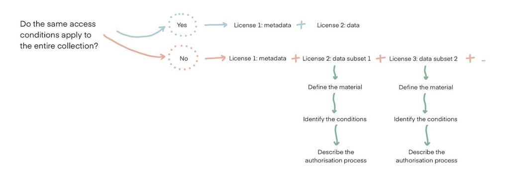

 

#### [Step 1: Consider access condition(s) for the entire collection](#step-1-consider-access-conditions-for-the-entire-collection)

#### [Step 2: Organise relevant materials](#step-2-organise-relevant-materials)

#### [Step 3: Define the license terms](#step-3-define-the-license-terms)

#### [Step 4: Determine authorisation level](#step-4-determine-authorisation-level)

#### [Options for access by application](#options-for-access-by-application)

 

> See the [LDaCA Glossary](https://docs.ldaca.edu.au/other-resources/glossary/) for definitions of key terms and concepts.

 

LDaCA recommends the following workflow to determine the access conditions to be outlined in the license. Examples of existing data access licenses can be found [here](/licenses/).

 

## Step 1: Consider access condition(s) for the entire collection

- Do the same access conditions apply to the entire collection?
  - **If yes** → two licenses can be defined (one for metadata, one for the collection data). 
    Metadata is licensed with an open license in order to allow the user to find the collection through the LDaCA catalogue.
  - **If no** → all of the ways the data can be accessed must be defined, with a license for each subset.

 

 

- Name the license(s).
- Complete the following steps 2-4 for each license.

 

## Step 2: Organise relevant materials

What material can be accessed with this license?

- The material can be organised in different ways:
  - Metadata vs. data
  - Formats, e.g. transcriptions vs. audio
  - List of files/speakers (based on a shared quality such as sensitive material, transcribed or non-anonymised material)

 

## Step 3: Define the license terms

- What conditions are included in the license?
  - Can data be shared?
  - Can data be modified?
  - What is the license duration?
- Provide a brief description of the license conditions (1-2 lines).
- List the correct citation for this material.

 

## Step 4: Determine authorisation level

What authorisation is required for users to access this license?

- **If none** → all users can accept the click-through license and access the material.
- **If by invitation** → only users invited by the Data Steward can accept the license and access the data.
- **If by application** → arrange a form or a document with requirements for users to fill in.

 

 

This information can be mapped out visually or listed in an Excel sheet with the following basic structure:

| License | Step 1: Determine the number of separate licenses needed, and name the license | Step 2: Define the material | Step 3: List the license terms | Step 4: Describe the authorisation process, if applicable |
| ------- | ------------------------------------------------------------------------------ | --------------------------- | ------------------------------ | --------------------------------------------------------- |
| 1       |                                                                                |                             |                                |
| 2       |                                                                                |                             |                                |

 

## Options for access by application

Access by application can be managed in a number of formats:

- Integrated forms, e.g. set three key questions for users requesting access to the collection.
- PDF application form, i.e. provide a dynamic PDF form that the user can download, complete and re-upload.
- Document upload request, i.e. request a copy of the user’s research ethics approval or proof of affiliation.
- Link to external service, i.e. Google Forms, payment service.

 
