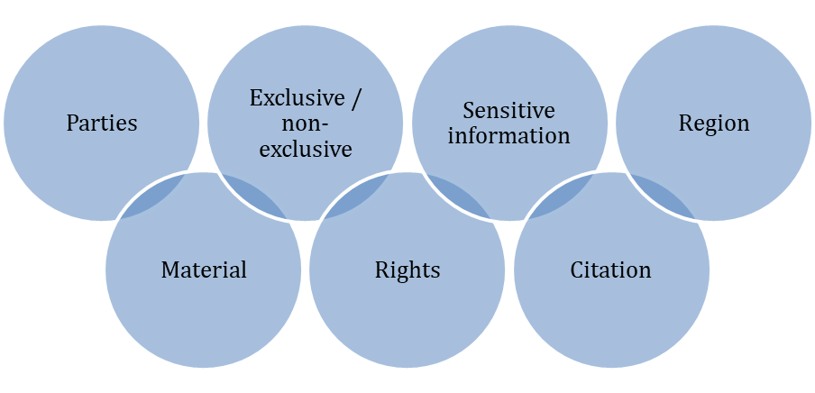

 

#### [Purpose](#purpose)

#### [1. Access Conditions](#1-access-conditions)

- #### [1.1 Legal, moral, and ethical constraints](#11-legal-moral-and-ethical-constraints)
- #### [1.2 Licensing](#12-licensing)

#### [2. Persistent Identifiers](#2-persistent-identifiers)

#### [3. Metadata](#3-metadata)

#### [4. Appendix: Determining Copyright](#4-appendix-determining-copyright)

 

> See the [LDaCA Glossary](https://docs.ldaca.edu.au/other-resources/glossary/) for definitions of key terms and concepts.

 

## Purpose

Data governance defines policies, roles, responsibilities and procedures for ongoing use and storage of data, as well as for access to data. Effective data governance maximises sustainability, while ensuring data integrity and protecting research participants. Long-term sustainability requires a data management plan.

This document provides guidance on some components of data governance that are key to a data management plan, including access conditions, licensing, persistent identifiers, and metadata. The principles below are those employed by LDaCA, but they are widely applicable and represent best practice for data governance, in accordance with the FAIR and CARE principles.

 

>  **Questions for reflection:** 
> In each section, you will find a thought bubble marking some questions for reflection that will help you start to explore these data governance topics. This content is designed as guidance for Data Stewards considering how to manage their data into the future.

 

## 1. Access Conditions

Access conditions refer to who can access data and what use is permitted. Defining specific conditions for access supports data reusability and the advancement of the scientific endeavour; it also protects the data from misuse.

To determine access conditions, the Data Steward must:

1. understand the legal, moral, and ethical constraints to sharing data, and
2. prepare a license outlining access conditions.

 

### 1.1 Legal, moral, and ethical constraints

 

#### Legal constraints

In Australia, as in many other countries, research data is recognised as Intellectual Property that can be protected under legal mechanisms such as copyright. When considering how data can be shared and accessed by others, it is important to consider these legal constraints.

Copyright protects expressions of ideas in works such as books, music, paintings, films, and performative acts such as speech, sign and gesture, etc., and therefore also data collections. The creator of the work is known as the copyright owner.

Copyright provides two types of rights:

- **Economic rights**: The owner has the exclusive right to reproduce, publish, perform, communicate, and adapt or modify their work, for both commercial and non-commercial purposes. This right can be transferred or shared with others via assignment or licensing.
- **Moral rights**: The work must be correctly attributed and not treated in a derogatory manner. This protects the integrity of the work. Moral rights cannot be transferred or shared.

 

>  **Questions for reflection:** 
> How can I identify the copyright owner of a language collection?

 

Unlike trademarks and patents, copyright doesn’t require registration and there are no official records that can be searched to identify a copyright owner in Australia. Additionally, the creator of material is not necessarily the copyright owner and copyright may also be jointly owned.

Copyright ownership is determined according to a set of complex rules set out in the Copyright Act and its amendments. It is important to review in detail the law to ensure the correct owner has been identified. Legal advice should be sought where the copyright owner cannot be clearly identified. If the copyright owner has died the copyright is usually passed on to that person’s spouse or children. (See more information at the end of this section.)

The copyright owner of a language collection can be identified by considering the following questions:

 

| Question                                                                                                                                                                            | Further Information                                                                                                                                                                                                                                                                                                                                                                                                                                                                                                                                                                                                                                             |
| ----------------------------------------------------------------------------------------------------------------------------------------------------------------------------------- | --------------------------------------------------------------------------------------------------------------------------------------------------------------------------------------------------------------------------------------------------------------------------------------------------------------------------------------------------------------------------------------------------------------------------------------------------------------------------------------------------------------------------------------------------------------------------------------------------------------------------------------------------------------- |
| Does the collection comprise materials all collected under the same conditions? (e.g., as part of the same research project)<ul><li>Yes<li>No                                       | If the collection includes material from a third party, the copyright owner and copyright status should be identified for each subset of the collection.                                                                                                                                                                                                                                                                                                                                                                                                                                                                                                        |
| Has the copyright owner been determined by a contract, formal agreement, or other relevant document?<ul><li>Yes<li>No                                                               | In some cases, existing contracts or agreements will assign copyright ownership in advance. This will take precedence over the rules set out in the Copyright Act.                                                                                                                                                                                                                                                                                                                                                                                                                                                                                              |
| What type of material is included in the collection?<ul><li>Textual work<li>Musical work<li>Dramatic work<li>Computer program<li>Artistic work<li>Film or video<li>Sound recordings | Generally, the author of a textual work, musical work, dramatic work, computer program or artistic work (i.e., the person who created the work) is the first owner of copyright. However, the general rules for films, videos and sound recordings are different.<ul><li>For sound recordings, copyright is owned by the ‘maker’ of the sound recording, typically the person or company who owns the recording equipment.<li>For film and video, copyright is owned by the person or company which made the arrangements for the creation of the work.</li></ul>In the academic context, this is typically the university where the research was conducted. |
| Was the material created by an employee in the course of their employment?<ul><li>Yes<li>No                                                                                         | When the work was created by an employee as part of their usual work duties, the employer is the copyright owner (unless there is a specific employment agreement that specifies otherwise).                                                                                                                                                                                                                                                                                                                                                                                                                                                                    |
| Is the work a performance?<ul><li>Yes<li>No                                                                                                                                         | Performers’ rights apply to live performances including dramatic works, musical works, dances, circus acts, expressions of folklore, readings, and recitations of existing or improved literary works recorded or filmed with or without an audience. Permission must be sought to record the live performance, and to broadcast and distribute recordings. As of 1 January 2005, performers co-own copyright in sound recordings of their performances. There are exceptions for commissioned recordings, or those made by an employee.                                                                                                                    |

 

>  **Questions for reflection:** 
> Does copyright apply to this language collection?

 

In Australia, copyright generally lasts for the life of the author/creator plus 70 years at which point the work becomes part of the public domain. However, it is important to review copyright on a case-by-case basis given that the rules vary, and amendments have been made to law over time.

To understand how copyright might apply to a collection, the Data Steward should consider the following questions:

 

| Question                                                                                                                                                                                                       | Further Information                                                                                                                                                                                                                                                                                                                                                                                                                                                                                          |
| -------------------------------------------------------------------------------------------------------------------------------------------------------------------------------------------------------------- | ------------------------------------------------------------------------------------------------------------------------------------------------------------------------------------------------------------------------------------------------------------------------------------------------------------------------------------------------------------------------------------------------------------------------------------------------------------------------------------------------------------ |
| What type of works are included in the collection?<ul><li>Works (literary works, dramatic works, music, artistic works)<li>Subject matter other than works (sound recordings, performances, films, broadcasts) | Copyright protects two broad categories of intellectual property:<ul><li>Works<ul><li>Literary works (books, magazine articles, poetry, etc.)<li>Dramatic works (dance, plays, etc.)<li>Music (scores, songs, etc.)<li>Artistic works (paintings, drawings, etc.)</ul><li>Subject matter other than works<ul><li>Sound recordings (recordings of interviews, conversations, oral histories, songs; live performances, songs, podcasts, etc.)<li>Films (documentaries, television programs, animations, etc.) |
| When was the material created?<ul><li>Year:                                                                                                                                                                    | This information will be key to determining the duration of the copyright.                                                                                                                                                                                                                                                                                                                                                                                                                                   |
| When was the material first made public?<ul><li>Year:<li>Never made public                                                                                                                                     | "Made public" means communicated, published, performed in public or sold to the public. The timing of the publication of the materials is key to the duration of copyright for sound recordings or films, as the laws have changed (see [Appendix](#4-appendix-determining-copyright)).                                                                                                                                                                                                                      |
| Where was the material made?                                                                                                                                                                                   | Australian copyright law applies to any use or sharing of material within Australia, even if the copyright owner is from outside of Australia.                                                                                                                                                                                                                                                                                                                                                               |

 

Once this information has been confirmed, calculate the duration of copyright using the Appendix. If copyright applies, the copyright owner may consider sharing some of their rights with others via licensing. If copyright has expired, the material is in the public domain and the copyright owner cannot restrict access using licensing.

 

**Find out more about copyright, intellectual property and licensing:** 

- [What is Intellectual Property?](https://www.wipo.int/edocs/pubdocs/en/wipo_pub_450_2020.pdf) (World Intellectual Property Organisation)
- Fact sheets (Arts Law Centre of Australia):

  - [Copyright Information sheet](https://www.artslaw.com.au/information-sheet/copyright/)
  - [Duration of Copyright](https://www.copyright.org.au/browse/book/ACC-Duration-of-Copyright-INFO023)
  - [Performers’ Rights](https://www.artslaw.com.au/information-sheet/performers-rights/)
  - [Licensing](https://www.artslaw.com.au/information-sheet/licensing-aitb/)

- [Fact sheets](https://www.copyright.org.au/resources) (Australian Copyright Council)
- [Types of IP](https://www.ipaustralia.gov.au/understanding-ip/types-of-ip) (IP Australia)
- [Fact sheet: Intellectual Property – Basics](https://staff.uq.edu.au/files/33574/legal-services-fact-sheet-ip-basics.pdf) (The University of Queensland)
- [What are the Creative Commons licenses?](https://creativecommons.org.au/learn/fact-sheets/what-are-the-cc-licences/) (Creative Commons Australia)

 

#### Ethical and moral constraints for data access

In addition to the legal constraint determined by copyright, it is important to also consider ethical and moral constraints.

Research ethics set shared standards for research processes that uphold and promote important values such as trust, accountability, human rights, and social responsibility, among others, in the pursuit of knowledge and truth.

In Australia, research ethics are defined in key frameworks such as:

- [Australian Code for the Responsible Conduct of Research](https://www.nhmrc.gov.au/about-us/publications/australian-code-responsible-conduct-research-2018)
- [National Statement on Ethical Conduct in Human Research](https://www.nhmrc.gov.au/about-us/publications/national-statement-ethical-conduct-human-research-2007-updated-2018)
- [AIATSIS Code of Ethics for Aboriginal and Torres Strait Islander Research](https://aiatsis.gov.au/sites/default/files/2020-10/aiatsis-code-ethics.pdf)

Research carried out in Australian universities and similar institutions using public funds and involving human participants must be approved by Human Research Ethics Committees (HRECs). Research ethics proposals outline the conditions for collecting, analysing, sharing, managing, and potentially disposing of research data. A review of the research ethics proposal under which the data was collected and other relevant documents, such as grant agreements, is necessary when determining data access conditions for a collection.

While ethical constraints are often binding, several international frameworks have been developed to further promote data reusability and to address key issues such as Indigenous rights and interests. The FAIR and CARE principles are widely accepted standards (see [LDaCA principles](/about/principles/) for more information).

 

##### FAIR principles

The FAIR principles provide a set of standards for data management that facilitates continued knowledge discovery and innovation.

In brief, the four principles are:

1. Findability: Data is easily findable, via persistent identifiers and rich metadata.
2. Accessibility: Access conditions are clearly defined, and protocols are developed to facilitate authentication and authorisation.
3. Interoperability: Data can be integrated with other data and applications, through standard data formats and compatible metadata vocabularies.
4. Reusability: Data and metadata are well-described with clear information on provenance and data access conditions in order to optimise future reuse.

 

##### CARE principles

The CARE Principles for Indigenous Data Governance provide guidelines with the aim of balancing the protection of Indigenous rights and interests and supporting data sharing and reuse. Though designed with consideration specifically for Indigenous communities these are important principles to bear in mind for all language collections.

In brief, the four principles are:

1. Collective benefit: Data sharing provides a collective benefit for Indigenous Peoples in terms of inclusive development and innovation, improved governance and citizen engagement and the achievement of equitable outcomes.
2. Authority to control: Indigenous Peoples have the authority to control and govern data.
3. Responsibility: Those working with Indigenous data have a responsibility to nurture respectful relationships with the communities from which the data originates.
4. Ethics: Data governance prioritises the rights and wellbeing of Indigenous Peoples and minimises harm.

 

>  **Questions for reflection:** 
> What ethical and moral questions need to be considered before sharing this collection?

 

| Question                                                                                                                                     | Further Information                                                                                                                                                                                                                                                                                                                                                                                                                                                                                                                                                                                                                                                                                                     |
| -------------------------------------------------------------------------------------------------------------------------------------------- | ----------------------------------------------------------------------------------------------------------------------------------------------------------------------------------------------------------------------------------------------------------------------------------------------------------------------------------------------------------------------------------------------------------------------------------------------------------------------------------------------------------------------------------------------------------------------------------------------------------------------------------------------------------------------------------------------------------------------- |
| Does the research ethics proposal (or other relevant documents such as a grant agreement) include data sharing constraints?<ul><li>Yes<li>No | What are the conditions for data management and sharing? List the additional constraints which data access must adhere to as they appear in the project/collection documentation.                                                                                                                                                                                                                                                                                                                                                                                                                                                                                                                                    |
| How is participant consent considered in the governance decisions?                                                                           | Consider the following questions.<ul><li>Was informed participant consent documented during data collection?<li>Are there specific constraints for sharing data? In what format? With which audience?<li>Is there a risk of harm, discomfort or inconvenience to the participants by making the data available? (e.g. will public access to the data run the risk of amplifying existing negative stereotypes about the participant or the social group(s) they are identified with, will their personal information be easily deduced/tracked in any way, etc.)<li>What is the protocol for de-identification and the expectations of the participants? Have these been met?                                           |
| Are the FAIR principles being upheld?<ul><li>Yes<li>No                                                                                       | Consider some more specific questions:<ul><li>Does the collection have a persistent identifier?<li>Are access conditions clearly defined?<li>Are the data formats widely compatible?<li>Is the metadata detailed and well-described?<li>Is the metadata searchable?<li>Does the metadata use a common metadata schema/vocabulary?<li>How has the collection been used previously?<li>Is there a record of publications and research findings that have used the collection?                                                                                                                                                                                                                                             |
| Have the CARE principles been considered and implemented?<ul><li>Yes<li>No                                                                   | Consider some more specific questions:<ul><li>How have communities or individuals been involved in data management?<li>How do participants and their communities benefit collectively from the sharing of this data?<li>Do participants and their communities have the authority to make decisions about the governance of the collection?<li>Are relationships with participants and their communities being nurtured?<li>Are the rights and wellbeing of participants and their communities prioritised?<li>Does the data governance plan consider the role of participants and their communities?<li>Does the use of the data reflect community values?<li>What cultural meanings of sensitive content are relevant? |

 

**Find out more about FAIR and CARE:**

- [CARE Principles for Indigenous Data Governance](https://www.gida-global.org/care) (Global Indigenous Data Alliance)
- [CARE Principles](https://ardc.edu.au/resource/the-care-principles/) (Australian Research Data Commons)
- Carroll, S. R., Garba, I., Figueroa-Rodríguez, O. L., Holbrook, J., et al. (2020). The CARE Principles for Indigenous Data Governance. Data Science Journal, 19(1), 43.DOI: https://doi.org/10.5334/dsj-2020-043
- [FAIR Data](https://ardc.edu.au/resource/fair-data/) (Australian Research Data Commons)
- [FAIR Principles](https://www.go-fair.org/fair-principles/) (Go Fair)
- Wilkinson, M., Dumontier, M., Aalbersberg, I. et al. (2016). The FAIR Guiding Principles for scientific data management and stewardship. Sci Data 3, 160018. https://doi.org/10.1038/sdata.2016.18

 

### 1.2 Licensing

Documenting access conditions is key to ensuring appropriate use of the data over time. Transparency and clarity surrounding access conditions also supports the sustainability of the data and reduces the need for the Data Steward to be available to communicate or enforce the access conditions.

While access conditions can be documented internally in a data management plan, a common and useful mechanism for documenting and managing access is via licensing.

Licensing allows the copyright owner to share the right to access and use the data without forfeiting or transferring the ownership of the copyright of the work. The license sets out the conditions for who can access the data, how it can be used, and what other conditions are required. While licensing is a legal mechanism, it can also be used to uphold other conditions as determined by the Data Steward.

 

>  **Questions for reflection:** 
> Is there an existing data license?

 

| Question                                                                       | Further Information                                                                                                                                                                                                                                                                                    |
| ------------------------------------------------------------------------------ | ------------------------------------------------------------------------------------------------------------------------------------------------------------------------------------------------------------------------------------------------------------------------------------------------------ |
| Is there an existing license outlining the access conditions?<ul><li>Yes<li>No | If the collection has already been made available, a license may have already been prepared. Avoid duplicating previous work by checking this first. Although it is best practice to have a single license attached to a collection, multiple licenses can exist as long as they are non-exclusive. |

 

**Figure: Key parts of a data license**

 

 

>  **Questions for reflection:** 
> What information needs to be included in the license?

 

| Question                                                            | Further Information                                                                                                                                                                                                                                  |
| ------------------------------------------------------------------- | ---------------------------------------------------------------------------------------------------------------------------------------------------------------------------------------------------------------------------------------------------- |
| What are the **parties** relevant to this license?                  | Who is the author of the material? Who is the copyright owner? Is access managed by a Data Steward? Which individuals or groups are permitted access to the material? Who is the Licensor (copyright owner) and Licensee?                |
| What **materials** are covered by the license?                      | Does this license cover the entire collection or a subset of the material?                                                                                                                                                                           |
| Is this an **exclusive** or **non-exclusive** license?              | Does this license grant an individual or group exclusive rights to use and share the material? If yes, this is an exclusive license.                                                                                                              |
| Describe the **rights** that are being transferred to the licensee. | What rights are being transferred? Can the material be modified? For what purpose? Can the material be shared? Under what conditions?                                                                                                          |
| Does this collection include **sensitive information**?             | Does the material include personal information? What is the protocol for ensuring participant privacy? What are the responsibilities of the licensee?                                                                                          |
| What are the requirements surrounding **citation**?                 | How should the material be correctly attributed? What is the suggested citation for the collection?                                                                                                                                               |
| Under which **region** is the license legally binding?              | Is the license limited to a specific geographical region?                                                                                                                                                                                            |
| Other considerations                                                | How long will the license be valid? Does it expire after a specific period of time? Is the licensee required to pay a fee? How is the fee processed? Under what conditions can the license be terminated? How will disputes be resolved? |

 

While in some cases it may be necessary to write a custom data license, for other collections it may be possible to apply an already-existing license, such as a Creative Commons license. Creative Commons provides a useful option for promoting data reusability while protecting key access conditions.

The Creative Commons licenses combine four main elements in different ways:

- BY - Attribution: This is a requirement for all Creative Commons licenses. The original creator must always be attributed.
- SA - Share-Alike: Data can only be shared under identical license terms.
- NC - Non-Commercial: Only non-commercial use of the data is permitted.
- ND - No Derivatives: Material can be copied and distributed in the original form only and cannot be adapted.

A copyright owner may also choose to waive their rights and make data available in the public domain before the duration of the copyright has expired. Creative Commons provides a relevant tool for documenting this decision:

- [CC0](https://creativecommons.org/share-your-work/public-domain/cc0/): A copyright owner opts out of copyright and waives their exclusive rights. The material is placed in the public domain before the copyright duration has expired.

 

## 2. Persistent Identifiers

Persistent identifiers (PIDs) are digital identifiers that are permanently assigned to physical and digital objects. In contrast to other identifiers that are used online, such as URLs, PIDs are persistent, meaning they point to reliable information in the long term. They have become crucial for research data as they make a collection citable; ensure that it is findable even if moved to a different location; and establish its relationship to other objects and entities in the academic research environment (e.g. researchers, funders, organisations, academic publications, software and other datasets).

While various PID systems have been in use for research data over the last 25 years, including ISBN and ORCiD, the DOI System has been the most widely used globally to date and is becoming the default identifier for research datasets.

A DOI is a unique number made up of a prefix and a suffix separated by a forward slash. It is resolvable by displaying it as a link: https://doi.org/10.1000/182.

An example of a DOI for a data collection (obtained via the university library) can be viewed here: [Sydney Speaks DOI landing page](https://datacommons.anu.edu.au/DataCommons/rest/display/anudc:6184?layout=def:display).

 

>  **Questions for reflection:** 
> Who can get a DOI? How?

 

| Question                                                   | Further Information                                                                                                                                                                                                                                                    |
| ---------------------------------------------------------- | ---------------------------------------------------------------------------------------------------------------------------------------------------------------------------------------------------------------------------------------------------------------------- |
| Does the collection have an existing PID?<ul><li>Yes<li>No | Investigate whether the collection already has an existing PID as this is sometimes automatically generated when the collection is listed or archived with an archive or library.                                                                                      |
| Who can generate a DOI for the collection?                 | The most common DOI minting services are universities, research organisations, research libraries and research repositories. You can make enquiries with your university library or the research repository of the organisation that supported the data collection. |

 

**Find out more about PIDs:** 
Klump, J. and Huber, R., 2017. 20 Years of Persistent Identifiers – Which Systems are Here to Stay?. Data Science Journal, 16, p.9. DOI: http://doi.org/10.5334/dsj-2017-009

 

## 3. Metadata

Metadata is data about data — information that describes the data collection as a whole; provides the context and conditions under which the data was collected, can be stored, shared and used; and the characteristics of the format, duration or size of data making up the collection; and includes socio-demographic details of participants.

Standardised metadata allows data to be more easily found and understood, to be compared, and grouped with other similar objects.

Metadata is often managed in two different ways:

1. A standard metadata vocabulary (such as Dublin Core (DC), Darwin Core and Metadata Object Description Schema (MODS). These vocabularies set out a limited list of metadata terms that can be used across disciplines with the aim of promoting a shared metadata framework.
2. A customised metadata strategy, unique to a particular project to meet specific needs.

Where a customised metadata strategy is used, metadata terms should be clearly defined so as to facilitate comprehension of the metadata and to avoid misunderstandings or multiple interpretations. Customised metadata terms can be mapped onto existing vocabularies in order to organise metadata in a manner aligned to a standard.

 

>  **Questions for reflection:** 
> What does it mean to apply standards to metadata?

 

| Question                                                                                      | Further Information                                                                                                                                                                                                                                                                                   |
| --------------------------------------------------------------------------------------------- | ----------------------------------------------------------------------------------------------------------------------------------------------------------------------------------------------------------------------------------------------------------------------------------------------------- |
| Does the collection use metadata terms from an existing metadata vocabulary?<ul><li>Yes<li>No | If the collection uses customised metadata terms (i.e. not an existing metadata vocabulary), consider mapping the relationships between the custom system and an existing metadata vocabulary. This will facilitate findability as the metadata aligns with standards used in the research community. |

 

## 4. Appendix: Determining Copyright

Information is provided as guidance only; legal advice should be sought.

Select the correct table for works and subject matter other than works.

 

**Works:**

<table class="tg" >
<thead>
  <tr>
    <th class="tg-0lax">Step 1: Is the author known?</th>
    <th class="tg-0lax" colspan="4">Author of the work is known*</th>
  </tr>
</thead>
<tbody>
  <tr>
    <td class="tg-0lax">Step 2: When was the material first made public?</td>
    <td class="tg-0lax">Work has not been made public</td>
    <td class="tg-0lax" colspan="3">Work has been made public</td>
  </tr>
  <tr>
    <td class="tg-0lax">Step 3: Was the material first made public before or after the author died?</td>
    <td class="tg-0lax">N/A</td>
    <td class="tg-0lax">Work was made public before the author died</td>
    <td class="tg-0lax" colspan="2">Work was not made public before the author died</td>
  </tr>
  <tr>
    <td class="tg-0lax">Step 4: Was the material first made public before or on/after 1 January 2019?</td>
    <td class="tg-0lax">N/A</td>
    <td class="tg-0lax">N/A</td>
    <td class="tg-0lax">Work was made public with the author’s permission before 1 January 2019</td>
    <td class="tg-0lax">Work was not made public with the author’s permission before 1 January 2019</td>
  </tr>
  <tr>
    <td class="tg-0lax">Copyright duration</td>
    <td class="tg-0lax">Date author died + 70 years.</td>
    <td class="tg-0lax">Date author died + 70 years.</td>
    <td class="tg-0lax">Date the material was first made public + 70 years.</td>
    <td class="tg-0lax">Date author died + 70 years.</td>
  </tr>
</tbody>
</table>

\*Different copyright duration applies to works for which the author is unknown.

 

**Subject matter other than works: sound recordings, films and videos**

<table class="tg">
<thead>
  <tr>
    <th class="tg-0lax">Step 1: When was the material created?</th>
    <th class="tg-0lax" colspan="4">Created before 1 January 2019</th>
    <th class="tg-0lax" colspan="2">Created on or after 1 January 2019</th>
  </tr>
</thead>
<tbody>
  <tr>
    <td class="tg-0lax">Step 2: When was the material first made public?</td>
    <td class="tg-0lax">Not made public</td>
    <td class="tg-0lax">First made public before 1 Jan 2019</td>
    <td class="tg-0lax">First made public on or after 1 Jan 2019 and within 50 years of the date of creation</td>
    <td class="tg-0lax">First made public on or after 1 Jan 2019 more than 50 years after the date of creation</td>
    <td class="tg-0lax">Made public within 50 years of the date of creation</td>
    <td class="tg-0lax">Made public more than 50 years after the date of creation</td>
  </tr>
  <tr>
    <td class="tg-0lax">Copyright duration</td>
    <td class="tg-0lax">Date the material was created + 70 years.</td>
    <td class="tg-0lax">Date the material was first made public + 70 years.</td>
    <td class="tg-0lax">Date the material was first made public + 70 years.</td>
    <td class="tg-0lax">Date the material was created + 70 years.</td>
    <td class="tg-0lax">Date the material was first made public + 50 years.</td>
    <td class="tg-0lax">Date the material was created + 50 years.</td>
  </tr>
</tbody>
</table>

 
